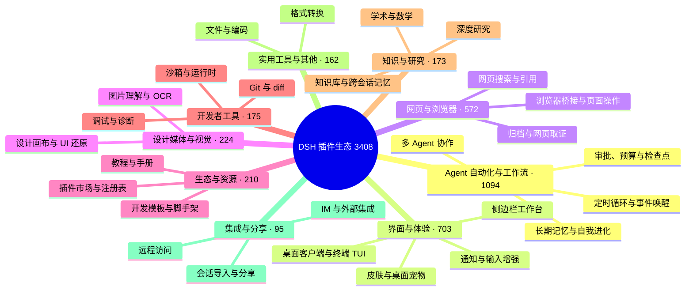

# 🐳 Awesome DSH Plugins

> 用 30 秒为你的 DeepSeek Harness（DSH）找到合适的插件。
> 这不是又一个仓库清单：GitHub 上所有打着 `dsh-plugin` 标签的仓库由脚本每天自动抓取，再经人工逐个核实——真插件进目录，蹭热度的进黑名单，每条剔除理由公开可查。并告诉你每个插件适合谁、从哪里开始。

[English](./README_EN.md) · [全量目录](./CATALOG.md) · [Star Top 200](./TOP200.md) · [作者自荐](./SHOWCASE.md) · [推荐一个插件](./CONTRIBUTING.md) · [机器可读数据](./data/repositories.json)

**如果这个列表帮你找到一个有用的插件，欢迎点一个 Star ⭐。它能帮助更多 DSH 用户发现这个生态。**

## 🧭 用户索引

| 我想要…… | 直接去哪里 |
| --- | --- |
| 30 秒选出一个插件 | [精选推荐](#-精选推荐)：从「我想让 DSH 做什么」出发，按场景分组列出社区优秀插件 |
| 第一次装插件 | [新手入门组合](#-新手入门组合)：按当前问题选一套组合，不用一次装很多 |
| 按热度翻完整榜单 | [社区热度榜](#-社区热度榜)（首页 Top 20）· [TOP200.md](./TOP200.md)（完整 Top 200） |
| 按分类浏览全部项目 | [CATALOG.md](./CATALOG.md)（全量目录）· [生态全景](#-生态全景)（分类概览） |
| 看看作者们自己提交的新插件 | [作者自荐](#-作者自荐)（首页最近 10 条）· [SHOWCASE.md](./SHOWCASE.md)（全部） |
| 用程序消费插件数据 | [data/market.json](./data/market.json)——面向下游市场的精选文件（≤500 KB，见[接口规范](https://github.com/bruc3van/dsh-desktop-safe-market/blob/master/docs/market-json-spec.md)）；[data/repositories.json](./data/repositories.json)——每日自动快照，含星数、许可证、活跃度等元数据 |
| 收录或推荐你自己的插件 | [推荐或修正插件](#-推荐或修正插件) / [CONTRIBUTING](./CONTRIBUTING.md) |

## 🗺️ 生态全景

截至 2026-08-16 共收录 **3408** 个经核实的仓库。它们长这样：

按分类浏览每个分类下的全部项目，见 [CATALOG.md](./CATALOG.md)。

## ⭐ 精选推荐

**这里不按星数排名。** 我们优先选择解决明确问题、说明完整、仍在维护且具有代表性的社区项目——所以你会看到上千 Star 的项目，也会看到几十 Star 但无可替代的项目。从你的问题出发，找到最接近的一行，点进去就是答案；收录不等于安全或兼容性背书。想看按热度排名的完整榜单，见[社区热度榜](#-社区热度榜)。

### 🖥️ 桌面与终端

- **想要独立的桌面客户端**，而不是浏览器标签页：[dsh-desktop](https://github.com/bruc3van/dsh-desktop) —— 开箱即用：自动复用本机已运行的实例，或用内置运行时一键启动，无需安装 Node.js/CLI，支持远程连接、托盘常驻与异常恢复。
- **想在终端里用 Claude Code 风格界面**：[dsh-TUI](https://github.com/ccch1mneyyy/dsh-TUI) · [dsh-tianshu-tui](https://github.com/huiliyi37/dsh-tianshu-tui) —— 全屏交互终端：状态行、思考流展开、上下文/TPS 仪表；tianshu 版本还内置 TDD 与证据门工作流。

### 🧰 界面与工作台

- **想一次安装补齐常用界面功能**：[dsh-web-ui](https://github.com/zhu1090093659/dsh-web-ui) —— 任务看板、Git 关系图、侧边面板、远程移动端界面、桌面宠物、实时 Token 用量统计与皮肤中心，一站式功能合集。
- **想看清上下文窗口里装了什么**：[dsh-context](https://github.com/bowenliang123/dsh-context) —— 在 Web UI 增加 Context 面板，展示上下文由什么构成、如何演化，辅助把握 token 控制与裁剪时机。
- **想把侧边栏升级成完整工作台**：[DSH-better-sidebar](https://github.com/omdsh-dev/DSH-better-sidebar) —— 内置文件渲染编辑、终端、Git 与子代理，并支持第三方扩展注册新 Tab。
- **想在开发对话里直接检查和操作当前网页**：[dsh-browser](https://github.com/Lum1104/dsh-browser) —— Chrome 侧边栏扩展，让 DSH 直接操作你的浏览器：无需视觉能力，即可在当前对话里授权页面、读取并执行网页操作。

### 👀 让模型看得见、搜得到

- **想给 DSH 增加视觉理解能力**：[modlens](https://github.com/liustack/modlens) · [dsh-vision-toolkit](https://github.com/Anionex/dsh-vision-toolkit) —— modlens 把图片转成 OCR/布局/语义结构化证据；dsh-vision-toolkit 覆盖图片问答、长截图 OCR、UI 还原与像素对比。
- **想免 Key、免 Python、粘贴即用看图**：[dsh-vision-router](https://github.com/ysr666/dsh-vision-router) —— 内置免费视觉链（五模型匿名兜底，免注册免 Key），图片轮像普通工具轮一样由模型驱动 10 个 `vision_*` 像素工具（定位、裁剪、描述、像素对比、修复、取色、OCR、抠图、矢量化、截图）连续多步执行，并输出结构化证据 JSON；一条命令安装（Web profile），Node only。
- **想让 Agent 自己搜索网页和 X，答案带引用**：[modsearch](https://github.com/liustack/modsearch) · [anysearch-dsh](https://github.com/anysearch-team/anysearch-dsh) —— modsearch 在对话中直接搜索、抓取并返回带引用的结构化证据；anysearch-dsh 提供 AnySearch 搜索源与高级搜索工具，可作补充搜索后端。

### 🧠 记忆与无人值守

- **想给 DSH 加上可审计的跨会话记忆**：[dsh-memory-evolve](https://github.com/csyangwen/dsh-memory-evolve) · [dsh-mneme](https://github.com/modusensus/dsh-mneme) —— 五轨记忆 + 技能自进化；或 SQLite + 可编辑 Markdown 的记忆镜像，记忆透明可改。
- **想定时或按事件唤醒 Agent**：[dsh-loop](https://github.com/vlln/dsh-loop) · [dsh-sentinel](https://github.com/fuhefei/dsh-sentinel) —— 覆盖周期任务，以及文件、命令、HTTP、进程和 Webhook 事件。
- **请求经常因网络波动或超时中断**，不想每次手动补一句「继续」：[dsh-auto-continue](https://github.com/HsiangNianian/dsh-auto-continue) —— 回合因非人为原因失败后自动补发「继续」：错误分类只恢复临时性故障，自适应退避避免轰炸故障上游，继续文本可模板化，参数在插件设置卡片中调整。
- **想回退对话与工作区状态**：[dsh-turn-rewind](https://github.com/Anionex/dsh-turn-rewind) —— 基于持久化 Change Ledger 回退到任意早期回合，对话与代码状态一起恢复。
- **想回合结束时收到桌面通知**：[dsh-notification](https://github.com/omdsh-dev/dsh-notification) —— 按结果类型（成功/失败）控制通知，支持关键词过滤，长时间任务无需盯屏。

### ✍️ 对话体验细节

- **想像 Codex 一样用 @ 引用工作区文件**：[dsh-at-file](https://github.com/omdsh-dev/dsh-at-file) —— 在输入框内按 @ 搜索工作区文件并把内容附进 prompt，免去手动复制粘贴。
- **想更顺手地阅读和操作长对话**：[dsh-navbar](https://github.com/vlln/dsh-navbar) · [dsh-annotation](https://github.com/omdsh-dev/dsh-annotation) —— 快速跳转用户消息节点，并像 Codex 一样选中文本批注。
- **想看清后台任务进度**：[dsh-task-status](https://github.com/vlln/dsh-task-status) —— 在对话页显示任务进度和实时输出 tail。
- **想给长会话加一个实时大纲**：[dsh-outline](https://github.com/urzeye/dsh-outline) —— 用户问题与 Markdown 标题（1~6 级）组成大纲树，流式生成时实时更新，点击节点定位并高亮，支持展开深度调节、搜索与会话级收藏。

### 🎨 创作与乐趣

- **想在对话中生成交互式界面**：[dsh-genui](https://github.com/omdsh-dev/dsh-genui) —— 在回复中渲染图表、表单、测验、Mermaid 和 3D 场景。
- **想让 Agent 操作真实设计画布**：[dsh-openpencil](https://github.com/ZSeven-W/dsh-openpencil) —— 创建、编辑、预览和验证可交互的多页面 OpenPencil 设计稿。
- **想给工作区增加一个陪伴型宠物**：[whale-girl](https://github.com/vlln/whale-girl) —— 可拖拽、投喂和玩耍的积累型鲸鱼娘桌面伙伴。
- **想换皮肤、自定义背景**：[dsh-skin](https://github.com/KinGao294/dsh-skin) · [dsh-deep-whale](https://github.com/Small-tailqwq/dsh-deep-whale) —— dsh-skin 一键切换多套 --dsw-alias-* 配色并支持半透明壁纸（Codex 风格）；dsh-deep-whale 是生态内最受欢迎的鲸鱼娘皮肤系列（CC BY-NC-SA，不可商用）。

### 🛠️ 开发与工作流

- **想把现有业务代码转成 Agent 可调用能力**：[Code2Skill](https://github.com/leechen298/Code2Skill) —— 从用户授权的前端、后端或全栈源码生成 Function、MCP Tools、业务 Skills 和离线测试，并可作为 DSH Bundle 安装。

### 🔀 迁移与集成

- **想把其他工具的历史会话搬进 DSH**：[dsh-chat-import](https://github.com/Nwflower/dsh-chat-import) —— 13 源全保真导入（Claude Code/Codex/ChatGPT/Cursor/Gemini/Reasonix/opencode/ZCode/Grok Build/OpenClaw/Pi/Hermes/Kimi）历史会话为可续聊 DSH 会话，并支持反向导出/同步回 Claude Code。

### 🔌 远程与外部协作

- **想让外部 Agent 驱动 Harness 执行任务**：[dsh-harness-mcp-server](https://github.com/chushixixin/dsh-harness-mcp-server) —— 在 Harness 内部启动 MCP server，让任意 MCP 客户端（如 Hermes）下发任务给 Harness 执行，实现「大脑 + 胳膊」协作。
- **想从外部设备安全访问本机 Harness**：[dsh-remote](https://github.com/flymysql/dsh-remote) —— 打印当前实例的精确连接命令：SSH 本地转发、autossh 保活、反向隧道（NAT 友好）与带 --trusted-host 的反向代理，设置页一键复制；遵循官方安全设计，不碰 0.0.0.0。

### 💰 用量与账单

- **想查看 Token 用量与费用**：[dsh-usage-stats](https://github.com/Ychris12138/dsh-usage-stats) · [dsh-cost-meter](https://github.com/Han-1413141/dsh-cost-meter) —— dsh-usage-stats 提供 GitHub 风格用量热力图、按模型拆解与 DeepSeek 账户余额；dsh-cost-meter 按官方价格同步统计本会话/当日费用。

### 🌱 生态入口

- **想更方便地管理和发现插件**：[plugin-registry](https://github.com/vlln/plugin-registry) · [dsh-market](https://github.com/dsh-market/dsh-market) —— plugin-registry 在浏览器面板中管理 repository 插件并提供开发引导；dsh-market 把插件市场做进 DSH 界面，浏览、搜索、一键安装。

### 🚀 新手入门组合

不需要一次装很多。先选一个与你当前问题最接近的组合：

| 套装 | 适合 | 组合 |
| --- | --- | --- |
| 日常体验 | 第一次装插件，先解决管理、状态和导航 | [plugin-registry](https://github.com/vlln/plugin-registry) · [dsh-task-status](https://github.com/vlln/dsh-task-status) · [dsh-navbar](https://github.com/vlln/dsh-navbar) |
| 自动化 | 定时循环 + 事件驱动唤醒，长时间无人值守任务 | [dsh-loop](https://github.com/vlln/dsh-loop) · [dsh-sentinel](https://github.com/fuhefei/dsh-sentinel) |
| 视觉与搜索 | 让纯文本模型看得见、搜得到 | [modlens](https://github.com/liustack/modlens) · [modsearch](https://github.com/liustack/modsearch) · [dsh-vision-toolkit](https://github.com/Anionex/dsh-vision-toolkit) |
| 创作与界面 | 生成式 UI、真实设计画布与视觉理解 | [dsh-genui](https://github.com/omdsh-dev/dsh-genui) · [dsh-openpencil](https://github.com/ZSeven-W/dsh-openpencil) · [dsh-vision-toolkit](https://github.com/Anionex/dsh-vision-toolkit) |
| 记忆与持续运行 | 跨会话记忆 + 中断自动续跑的无人值守项目 | [dsh-memory-evolve](https://github.com/csyangwen/dsh-memory-evolve) · [dsh-mneme](https://github.com/modusensus/dsh-mneme) · [dsh-auto-continue](https://github.com/HsiangNianian/dsh-auto-continue) |

## 🏆 社区热度榜

按 Star 排序的社区热度参考，数据取自 2026-08-16 快照；蹭 `dsh-plugin` Topic 的非插件仓库与编辑部拉黑的仓库均已剔除，新仓库先进入[待审核队列](./data/review/pending.md)、经人工核实（[data/approved.json](./data/approved.json)）后才进入榜单，剔除清单见 [data/curated.json](./data/curated.json)。首页展示前 20 名，完整 Top 200 见 [TOP200.md](./TOP200.md)。排名反映受欢迎程度，不代表质量、兼容性或安全背书。

| # | 项目 | ⭐ Stars | License |
| ---: | --- | ---: | --- |
| 1 | [zhu1090093659/dsh-web-ui](https://github.com/zhu1090093659/dsh-web-ui) | 2768 | Apache-2.0 |
| 2 | [liustack/modlens](https://github.com/liustack/modlens) | 1955 | MIT |
| 3 | [omdsh-dev/DSH-better-sidebar](https://github.com/omdsh-dev/DSH-better-sidebar) | 1302 | MIT |
| 4 | [ccch1mneyyy/dsh-TUI](https://github.com/ccch1mneyyy/dsh-TUI) | 1291 | MIT |
| 5 | [Small-tailqwq/dsh-deep-whale](https://github.com/Small-tailqwq/dsh-deep-whale) | 922 | — |
| 6 | [ccch1mneyyy/working-activity](https://github.com/ccch1mneyyy/working-activity) | 644 | MIT |
| 7 | [Anionex/dsh-vision-toolkit](https://github.com/Anionex/dsh-vision-toolkit) | 440 | MIT |
| 8 | [Nagi-ovo/dsh-ads](https://github.com/Nagi-ovo/dsh-ads) | 416 | BSD-3-Clause |
| 9 | [NanmiCoder/dsh-agent-teams](https://github.com/NanmiCoder/dsh-agent-teams) | 343 | MIT |
| 10 | [morluto/rea](https://github.com/morluto/rea) | 330 | MIT |
| 11 | [dsh-market/dsh-market](https://github.com/dsh-market/dsh-market) | 300 | MIT |
| 12 | [Electricitysheep/dsh-handbook](https://github.com/Electricitysheep/dsh-handbook) | 294 | — |
| 13 | [omdsh-dev/dsh-at-file](https://github.com/omdsh-dev/dsh-at-file) | 225 | MIT |
| 14 | [vibeinging/deepseek-harness-desktop-app](https://github.com/vibeinging/deepseek-harness-desktop-app) | 202 | MIT |
| 15 | [hust-open-atom-club/oh-dsh](https://github.com/hust-open-atom-club/oh-dsh) | 196 | MIT |
| 16 | [huiliyi37/dsh-tianshu-tui](https://github.com/huiliyi37/dsh-tianshu-tui) | 173 | Apache-2.0 |
| 17 | [vlln/whale-girl](https://github.com/vlln/whale-girl) | 173 | MIT |
| 18 | [Lum1104/dsh-browser](https://github.com/Lum1104/dsh-browser) | 167 | MIT |
| 19 | [ysr666/dsh-vision-router](https://github.com/ysr666/dsh-vision-router) | 155 | MIT |
| 20 | [bruc3van/awesome-dsh-plugin](https://github.com/bruc3van/awesome-dsh-plugin) | 152 | MIT |

[查看完整 Star Top 200 →](./TOP200.md)

## 🆕 最近加入生态

人工筛选的近期新项目，不定期更新：

| 项目 | 简介 | 创建日期 |
| --- | --- | --- |
| [mbj733/dsh-hermes-memory](https://github.com/mbj733/dsh-hermes-memory) | DSH (DeepSeek Harness) agent preset + plugin: Hermes-style cross-session memory & autonomous skill learning. | 2026-08-14 |
| [SnowAmberX/dsh-role-router](https://github.com/SnowAmberX/dsh-role-router) | Role-based model routing plugin for DeepSeek Harness: planner/subagent roles plus a settings card and composer summary | 2026-08-14 |
| [Yee-h/dsh-zen-proxy](https://github.com/Yee-h/dsh-zen-proxy) | dsh plugin: in-process proxy that injects official OpenCode Zen client headers, enabling Zen free models in dsh without the 429 FreeUsageLimitError | 2026-08-14 |
| [khiqwq/dsh-credentials-system](https://github.com/khiqwq/dsh-credentials-system) | System-bound encrypted credential provider for DeepSeek Harness | 2026-08-14 |
| [CodePrometheus/dsh-observability](https://github.com/CodePrometheus/dsh-observability) | Observability for DeepSeek Harness (dsh), use the OpenTelemetry Protocol | 2026-08-14 |
| [mixin-ai/dsh-file-changes](https://github.com/mixin-ai/dsh-file-changes) | DeepSeek Harness web plugin: per-turn file-change panel with diff viewing and filesystem reveal | 2026-08-14 |
| [pineapple880066/dsh-desktop-pets](https://github.com/pineapple880066/dsh-desktop-pets) | Codex-style desktop pets for DeepSeek Harness (dsh-plugin) | 2026-08-14 |
| [sherconan/dsh-web-recon](https://github.com/sherconan/dsh-web-recon) | 网页系统侦察 · DeepSeek Harness 插件：摸清一个网页系统怎么运作，只摸一次。抓真实接口与可访问性树，固化成可复用的作战手册。零依赖，不用 Playwright。 | 2026-08-14 |

## 📣 作者自荐

插件作者按 [CONTRIBUTING](./CONTRIBUTING.md#作者自荐--self-promotion) 规范自行提交的推荐位：**不经编辑部审核，也不代表质量或安全背书**，安装前请自行评估（见下方「使用与安全」）。本区最多保留 30 条，区满后先进先出；条目若被上方[精选推荐](#-精选推荐)收录，会从本区移除、不占名额。首页只展示**最近 10 条**，完整列表见 [SHOWCASE.md](./SHOWCASE.md)。

- **[dsh-tray](https://github.com/KAIbsb/dsh-tray)**（[@KAIbsb](https://github.com/KAIbsb) · 2026-08-15）— Windows 托盘管家:一键启动/重启/停止 DSH Web、崩溃自动拉起、状态鲸鱼图标与开机自启,配合浏览器 APP 模式窗口更顺手。
- **[dsh-plugin-guide](https://github.com/PerryLink/dsh-plugin-guide)**（[@PerryLink](https://github.com/PerryLink) · 2026-08-15）— DSH 插件开发知识库：官方约束、任务工作流、API 参考与社区踩坑，作为按需加载的智能体技能随 bundle 安装，开发插件时让 DSH 自己查。
- **[dsh-auto-review](https://github.com/PerryLink/dsh-auto-review)**（[@PerryLink](https://github.com/PerryLink) · 2026-08-15）— 审批链上的第二模型 AI 自动审查：只读审查子代理返回带理由与风险等级的 allow/deny 结构化裁决，fail-closed 兜底，全量会话日志可审计；/auto-review 命令 + Web 审查面板，npm 可装，可与 dsh-permission-rules 组成「规则先行、AI 兜底」闭环。
- **[dsh-lsp-actions](https://github.com/PerryLink/dsh-lsp-actions)**（[@PerryLink](https://github.com/PerryLink) · 2026-08-15）— DeepSeek Harness 的 LSP 动作面：诊断、格式化、补全、代码动作、符号、签名提示、inlay 提示与重命名 8 个工具，由真实语言服务器驱动；写入走 write-intent 与沙箱策略，其余只读。
- **[dsh-doc-share](https://github.com/dawsondx/dsh-doc-share)**（[@dawsondx](https://github.com/dawsondx) · 2026-08-15）— 把 DSH 对话重排成带封面、摘要统计与章节排版的正式报告：轮次选择弹窗（搜索/全选/加载更早历史）、单轮快捷分享、兼容 gen-UI 富组件，一次生成 PNG / 单 HTML / PDF / Markdown 四种格式。
- **[dsh-llm-ollama](https://github.com/NOirBRight/dsh-llm-ollama)**（[@NOirBRight](https://github.com/NOirBRight) · 2026-08-15）— Ollama Cloud 原生聊天适配器：注册 `ollama-cloud` LLM 路由，原生模型发现（上下文窗口、视觉、推理、工具调用），并接入 web 搜索/抓取 provider。
- **[dsh-abyss](https://github.com/Zongwei9888/dsh-abyss)**（[@Zongwei9888](https://github.com/Zongwei9888) · 2026-08-15）— 深海事务所：把一次多 agent 运行画成看得见的事务所。每个 agent 一张卡片（厂商 / 模型 / 委派层级 / 令牌与花费 / 上下文水位），派活、私聊、汇报按会话日志原文实时演出；另有整棵会话树的成本与失败统计、考勤泳道、委派谱系，以及从 durable 日志回放任意历史案子并一键导出 Markdown 复盘。零运行时依赖，不改 dsh 代码，数据挂在产品同源的 `/abyss` 下。
- **[dsh-mcp-lens](https://github.com/labmimors/dsh-mcp-lens)**（[@labmimors](https://github.com/labmimors) · 2026-08-15）— 把大型 MCP 工具目录保持为 `mcp_search` 和 `mcp_call` 两个模型可见接口，按需返回少量精确 schema，再以 `allowTools` / `denyTools` 同时约束搜索和调用；适合接入几十到上千个 MCP 工具的 DSH 用户，并附本地 schema 字节计算器与 CI 预算 Action。
- **[dsh-movein](https://github.com/sjh9714/dsh-movein)**（[@sjh9714](https://github.com/sjh9714) · 2026-08-16）— 把整套 Claude Code 配置一条命令搬进 DSH：技能、MCP、hooks、子代理、权限规则（deny/ask 桥接 + 迁移差异报告），默认 dry run 先出搬家清单；v0.4 起 `--reverse` 把 DSH 里长出来的技能搬回去，双栖不二选。
- **[dsh-voice-input-plugin](https://github.com/Zhangbo-cn/dsh-voice-input-plugin)**（[@Zhangbo-cn](https://github.com/Zhangbo-cn) · 2026-08-16）— 输入框麦克风：点击持续监控、按住对话；浏览器语音识别逐字上屏，回复由 host Edge TTS 边生成边朗读，朗读时暂停识别防回声，点击可停止。

[查看全部 30 条自荐 →](./SHOWCASE.md)

## 🔍 我们如何维护这个列表

- **面向使用者，而不是爬虫：** 从「我想完成什么」出发组织首页，而不是让你阅读几百行仓库名称。
- **人工推荐 + 全量索引分层：** 首页只放经过人工筛选的精选推荐与自荐预览；[CATALOG.md](./CATALOG.md) 收录全部经核实的仓库；新增仓库先进入[待审核队列](./data/review/pending.md)，核实后合并（约定见 [data/review/README.md](./data/review/README.md)）。
- **数据自动、页面人工：** 原始快照与待审核队列每天由脚本自动刷新；全量目录与 Top 200 热度榜只在人工核实合并后重新生成（生成逻辑见 [scripts/merge.mjs](./scripts/merge.mjs) 与 [scripts/top.mjs](./scripts/top.mjs)，可随时切回 Top 100）；首页精选推荐、自荐与最近加入由人工维护，避免刷星、蹭 Topic 等被污染的接口数据直接改写推荐内容。
- **剔除蹭热度条目：** 带 `dsh-plugin` Topic 但并非 DSH 插件的仓库（平台本体、其他 Agent 工具、同名目录站等）以及编辑部拉黑的仓库不计入目录与榜单，理由逐条记录在 [data/curated.json](./data/curated.json)（榜单另有 `leaderboard_exclusions`：保留在目录中、但不参与榜单排序的仓库），可随时复查与质疑。
- **下游市场文件：** [data/market.json](./data/market.json) 是给下游市场（如 DSH 桌面端插件市场）消费的精选小文件——在快照与 curation 之上过滤、清洗并按类目均衡发牌（≤300 条、≤500 KB），每日快照刷新与 curation 合并后自动重建；字段与生成规则见下游的[发布规范](https://github.com/bruc3van/dsh-desktop-safe-market/blob/master/docs/market-json-spec.md)。同一时序下同步生成根目录 [MARKET.md](./MARKET.md)——这份文件的只读可视化（按 Star 数排名），可在 GitHub 上直接预览市场内容，无需安装下游插件。
- **中文默认，中英双语：** 普通用户可以直接理解，英文读者也有独立入口。

截至 2026-08-16，全量目录收录 **3408** 个仓库、**22** 种主要语言；其中 **2939** 个声明了许可证，**3400** 个未归档且未禁用（目录随人工审核合并更新，最新统计以 [CATALOG.md](./CATALOG.md) 为准）。

## ⚠️ 使用与安全

第三方插件可能读取会话、文件、网络或系统资源。安装前请检查源码、权限、许可证、安装方式和最近更新情况，并优先在隔离环境中试用。本列表仅做发现与整理，不代表 DSH 官方认可，收录也不构成安全或兼容性背书。

## 🤝 推荐或修正插件

发现遗漏、分类不准确或说明过时？欢迎提交 Issue 或 Pull Request：

- **收录你的插件：** 公开仓库只要带上 `dsh-plugin` Topic 且确实是 DSH 插件，就会在每日刷新时进入[待审核队列](./data/review/pending.md)，经我们核实后进入全量目录——**不需要给我们提 PR**。蹭 Topic 的条目会被剔除，理由记录在 [data/curated.json](./data/curated.json)。
- **作者自荐上首页：** 如果你是插件作者，可以按 [CONTRIBUTING](./CONTRIBUTING.md#作者自荐--self-promotion) 的自荐规范在 [SHOWCASE.md](./SHOWCASE.md) 末尾追加一条自荐（中英各一行），并把首页自荐预览区同步为最近 10 条，无需编辑部审核。
- **上首页推荐：** 首页的精选推荐与最近加入为人工维护页面，提 Issue 告诉我们它解决什么问题、适合谁，或直接编辑对应 Markdown 并附上理由；热度榜 [TOP200.md](./TOP200.md) 由脚本生成，如需把某仓库排除出榜单，请在 [data/curated.json](./data/curated.json) 登记 `leaderboard_exclusions` 并注明理由。

详见 [CONTRIBUTING.md](./CONTRIBUTING.md)。

## 📈 Star History

## 🧭 相关项目

**作者维护**

- **[dsh-desktop](https://github.com/bruc3van/dsh-desktop)** — 让 Agent 安全常驻桌面的独立 DeepSeek Harness 客户端：官方 Web UI 原封不动，长任务常驻托盘，精选插件先审查、再安装。（其内置市场的目录数据即来自本仓库的 `market.json`。）
- **[dsh-desktop-safe-market](https://github.com/bruc3van/dsh-desktop-safe-market)** — 先审查再安装的 DSH 市场（review-before-install DSH marketplace）。（消费本仓库 `market.json` 的下游市场，DSH 桌面端内置的「插件市场」即由它实现。）

**官方仓库**

- **[deepseek-harness](https://github.com/deepseek-ai/deepseek-harness)** — DeepSeek Harness: Everything is a Plugin. 官方 `dsh` 与 Web UI 的上游项目——本目录收录的全部插件都为它而生。

## License

本列表采用 [MIT License](./LICENSE) 发布；各收录项目遵循其各自许可证。
