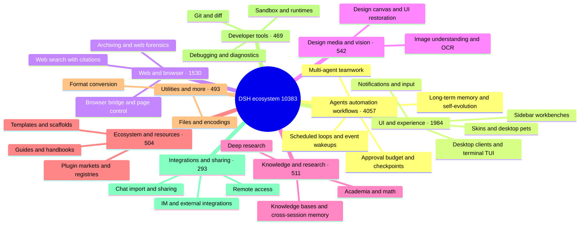

# 🐳 Awesome DSH Plugins

> Find the DeepSeek Harness plugin that truly fits you in 30 seconds. Every day, we automatically fetch and review GitHub projects tagged `dsh-plugin`: real plugins are organized by category, while topic riders are removed. With scenario-based categories, featured picks, popularity rankings, and visual guides, you can quickly see what each plugin does, who it is for, and how to get started. Star this project and help great plugins get discovered faster.

[中文](./README.md) · [Full catalog](./CATALOG.md) · [Star Top 200](./TOP200.md) · [Author showcase](./SHOWCASE.md) · [Recommend a plugin](./CONTRIBUTING.md) · [Machine-readable data](./data/repositories.json)

**If this list helps you discover something useful, consider leaving a Star ⭐ so more DSH users can find the ecosystem.**

## 🧭 Quick index

| You want to… | Go to |
| --- | --- |
| Pick a plugin in 30 seconds | [Featured picks](#-featured-picks): great community plugins organized around "what do you want DSH to do" |
| Install your first plugins | [Starter kits](#-starter-kits): pick one combo closest to your current problem |
| Browse the full ranking by stars | [Community leaderboard](#-community-leaderboard) (home Top 20) · [TOP200.md](./TOP200.md) (full Top 200) |
| Browse everything by category | [CATALOG.md](./CATALOG.md) (full catalog) · [Ecosystem at a glance](#-ecosystem-at-a-glance) |
| See what authors are submitting themselves | [Author showcase](#-author-showcase) (10 most recent on the home page) · [SHOWCASE.md](./SHOWCASE.md) (all entries) |
| Consume plugin data programmatically | [data/market.json](./data/market.json) — the curated downstream-market file (≤500 KB, see the [interface spec](https://github.com/bruc3van/dsh-desktop-safe-market/blob/master/docs/market-json-spec.md)); [data/repositories.json](./data/repositories.json) — daily automated snapshot with stars, license, and activity metadata |
| List or recommend your own plugin | [Recommend or correct an entry](#-recommend-or-correct-an-entry) / [CONTRIBUTING](./CONTRIBUTING.md) |

## 🗺️ Ecosystem at a glance

<!-- dsh:panorama:start -->
As of 2026-08-28 the catalog lists **10,383** verified repositories. Here is the shape of it:

<!-- dsh:panorama:end -->

To browse every project in a category, see [CATALOG.md](./CATALOG.md) — the catalog is split into one volume per category, and the index lists them all.

## ⭐ Featured picks

**These are not ranked by stars, but we prioritize community-verified high-star projects** — most picks come from the Star Top 200: they solve a clear problem, document themselves well, stay maintained, and have been validated by many users. A few are dozens-of-stars picks with no substitute. Start from your problem, find the closest line, and the answer is one click away. Inclusion is not an endorsement of security or compatibility. For the full star-ranked board, see the [Community leaderboard](#-community-leaderboard). Screenshots under each category below are taken from the repositories' own READMEs — click any screenshot to jump straight to its repository home page.

### 🖥️ Desktop & terminal

- **Want a standalone desktop client** instead of a browser tab: [dsh-desktop](https://github.com/bruc3van/dsh-desktop) — the authentic official Web UI, with little modification, and closing the window doesn't stop your task: it stays resident in the tray until you open it again. The installer bundles the official runtime, so you just double-click to launch — no Node.js, no commands to type. Smart mode reuses the local instance you're already running, and fixed-address mode connects straight to a Web UI you maintain yourself. On security it's hardened layer by layer — window sandboxing, navigation locking, a hijack-proof update chain, and least privilege — and it ships a bundled security market with a curated selection of 600+ plugins, all reviewed before they install.
- **Want a Claude Code-style terminal UI**: [dsh-TUI](https://github.com/ccch1mneyyy/dsh-TUI) · [dsh-tianshu-tui](https://github.com/huiliyi37/dsh-tianshu-tui) — Full-screen interactive terminals with a live status line, thought streaming, and context/TPS gauges; the tianshu build adds TDD and evidence-gate workflows.
- **Want to run DSH locally on an Android phone**: [dsh-mobile-apk](https://github.com/kelai141/dsh-mobile-apk) — An Android APK shell: WebView UI + embedded Termux runtime, SAF directory bridge, keep-alive service, and watchdog. To remote-control DSH already running on your computer, see [dsh-pocket](https://github.com/shaobeichen/dsh-pocket) below.

| | | |
| :---: | :---: | :---: |
|  [dsh-desktop](https://github.com/bruc3van/dsh-desktop) |  [dsh-desktop](https://github.com/bruc3van/dsh-desktop) |  [dsh-TUI](https://github.com/ccch1mneyyy/dsh-TUI) |
|  [dsh-tianshu-tui](https://github.com/huiliyi37/dsh-tianshu-tui) | | |

### 🧰 Interface workbenches

- **Want one install that covers common UI needs**: [dsh-web](https://github.com/zhu1090093659/dsh-web) — Task board, Git graph, side panel, remote mobile UI, desktop pet, live token stats, and a skin center in one collection (renamed from `dsh-web-ui`).
- **Want to see what is inside the context window**: [dsh-context](https://github.com/bowenliang123/dsh-context) — A Context tab in the Web UI showing what the model's context window is made of and how it evolves — helps time trimming and token control.
- **Want to turn the sidebar into a workbench**: [DSH-better-sidebar](https://github.com/omdsh-dev/DSH-better-sidebar) — File rendering/editing, terminal, Git, and subagents built in, with third-party tab extensions.
- **Want the working status line to come alive**: [working-activity](https://github.com/ccch1mneyyy/working-activity) — Real-time tool activity and progress, witty copy, model self-narration, and context warnings — no more boring waits.
- **Want the agent to operate a browser**: [dsh-browser](https://github.com/Lum1104/dsh-browser) · [BrowserSkill](https://github.com/Tencent/BrowserSkill) — dsh-browser is a Chrome side-panel extension that grants the current tab and acts on it inside your conversation; BrowserSkill is Tencent's bridge to a real, already-logged-in browser (a separate Agent Window, so your own browsing is not interrupted), with a first-class DSH plugin at `@wxg-prc-cpg/browser-skill-dsh-plugin`.

| | | |
| :---: | :---: | :---: |
|  [dsh-web](https://github.com/zhu1090093659/dsh-web) |  [dsh-context](https://github.com/bowenliang123/dsh-context) |  [BrowserSkill](https://github.com/Tencent/BrowserSkill) |

### 👀 Let the model see and search

- **Want to add visual understanding to DSH**: [modlens](https://github.com/liustack/modlens) · [dsh-vision-toolkit](https://github.com/Anionex/dsh-vision-toolkit) — modlens turns images into structured OCR/layout/semantics evidence; dsh-vision-toolkit covers image Q&A, long-screenshot OCR, UI restoration, and pixel diffs.
- **Want paste-and-go vision with no key and no Python**: [dsh-vision-router](https://github.com/ysr666/dsh-vision-router) — a built-in free vision chain (five-model anonymous fallback, no signup or key); image turns work like ordinary tool turns, with the model driving 10 `vision_*` pixel tools (ground, crop, describe, pixel diff, fix, palette, OCR, cutout, SVG trace, screenshot) in continuous multi-step sequences, plus structured evidence JSON; one-command install (Web profile), Node only.
- **Want the agent to search the web and X with citations**: [modsearch](https://github.com/liustack/modsearch) · [anysearch-dsh](https://github.com/anysearch-team/anysearch-dsh) — modsearch searches and fetches from the web/X inline, returning cited structured evidence; anysearch-dsh adds the AnySearch provider and advanced search tools as a complementary backend.
- **Want to generate images in the conversation**: [dsh-image-gen](https://github.com/shanliuling/dsh-image-gen) — Calls `generate_image` in chat (Gemini / OpenAI / Seedream / DashScope), with a gallery, fullscreen preview, and one-click download.

| | | |
| :---: | :---: | :---: |
|  [modlens](https://github.com/liustack/modlens) |  [dsh-vision-toolkit](https://github.com/Anionex/dsh-vision-toolkit) |  [dsh-vision-router](https://github.com/ysr666/dsh-vision-router) |
|  [dsh-image-gen](https://github.com/shanliuling/dsh-image-gen) | | |

### 🧠 Memory & unattended runs

- **Want auditable cross-session memory**: [mem9](https://github.com/mem9-ai/mem9) · [dsh-mnemon](https://github.com/omdsh-dev/dsh-mnemon) — mem9 is cross-session / cross-machine / cross-agent persistent shared memory with hybrid recall and a visual dashboard, with a native DeepSeek Harness integration; Mnemon is a three-tier memory control plane: persistent runtime context, searchable project documents, pluggable long-term memory, and smart routing.
- **Want coding tasks to run on a schedule**: [dsh-automation](https://github.com/titanwings/dsh-automation) — Run tasks in fresh Agent sessions on a plan, with schedules created and managed from the DSH Web UI or by an agent.
- **Requests keep dying to network hiccups and timeouts**, and you do not want to say "continue" by hand every time: [dsh-auto-continue](https://github.com/HsiangNianian/dsh-auto-continue) — Auto-sends a queued "continue" after non-human failures: error classification resumes only transient faults, adaptive backoff avoids hammering a broken upstream, and templated continue text keeps you in the loop — all configurable from the plugin settings card.
- **Want to rewind conversation and workspace state**: [dsh-turn-rewind](https://github.com/Anionex/dsh-turn-rewind) — Rewind to any earlier turn via a persistent Change Ledger, restoring both conversation and workspace state.
- **Want a desktop notification when a turn finishes**: [dsh-notification](https://github.com/omdsh-dev/dsh-notification) — Per-outcome notifications with keyword include/exclude rules so long tasks need no babysitting.

| | | |
| :---: | :---: | :---: |
|  [dsh-mnemon](https://github.com/omdsh-dev/dsh-mnemon) |  [dsh-automation](https://github.com/titanwings/dsh-automation) | |
|  [dsh-auto-continue](https://github.com/HsiangNianian/dsh-auto-continue) |  [dsh-turn-rewind](https://github.com/Anionex/dsh-turn-rewind) | |

### ✍️ Conversation details

- **Want to reference workspace files with @ mentions, like Codex**: [dsh-at-file](https://github.com/FSMargoo/dsh-at-file) — @-search workspace files in the composer and attach their path to the prompt. Official Harness now ships built-in `@file` / `@session`; prefer that for new installs. This plugin remains useful when you want the path picker and filter rules.
- **Want to tune reasoning effort**: [dsh-reasoning-effort](https://github.com/HanaAyane/dsh-reasoning-effort) — Codex-style model and reasoning-effort sliders, plus a big-fish running slider.
- **Want to navigate and annotate long conversations**: [dsh-annotation](https://github.com/omdsh-dev/dsh-annotation) · [dsh-navbar](https://github.com/vlln/dsh-navbar) — Codex-style text annotations and quick jumps between user-message nodes.

| | | |
| :---: | :---: | :---: |
|  [dsh-at-file](https://github.com/FSMargoo/dsh-at-file) |  [dsh-reasoning-effort](https://github.com/HanaAyane/dsh-reasoning-effort) |  [dsh-navbar](https://github.com/vlln/dsh-navbar) |

### 🎨 Creation & fun

- **Want to change the skin / set a custom wallpaper**: [dsh-deep-whale](https://github.com/Small-tailqwq/dsh-deep-whale) · [DSH-Transparent-UI-Plugin](https://github.com/WYH66666666/DSH-Transparent-UI-Plugin) — dsh-deep-whale is the most popular whale-girl skin series (CC BY-NC-SA, non-commercial); DSH-Transparent-UI-Plugin is a highly customizable frosted-glass theme — blur, frost, and background all adjustable, with a switch back to the stock UI anytime.
- **Want interactive UI rendered in chat**: [dsh-genui](https://github.com/omdsh-dev/dsh-genui) · [dsh-visualize](https://github.com/Nagi-ovo/dsh-visualize) — Charts, forms, quizzes, Mermaid diagrams, and 3D scenes rendered inline, or model-generated interactive visualization cards.
- **Want agents to operate a real design canvas / make slides**: [dsh-openpencil](https://github.com/ZSeven-W/dsh-openpencil) · [deepseek-design](https://github.com/Devin-AXIS/deepseek-design) — OpenPencil creates, edits, previews, and validates interactive multi-page designs; deepseek-design is a native Design / PPT / Video studio (template catalogs, canvas refinement, selection-aware Ask AI).
- **Want a companion in the workspace**: [whale-girl](https://github.com/vlln/whale-girl) · [dsh-pet](https://github.com/PC2005-cloud/dsh-pet) — A draggable, feedable, playable desktop companion with persistent progression; or one-line-install pets (28 transparent animations) with a DIY pipeline that crafts custom pets from AI video.
- **Want a bit of fun**: [dsh-ads](https://github.com/Nagi-ovo/dsh-ads) · [anime-find](https://github.com/cocofhu/anime-find) · [dsh-minigames](https://github.com/lhh010/dsh-minigames) — Turn DSH into a 2005 portal site; search anime across multiple sources with Bangumi ratings in-chat; or play 18 offline mini-games while waiting.

| | | |
| :---: | :---: | :---: |
|  [dsh-deep-whale](https://github.com/Small-tailqwq/dsh-deep-whale) |  [DSH-Transparent-UI-Plugin](https://github.com/WYH66666666/DSH-Transparent-UI-Plugin) |  [dsh-visualize](https://github.com/Nagi-ovo/dsh-visualize) |
|  [dsh-openpencil](https://github.com/ZSeven-W/dsh-openpencil) |  [dsh-pet](https://github.com/PC2005-cloud/dsh-pet) |  [dsh-ads](https://github.com/Nagi-ovo/dsh-ads) |
|  [anime-find](https://github.com/cocofhu/anime-find) | | |

### 🛠️ Development & workflows

- **Want to turn one session into a collaborating team**: [dsh-agent-teams](https://github.com/NanmiCoder/dsh-agent-teams) — The current session acts as the captain: create resumable subagents, split goals into tasks with dependencies, and coordinate members via direct messages, with a live Web UI activity panel.
- **Want to upgrade one-shot multi-agent runs into a workflow layer**: [dsh_workflow](https://github.com/omdsh-dev/dsh_workflow) — Brings Claude Code's UltraCode mode to DSH: workflows that can be generated, saved, governed, observed, and recovered.
- **Want fewer manual approvals, safely**: [dsh-auto-mode](https://github.com/NanmiCoder/dsh-auto-mode) — Safe automatic permissions for DeepSeek Harness.

| | | |
| :---: | :---: | :---: |
|  [dsh-agent-teams](https://github.com/NanmiCoder/dsh-agent-teams) | | |

### 🔀 Migration & integrations

- **Want to migrate chat histories from other tools into DSH**: [dsh-chat-import](https://github.com/Nwflower/dsh-chat-import) — Full-fidelity import from 13 sources (Claude Code/Codex/ChatGPT/Cursor/Gemini/Reasonix/opencode/ZCode/Grok Build/OpenClaw/Pi/Hermes/Kimi) into resumable DSH sessions, plus reverse export/sync back to Claude Code.
- **Want to drive DSH from WeChat / Feishu / QQ and other chats**: [dsh-im](https://github.com/xmanrui/dsh-im) · [dsh-qqbot](https://github.com/tencent-connect/dsh-qqbot) — dsh-im connects Feishu, WeChat, DingTalk, WeCom, QQ, Slack, Telegram, Discord, and WhatsApp from one settings page; use dsh-qqbot when you only want Tencent's official QQ Bot.

| | | |
| :---: | :---: | :---: |
|  [dsh-im](https://github.com/xmanrui/dsh-im) | | |

### 🔌 Remote & external collaboration

- **Want to remote-control DSH already running on your computer from a phone**: [dsh-pocket](https://github.com/shaobeichen/dsh-pocket) — Run `dsh web` on the computer, scan a QR code on the phone, and get a live mirror (LAN + public tunnel, access password, mobile layout). Check progress, send tasks, and tap approvals while you are away.
- **Want the agent to operate remote hosts over SSH**: [dsh-remote](https://github.com/flymysql/dsh-remote) — Multi-machine SSH (password / private key / agent / OTP / jump host) plus remote workspace selection and 21 `rw_*` tools (list / read / edit / exec / search / port forward / two-way SFTP); ships a 🌐 remote-files sidebar, an audit log, and self-update. Does not bind 0.0.0.0.

| | | |
| :---: | :---: | :---: |
|  [dsh-pocket](https://github.com/shaobeichen/dsh-pocket) | | |

### 💰 Usage & billing

- **Want a corner widget for balance and per-turn spend**: [DeepSeek-Balance-Whale-Widget](https://github.com/MeteorNOX/DeepSeek-Balance-Whale-Widget) — A draggable whale in the lower-right corner: account balance, today's spend, and a per-turn cost bubble. Works out of the box (default bookkeeping from balance deltas, no platform token required).
- **Want a token-usage and cost panel**: [dsh-usage-stats](https://github.com/Ychris12138/dsh-usage-stats) · [dsh-cost-meter](https://github.com/Han-1413141/dsh-cost-meter) — dsh-usage-stats adds a GitHub-style usage heatmap, per-model breakdowns, and DeepSeek account balance to the Web GUI; dsh-cost-meter tracks per-session and daily costs synced with official pricing.

| | | |
| :---: | :---: | :---: |
|  [DeepSeek-Balance-Whale-Widget](https://github.com/MeteorNOX/DeepSeek-Balance-Whale-Widget) |  [dsh-usage-stats](https://github.com/Ychris12138/dsh-usage-stats) |  [dsh-cost-meter](https://github.com/Han-1413141/dsh-cost-meter) |

### 🔑 Models & subscriptions

- **Want to use an existing ChatGPT / Claude / Grok subscription as a model**, without another API key: [dsh-plugin-subscriptions](https://github.com/V1ki/dsh-plugin-subscriptions) — OAuth in Settings for ChatGPT (Codex), Claude, Grok (X Premium), and GitHub Copilot. Logged-in providers join the model picker, with usage windows plus image/video generation tools.

| | | |
| :---: | :---: | :---: |
|  [dsh-plugin-subscriptions](https://github.com/V1ki/dsh-plugin-subscriptions) | | |

### 🌱 Ecosystem entry points

- **Want to review before you install (security first)**: [dsh-desktop-safe-market](https://github.com/bruc3van/dsh-desktop-safe-market) — a review-before-install DSH marketplace: the feed comes from this list's daily snapshot plus human curation, and "Safe install" executes nothing — it hands a security-review prompt to the agent, which actually reads the plugin's code, and only after it comes back clean do you decide whether to run the official install command. Off by default — it goes online only once you enable it, and the plugin itself has no interface that can run an install.
- **Want a plugin market right inside the DSH UI**: [dsh-market](https://github.com/dsh-market/dsh-market) · [DSH-Plugins-Marketplace](https://github.com/bradeGithub/DSH-Plugins-Marketplace) · [dsh-plugin-hub](https://github.com/Noob-stupid/dsh-plugin-hub) — dsh-market brings browse/search/one-click-install into the DSH UI; DSH-Plugins-Marketplace covers one-click browse/install/update of every GitHub dsh-plugin plugin; dsh-plugin-hub is a plugin manager & marketplace with one-click enable/disable, update detection, and one-click framework upgrade, covering all GitHub dsh-plugin plugins & skills.

| | | |
| :---: | :---: | :---: |
|  [dsh-desktop-safe-market](https://github.com/bruc3van/dsh-desktop-safe-market) |  [dsh-market](https://github.com/dsh-market/dsh-market) | |

### 🚀 Starter kits

You do not need to install everything. Start with the kit closest to the problem you have today:

| Kit | For | Combination |
| --- | --- | --- |
| Everyday experience | First install: start with the desktop client, then common input | [dsh-desktop](https://github.com/bruc3van/dsh-desktop) · [dsh-at-file](https://github.com/FSMargoo/dsh-at-file) |
| Terminal lover | Command-line fans who want a full-screen terminal | [dsh-TUI](https://github.com/ccch1mneyyy/dsh-TUI) · [dsh-tianshu-tui](https://github.com/huiliyi37/dsh-tianshu-tui) |
| Vision & search | Let a text-only model see, search, and draw | [modlens](https://github.com/liustack/modlens) · [modsearch](https://github.com/liustack/modsearch) · [dsh-image-gen](https://github.com/shanliuling/dsh-image-gen) |
| Look & feel | Skins, frosted glass, and desktop pets | [dsh-deep-whale](https://github.com/Small-tailqwq/dsh-deep-whale) · [DSH-Transparent-UI-Plugin](https://github.com/WYH66666666/DSH-Transparent-UI-Plugin) · [whale-girl](https://github.com/vlln/whale-girl) |
| Multi-agent teams | Hand complex tasks to a team of agents | [dsh-agent-teams](https://github.com/NanmiCoder/dsh-agent-teams) · [dsh_workflow](https://github.com/omdsh-dev/dsh_workflow) · [dsh-auto-mode](https://github.com/NanmiCoder/dsh-auto-mode) |
| Memory & long-running | Cross-session memory + auto-resume for unattended projects | [mem9](https://github.com/mem9-ai/mem9) · [dsh-mnemon](https://github.com/omdsh-dev/dsh-mnemon) · [dsh-auto-continue](https://github.com/HsiangNianian/dsh-auto-continue) |
| Phone remote | Use the DSH on your computer while you are away | [dsh-pocket](https://github.com/shaobeichen/dsh-pocket) |
| Subscription models | Use existing ChatGPT / Claude / Grok subscriptions, no API key | [dsh-plugin-subscriptions](https://github.com/V1ki/dsh-plugin-subscriptions) |

**Read first:** [dsh-handbook](https://github.com/Electricitysheep/dsh-handbook) — a deep 0-to-1 handbook for DSH: install, plugin development, performance tuning, and real-world case studies (Chinese + English PDF). Want to write your own plugins? Start with [hello-dsh](https://github.com/pingfanfan/hello-dsh) — a zero-to-plugin tutorial with 22 Chinese skill examples.

## 🏆 Community leaderboard

Community popularity by stars, from the 2026-08-28 snapshot. Repositories riding the `dsh-plugin` topic without being plugins, and editorially blacklisted repositories, are excluded — see [data/curated.json](./data/curated.json); new repositories first enter the [review queue](./data/review/pending.md) and rank only after the maintainer has verified them ([data/approved.json](./data/approved.json)). The home page shows the Top 20; the full Top 200 is in [TOP200.md](./TOP200.md). Ranking reflects popularity only — not quality, compatibility, or security.

<!-- dsh:leaderboard:start -->
| # | Project | ⭐ Stars | License |
| ---: | --- | ---: | --- |
| 1 | [yjh051108/dsh-routing-suite](https://github.com/yjh051108/dsh-routing-suite) | 6914 | MIT |
| 2 | [zhu1090093659/dsh-web](https://github.com/zhu1090093659/dsh-web) | 6309 | Apache-2.0 |
| 3 | [liustack/modlens](https://github.com/liustack/modlens) | 3732 | MIT |
| 4 | [omdsh-dev/DSH-better-sidebar](https://github.com/omdsh-dev/DSH-better-sidebar) | 3031 | MIT |
| 5 | [ccch1mneyyy/dsh-TUI](https://github.com/ccch1mneyyy/dsh-TUI) | 2635 | MIT |
| 6 | [dsh-market/dsh-market](https://github.com/dsh-market/dsh-market) | 2625 | MIT |
| 7 | [Small-tailqwq/dsh-deep-whale](https://github.com/Small-tailqwq/dsh-deep-whale) | 1776 | — |
| 8 | [Tencent/BrowserSkill](https://github.com/Tencent/BrowserSkill) | 1421 | MIT |
| 9 | [dsh-tauri-desk/deepseek-harness-desktop](https://github.com/dsh-tauri-desk/deepseek-harness-desktop) | 1304 | MIT |
| 10 | [mem9-ai/mem9](https://github.com/mem9-ai/mem9) | 1202 | Apache-2.0 |
| 11 | [MeteorNOX/DeepSeek-Balance-Whale-Widget](https://github.com/MeteorNOX/DeepSeek-Balance-Whale-Widget) | 1190 | MIT |
| 12 | [NanmiCoder/dsh-agent-teams](https://github.com/NanmiCoder/dsh-agent-teams) | 1133 | MIT |
| 13 | [bowenliang123/dsh-context](https://github.com/bowenliang123/dsh-context) | 1120 | Apache-2.0 |
| 14 | [ysr666/dsh-vision-router](https://github.com/ysr666/dsh-vision-router) | 1009 | MIT |
| 15 | [xmanrui/dsh-im](https://github.com/xmanrui/dsh-im) | 918 | MIT |
| 16 | [Anionex/dsh-vision-toolkit](https://github.com/Anionex/dsh-vision-toolkit) | 836 | MIT |
| 17 | [toby-bridges/api-relay-audit](https://github.com/toby-bridges/api-relay-audit) | 812 | AGPL-3.0 |
| 18 | [shaobeichen/dsh-pocket](https://github.com/shaobeichen/dsh-pocket) | 737 | GPL-2.0 |
| 19 | [Electricitysheep/dsh-handbook](https://github.com/Electricitysheep/dsh-handbook) | 695 | — |
| 20 | [ccch1mneyyy/working-activity](https://github.com/ccch1mneyyy/working-activity) | 655 | MIT |
<!-- dsh:leaderboard:end -->

[See the full Star Top 200 →](./TOP200.md)

## 🆕 Recently joined

Manually screened recent projects, updated from time to time:

| Project | Description | Created |
| --- | --- | --- |
| [Lsc-91-69/dsh-brain-compaction](https://github.com/Lsc-91-69/dsh-brain-compaction) | Human-brain-style context compaction: composes seven community compression/memory plugins into one coordinated, verifiable system to cut long-task token usage. | 2026-08-28 |
| [liiiubai/dsh-mcp-bridge](https://github.com/liiiubai/dsh-mcp-bridge) | Exposes a running DSH's tools as a standard MCP server: any MCP client (Claude Code, Codex…) calls them through a safe allowlist. | 2026-08-28 |
| [NimuStudio/NimuQDock-dsh](https://github.com/NimuStudio/NimuQDock-dsh) | Docks DSH into QQ with a persona engine: mood, energy and memory make the agent a lifelike group member that lurks and joins in. | 2026-08-27 |
| [xiaoshi7915/dsh-kb-manager](https://github.com/xiaoshi7915/dsh-kb-manager) | Local knowledge-base lifecycle: multi-format import, smart chunking, hybrid retrieval (vector + BM25 → RRF), 16 agent tools plus an optional web panel. | 2026-08-27 |
| [Luawig/dsh-cloudflare-access](https://github.com/Luawig/dsh-cloudflare-access) | Cloudflare Access JWT verification and remote privileged authorization: serve DSH behind a public hostname with Settings, Credentials and presets still working. | 2026-08-27 |
| [Tkingxiao/dsh-novel-solo](https://github.com/Tkingxiao/dsh-novel-solo) | Single-author novel pipeline hardened for quantized small models: slimmed tool catalog and output protocol so a local model can finish a full-length novel. | 2026-08-27 |
| [Niceck/dsh-hhxg-market](https://github.com/Niceck/dsh-hhxg-market) | A-share quant-data plugin: 7 free + 5 VIP tools covering daily snapshots, margin flows, market sentiment and theme heat — real data on ask. | 2026-08-27 |
| [gwsbhqt/dsh-insight](https://github.com/gwsbhqt/dsh-insight) | Insight panel: one screen showing where every plugin/service/tool/model in a profile came from, which config layer inserted or disabled it, and what runs right now (read-only). | 2026-08-25 |

## 📣 Author showcase

Self-submitted recommendations from plugin authors, following the [contributing rules](./CONTRIBUTING.md#作者自荐--self-promotion). **These entries are not editorially reviewed and carry no quality or security endorsement** — evaluate them yourself before installing (see Usage & safety below). At most 30 entries are kept — first in, first out; entries promoted to the [Featured picks](#-featured-picks) above are removed from this section without using a slot. The home page shows only the **10 most recent entries**; the complete list lives in [SHOWCASE.md](./SHOWCASE.md).

<!-- dsh:showcase:start -->
- **[dsh-win32](https://github.com/sjh9714/dsh-win32)** ([@sjh9714](https://github.com/sjh9714) · 2026-08-18) — Native Windows shell and Workspace Write sandbox presets for DSH without WSL. Sandboxed sessions use busybox-w32 and unrestricted sessions use Git Bash. It preserves GBK and UTF-16 reads, while `doctor` checks presets, bundles, write boundaries, and known setup problems. Windows CI covers persistent shell round trips and interrupts under a restricted token.
- **[dsh-meow-memory](https://github.com/Phant0Meow/dsh-meow-memory)** ([@Phant0Meow](https://github.com/Phant0Meow) · 2026-08-19) — Cross-session long-term memory for DeepSeek Harness: seven-layer node:sqlite store (soul/user/project/fact/lesson/topic/rules), cache-friendly injection on the first message, memory_* retrieve/read/write tools, per-message keyword matching, BM25 × Ebbinghaus-weighted retrieval, and per-window nightly consolidation (dream).
- **[dsh-maze](https://github.com/lamost423/dsh-maze)** ([@lamost423](https://github.com/lamost423) · 2026-08-20) — Trace Compare & Live Maze: draws how the agent actually explored on one wall-clock timeline — the main path, failed detours, backtracks, and subagent branches; upload 1–2 session logs for a single-run maze or a same-axis comparison (per-turn alignment plus a detour inventory), or watch the maze grow live in a session tab; all verdicts are deterministic rules with hover rationale — no LLM judging.
- **[dsh-feishu](https://github.com/PGZXB/dsh-feishu)** ([@PGZXB](https://github.com/PGZXB) · 2026-08-20) — DeepSeek Harness inside Feishu: one chat maps to one dsh session, with the command panel, approvals and questions all card-based and output streaming as live cards; one QR scan completes the setup, so you can drive your local agent from phone or desktop. Published on npm as `@dsh-feishu/dsh-feishu`.
- **[dsh-easyrewrite](https://github.com/Renzic-Stone/DSH-EasyRewrite)** ([@Renzic-Stone](https://github.com/Renzic-Stone) · 2026-08-21) — Inline edit and recall for your own user messages in DSH Web: click a bubble to edit in place, or hit the recall key to truncate and resend — lazy commit, seamless archive/replace, a version pager to flip through history, per-session draft persistence with timeout auto-backup, and a trilingual UI (zh/en/ja); official extension points only, zero source patches.
- **[tabbit-browser](https://github.com/Tabbit-Browser/dsh-tabbit)** ([@Tabbit-Browser](https://github.com/Tabbit-Browser) · 2026-08-21) — Lets the DSH agent drive your Tabbit Browser through the browser-owned, task-isolated Playwright CLI (`tabbit-cli`): real pages, real login state, real interactions, for web automation, information extraction, QA and benchmarks. Ships a `tabbit-browser` skill (persistent task spaces, locators and waits, screenshots, receipts and recovery; auto-registered with the plugin, called via `/tabbit-browser`) and a `tabbit_browser_install` preflight tool (detects stable editions ≥1.9.0 and the runtime; starts a DSH background job to download the region-appropriate installer when missing or outdated). One-command install: `dsh plugin --profile web add github:Tabbit-Browser/dsh-tabbit`. ⚠️ No LICENSE file in the repo (README states MIT).
- **[deepseek-harness-remote](https://github.com/liguobao/deepseek-harness-remote)** ([@liguobao](https://github.com/liguobao) · 2026-08-21) — Securely access DeepSeek Harness running on your work computer from another computer, a browser, or an Android device: the Host makes outbound connections only, session traffic is end-to-end encrypted, and remote sessions reuse the native Workspace and conversation UI without exposing a public port. ⚠️ The repository has no root license file; the Host plugin package is MIT-licensed.
- **[dsh-codex-subscription](https://github.com/WSL043/dsh-codex-subscription)** ([@WSL043](https://github.com/WSL043) · 2026-08-21) — Uses an existing ChatGPT/Codex subscription as a native DSH Web model provider: independent OAuth with no API key or Codex CLI, selectable subscription search, server-reported standard Codex/Spark quota, secret-free support diagnostics, and image generation in conversations. For users who want subscription models directly inside DSH without configuring another API key.
- **[dsh-meow-smooth](https://github.com/Phant0Meow/dsh-meow-smooth)** ([@Phant0Meow](https://github.com/Phant0Meow) · 2026-08-24) — Meow Smooth: makes DSH feel like a native app on a phone — the composer collapses on blur, touch Enter inserts real line breaks, accidental pinch-zoom is locked out, and the sidebar folds away on narrow screens, plus a dozen more mobile polish details; ships long-task finish/failure push notifications (iOS PWA Web Push with a Bark fallback) and an optional compression proxy (70–90% off historical responses on cellular). Fully self-contained client-side with zero changes to dsh itself; published as the meow-smooth npm package.
- **[dsh-rewind](https://github.com/SiriLee/dsh-rewind)** ([@SiriLee](https://github.com/SiriLee) · 2026-08-26) — In-place conversation rewind in the same session window without forking (Claude Code /rewind semantics): a per-message rewind button cuts the model context back to any user message, with optional Claude-Code-style file restore from disk-persisted before-backups; official extension points only, zero source patches.
<!-- dsh:showcase:end -->

[See all 30 showcase entries →](./SHOWCASE.md)

## 🔍 How this list is maintained

- **Built for users, not crawlers:** the front page is organized around "what I want to get done", not hundreds of repo names.
- **Layered: human picks + full index:** the front page carries only hand-screened featured picks and the showcase preview; [CATALOG.md](./CATALOG.md) and its per-category volumes list every verified repository; new repositories first enter the [review queue](./data/review/pending.md) and appear after verification and merge (convention: [data/review/README.md](./data/review/README.md)).
- **Automated data, human pages:** the raw snapshot and the review queue refresh daily by script; the catalog and Top 200 leaderboard are regenerated only after a human review merge (generators: [scripts/merge.mjs](./scripts/merge.mjs), [scripts/top.mjs](./scripts/top.mjs), switchable back to Top 100); the home-page featured picks, showcase, and recently-joined sections are edited by hand, so polluted API data (star inflation, topic riders) never rewrites recommendations automatically.
- **Riders removed:** repositories carrying the `dsh-plugin` topic without being DSH plugins (the platform itself, other agent tools, competing catalogs) and editorially blacklisted repositories are excluded from the catalog and leaderboard, with per-repo reasons recorded in [data/curated.json](./data/curated.json) (the leaderboard additionally honors `leaderboard_exclusions` for repos that stay in the catalog but do not rank) — auditable and contestable at any time.
- **Downstream market file:** [data/market.json](./data/market.json) is the curated file downstream markets consume (e.g. the DSH desktop plugin market): the snapshot plus curation, filtered, cleaned, and dealt round-robin across categories (≤600 rows, ≤500 KB). It is rebuilt on every daily snapshot refresh and immediately after every curation merge; the field and generation rules live in the downstream [publishing spec](https://github.com/bruc3van/dsh-desktop-safe-market/blob/master/docs/market-json-spec.md). The same runs also publish [MARKET.md](./MARKET.md), a read-only star-ranked rendering of the file for previewing the market on GitHub without installing anything.
- **Chinese by default, bilingual:** native readability for the main audience, with a dedicated English entry point.

As of 2026-08-28, the catalog lists **10,383** repositories across **32** primary languages; **9,211** declare a license and **10,348** are neither archived nor disabled (the catalog updates after each human review merge — see [CATALOG.md](./CATALOG.md) for current numbers).

## ⚠️ Usage & safety

Third-party plugins can read conversations, files, network traffic, or system resources. Before installing, check the source, permissions, license, install method, and recent activity — and try new plugins in an isolated environment first. This list is for discovery and organization only; it is not affiliated with or endorsed by DSH, and inclusion is not a security or compatibility endorsement.

## 🤝 Recommend or correct an entry

Spot a miss, a wrong category, or stale wording? Open an Issue or Pull Request:

- **Get your plugin listed:** a public repo tagged `dsh-plugin` that is actually a DSH plugin enters the [review queue](./data/review/pending.md) on the next daily refresh and appears in the full catalog after we verify it — **no PR to this repo needed**. Topic riders are removed, with reasons recorded in [data/curated.json](./data/curated.json).
- **Self-promote as an author:** if you own the plugin, append one entry (Chinese and English) to [SHOWCASE.md](./SHOWCASE.md) following the [contributing rules](./CONTRIBUTING.md#作者自荐--self-promotion) and sync the home-page showcase preview to the 10 most recent entries — no editorial review needed.
- **Get on the front page:** the featured picks and recently-joined sections are hand-maintained — open an Issue telling us what problem it solves and for whom, or edit the corresponding Markdown directly with your reasoning. The leaderboard [TOP200.md](./TOP200.md) is generated by script; to keep a repository out of the board, register it under `leaderboard_exclusions` in [data/curated.json](./data/curated.json) with a reason.

See [CONTRIBUTING.md](./CONTRIBUTING.md) for details.

## 📈 Star History

## 🔗 Related projects

**Maintained by the author**

- **[dsh-desktop](https://github.com/bruc3van/dsh-desktop)** — a standalone DeepSeek Harness client that keeps an agent safely resident on your desktop. The window loads the authentic official Web UI, with little modification; closing the window doesn't stop your task — it stays resident in the tray until you open it again; the installer bundles the official runtime, so you just double-click to launch. Smart mode reuses an existing local instance and fixed-address mode connects straight to a Web UI you maintain yourself; security is hardened layer by layer, and it ships a bundled security market with 600+ curated plugins, all reviewed before they install. (Its bundled marketplace's catalog data comes from this repository's [`market.json`](./data/market.json).)
- **[dsh-desktop-safe-market](https://github.com/bruc3van/dsh-desktop-safe-market)** — the review-before-install DSH marketplace. (The downstream market consuming this repository's [`market.json`](./data/market.json); it powers the Plugins marketplace bundled with the DSH desktop client.)

**Official repositories**

- **[deepseek-harness](https://github.com/deepseek-ai/deepseek-harness)** — DeepSeek Harness: Everything is a Plugin. The upstream project behind the official `dsh` and Web UI — every plugin in this catalog exists for it.

## License

This list is published under the [MIT License](./LICENSE); each listed project remains under its own license.
