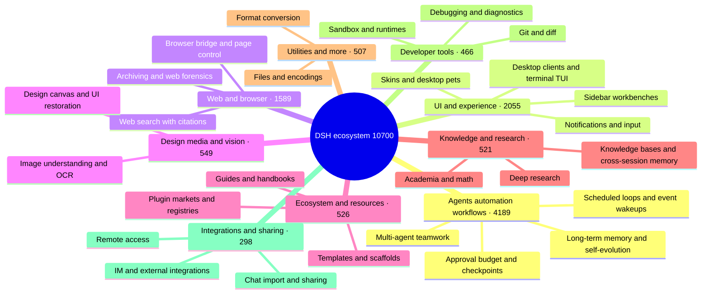

# 🐳 Awesome DSH Plugins

> Find the DeepSeek Harness plugin that truly fits you in 30 seconds. Every day, we automatically fetch and review GitHub projects tagged `dsh-plugin`: real plugins are organized by category, while topic riders are removed. With scenario-based categories, featured picks, popularity rankings, and visual guides, you can quickly see what each plugin does, who it is for, and how to get started. Star this project and help great plugins get discovered faster.

[中文](./README.md) · [Full catalog](./CATALOG.md) · [Star Top 200](./TOP200.md) · [Author showcase](./SHOWCASE.md) · [Recommend a plugin](./CONTRIBUTING.md) · [Machine-readable data](./data/repositories.json)

**If this list helps you discover something useful, consider leaving a Star ⭐ so more DSH users can find the ecosystem.**

## 🧭 Quick index

| You want to… | Go to |
| --- | --- |
| Pick a plugin in 30 seconds | [Featured picks](#-featured-picks): great community plugins organized around "what do you want DSH to do" |
| Install your first plugins | [Starter kits](#-starter-kits): pick one combo closest to your current problem |
| Browse the full ranking by stars | [Community leaderboard](#-community-leaderboard) (home Top 50) · [TOP200.md](./TOP200.md) (full Top 200) |
| Browse everything by category | [CATALOG.md](./CATALOG.md) (full catalog) · [Ecosystem at a glance](#-ecosystem-at-a-glance) |
| See what authors are submitting themselves | [Author showcase](#-author-showcase) (10 most recent on the home page) · [SHOWCASE.md](./SHOWCASE.md) (all entries) |
| Consume plugin data programmatically | [data/market.json](./data/market.json) — the curated downstream-market file (≤500 KB, see the [interface spec](https://github.com/bruc3van/dsh-desktop-safe-market/blob/master/docs/market-json-spec.md)); [data/repositories.json](./data/repositories.json) — daily automated snapshot with stars, license, and activity metadata |
| List or recommend your own plugin | [Recommend or correct an entry](#-recommend-or-correct-an-entry) / [CONTRIBUTING](./CONTRIBUTING.md) |

## 🗺️ Ecosystem at a glance

<!-- dsh:panorama:start -->
As of 2026-08-30 the catalog lists **10,700** verified repositories. Here is the shape of it:

<!-- dsh:panorama:end -->

To browse every project in a category, see [CATALOG.md](./CATALOG.md) — the catalog is split into one volume per category, and the index lists them all.

## ⭐ Featured picks

**These are not ranked by stars, but we prioritize community-verified high-star projects** — most picks come from the Star Top 200: they solve a clear problem, document themselves well, stay maintained, and have been validated by many users. A few are dozens-of-stars picks with no substitute. Start from your problem, find the closest line, and the answer is one click away. Inclusion is not an endorsement of security or compatibility. For the full star-ranked board, see the [Community leaderboard](#-community-leaderboard). Screenshots under each category below are taken from the repositories' own READMEs — click any screenshot to jump straight to its repository home page.

### 🖥️ Desktop & terminal

- **Want a standalone desktop client** instead of a browser tab: [dsh-desktop](https://github.com/bruc3van/dsh-desktop) — the authentic official Web UI, with little modification, and closing the window doesn't stop your task: it stays resident in the tray until you open it again. The installer bundles the official runtime, so you just double-click to launch — no Node.js, no commands to type. Smart mode reuses the local instance you're already running, and fixed-address mode connects straight to a Web UI you maintain yourself. On security it's hardened layer by layer — window sandboxing, navigation locking, a hijack-proof update chain, and least privilege — and it ships a bundled security market with a curated selection of 600+ plugins, all reviewed before they install.
- **Want a Claude Code-style terminal UI**: [dsh-TUI](https://github.com/ccch1mneyyy/dsh-TUI) · [dsh-tianshu-tui](https://github.com/huiliyi37/dsh-tianshu-tui) — Full-screen interactive terminals with a live status line, thought streaming, and context/TPS gauges; the tianshu build adds TDD and evidence-gate workflows.
- **Want to run DSH locally on an Android phone**: [dsh-mobile-apk](https://github.com/kelai141/dsh-mobile-apk) — An Android APK shell: WebView UI + embedded Termux runtime, SAF directory bridge, keep-alive service, and watchdog. To remote-control DSH already running on your computer, see [dsh-pocket](https://github.com/shaobeichen/dsh-pocket) below.

| | | |
| :---: | :---: | :---: |
|  [dsh-desktop](https://github.com/bruc3van/dsh-desktop) |  [dsh-desktop](https://github.com/bruc3van/dsh-desktop) |  [dsh-TUI](https://github.com/ccch1mneyyy/dsh-TUI) |
|  [dsh-tianshu-tui](https://github.com/huiliyi37/dsh-tianshu-tui) | | |

### 🧰 Interface workbenches

- **Want one install that covers common UI needs**: [dsh-web](https://github.com/zhu1090093659/dsh-web) — Task board, Git graph, side panel, remote mobile UI, desktop pet, live token stats, and a skin center in one collection (renamed from `dsh-web-ui`).
- **Want to see what is inside the context window**: [dsh-context](https://github.com/bowenliang123/dsh-context) — A Context tab in the Web UI showing what the model's context window is made of and how it evolves — helps time trimming and token control.
- **Want to turn the sidebar into a workbench**: [DSH-better-sidebar](https://github.com/omdsh-dev/DSH-better-sidebar) — File rendering/editing, terminal, Git, and subagents built in, with third-party tab extensions.
- **Want all your agent projects in one management console**: [dsh-worktable](https://github.com/Aisland-SJL/dsh-worktable) — A sidebar app drawer, dockable split workspaces, and a live control room watching every project.
- **Want a real office environment inside DSH**: [dsh-univer-office](https://github.com/dream-num/dsh-univer-office) — From the makers of Univer: spreadsheets, docs, slides, canvases, and relational tables brought into the conversation, with connected data.
- **Want the working status line to come alive**: [working-activity](https://github.com/ccch1mneyyy/working-activity) — Real-time tool activity and progress, witty copy, model self-narration, and context warnings — no more boring waits.
- **Want the agent to operate a browser**: [dsh-browser](https://github.com/Lum1104/dsh-browser) · [BrowserSkill](https://github.com/Tencent/BrowserSkill) — dsh-browser is a Chrome side-panel extension that grants the current tab and acts on it inside your conversation; BrowserSkill is Tencent's bridge to a real, already-logged-in browser (a separate Agent Window, so your own browsing is not interrupted), with a first-class DSH plugin at `@wxg-prc-cpg/browser-skill-dsh-plugin`.

| | | |
| :---: | :---: | :---: |
|  [dsh-web](https://github.com/zhu1090093659/dsh-web) |  [dsh-context](https://github.com/bowenliang123/dsh-context) |  [BrowserSkill](https://github.com/Tencent/BrowserSkill) |
|  [dsh-worktable](https://github.com/Aisland-SJL/dsh-worktable) |  [dsh-univer-office](https://github.com/dream-num/dsh-univer-office) | |

### 👀 Let the model see and search

- **Want to add visual understanding to DSH**: [modlens](https://github.com/liustack/modlens) · [dsh-vision-toolkit](https://github.com/Anionex/dsh-vision-toolkit) — modlens turns images into structured OCR/layout/semantics evidence; dsh-vision-toolkit covers image Q&A, long-screenshot OCR, UI restoration, and pixel diffs.
- **Want paste-and-go vision with no key and no Python**: [dsh-vision-router](https://github.com/ysr666/dsh-vision-router) — a built-in free vision chain (five-model anonymous fallback, no signup or key); image turns work like ordinary tool turns, with the model driving 10 `vision_*` pixel tools (ground, crop, describe, pixel diff, fix, palette, OCR, cutout, SVG trace, screenshot) in continuous multi-step sequences, plus structured evidence JSON; one-command install (Web profile), Node only.
- **Want the agent to search the web and X with citations**: [modsearch](https://github.com/liustack/modsearch) · [anysearch-dsh](https://github.com/anysearch-team/anysearch-dsh) — modsearch searches and fetches from the web/X inline, returning cited structured evidence; anysearch-dsh adds the AnySearch provider and advanced search tools as a complementary backend.
- **Want to generate images in the conversation**: [dsh-image-gen](https://github.com/shanliuling/dsh-image-gen) — Calls `generate_image` in chat (Gemini / OpenAI / Seedream / DashScope), with a gallery, fullscreen preview, and one-click download.

| | | |
| :---: | :---: | :---: |
|  [modlens](https://github.com/liustack/modlens) |  [dsh-vision-toolkit](https://github.com/Anionex/dsh-vision-toolkit) |  [dsh-vision-router](https://github.com/ysr666/dsh-vision-router) |
|  [dsh-image-gen](https://github.com/shanliuling/dsh-image-gen) | | |

### 🧠 Memory & unattended runs

- **Want auditable cross-session memory**: [mem9](https://github.com/mem9-ai/mem9) · [dsh-mnemon](https://github.com/omdsh-dev/dsh-mnemon) — mem9 is cross-session / cross-machine / cross-agent persistent shared memory with hybrid recall and a visual dashboard, with a native DeepSeek Harness integration; Mnemon is a three-tier memory control plane: persistent runtime context, searchable project documents, pluggable long-term memory, and smart routing.
- **Want coding tasks to run on a schedule**: [dsh-automation](https://github.com/titanwings/dsh-automation) — Run tasks in fresh Agent sessions on a plan, with schedules created and managed from the DSH Web UI or by an agent.
- **Requests keep dying to network hiccups and timeouts**, and you do not want to say "continue" by hand every time: [dsh-auto-continue](https://github.com/HsiangNianian/dsh-auto-continue) — Auto-sends a queued "continue" after non-human failures: error classification resumes only transient faults, adaptive backoff avoids hammering a broken upstream, and templated continue text keeps you in the loop — all configurable from the plugin settings card.
- **Want to rewind conversation and workspace state**: [dsh-turn-rewind](https://github.com/Anionex/dsh-turn-rewind) — Rewind to any earlier turn via a persistent Change Ledger, restoring both conversation and workspace state.
- **Want a desktop notification when a turn finishes**: [dsh-notification](https://github.com/omdsh-dev/dsh-notification) — Per-outcome notifications with keyword include/exclude rules so long tasks need no babysitting.

| | | |
| :---: | :---: | :---: |
|  [dsh-mnemon](https://github.com/omdsh-dev/dsh-mnemon) |  [dsh-automation](https://github.com/titanwings/dsh-automation) | |
|  [dsh-auto-continue](https://github.com/HsiangNianian/dsh-auto-continue) |  [dsh-turn-rewind](https://github.com/Anionex/dsh-turn-rewind) | |

### ✍️ Conversation details

- **Want to reference workspace files with @ mentions, like Codex**: [dsh-at-file](https://github.com/FSMargoo/dsh-at-file) — @-search workspace files in the composer and attach their path to the prompt. Official Harness now ships built-in `@file` / `@session`; prefer that for new installs. This plugin remains useful when you want the path picker and filter rules.
- **Want to tune reasoning effort**: [dsh-reasoning-effort](https://github.com/HanaAyane/dsh-reasoning-effort) — Codex-style model and reasoning-effort sliders, plus a big-fish running slider.
- **Want to navigate and annotate long conversations**: [dsh-annotation](https://github.com/omdsh-dev/dsh-annotation) · [dsh-navbar](https://github.com/vlln/dsh-navbar) — Codex-style text annotations and quick jumps between user-message nodes.
- **Want conversations laid out on a canvas, organized by branches**: [dsh-synapse](https://github.com/liangmianya/dsh-synapse) — A canvas-based session explorer and branching workspace for untangling long, non-linear conversations.

| | | |
| :---: | :---: | :---: |
|  [dsh-at-file](https://github.com/FSMargoo/dsh-at-file) |  [dsh-reasoning-effort](https://github.com/HanaAyane/dsh-reasoning-effort) |  [dsh-navbar](https://github.com/vlln/dsh-navbar) |
|  [dsh-synapse](https://github.com/liangmianya/dsh-synapse) | | |

### 🎨 Creation & fun

- **Want to change the skin / set a custom wallpaper**: [dsh-deep-whale](https://github.com/Small-tailqwq/dsh-deep-whale) · [DSH-Transparent-UI-Plugin](https://github.com/WYH66666666/DSH-Transparent-UI-Plugin) — dsh-deep-whale is the most popular whale-girl skin series (CC BY-NC-SA, non-commercial); DSH-Transparent-UI-Plugin is a highly customizable frosted-glass theme — blur, frost, and background all adjustable, with a switch back to the stock UI anytime.
- **Want your local Wallpaper Engine wallpapers as the background**: [dsh-wallpaper-engine](https://github.com/elysia395/dsh-wallpaper-engine) — Turns local Wallpaper Engine wallpapers into the DSH web background: live video playback, a liquid-glass settings window, content ratings, and auto-rotate (⚠️ the repository does not ship a license yet).
- **Want interactive UI rendered in chat**: [dsh-genui](https://github.com/omdsh-dev/dsh-genui) · [dsh-visualize](https://github.com/Nagi-ovo/dsh-visualize) — Charts, forms, quizzes, Mermaid diagrams, and 3D scenes rendered inline, or model-generated interactive visualization cards.
- **Want agents to operate a real design canvas / make slides**: [dsh-openpencil](https://github.com/ZSeven-W/dsh-openpencil) · [deepseek-design](https://github.com/Devin-AXIS/deepseek-design) — OpenPencil creates, edits, previews, and validates interactive multi-page designs; deepseek-design is a native Design / PPT / Video studio (template catalogs, canvas refinement, selection-aware Ask AI).
- **Want to write novels or produce short dramas**: [oh-story-dsh](https://github.com/zenstory-ai/oh-story-dsh) — A plugin for novel writing and short-drama production, powered by Oh Story and Drama Skills.
- **Want a companion in the workspace**: [whale-girl](https://github.com/vlln/whale-girl) · [dsh-pet](https://github.com/PC2005-cloud/dsh-pet) — A draggable, feedable, playable desktop companion with persistent progression; or one-line-install pets (28 transparent animations) with a DIY pipeline that crafts custom pets from AI video.
- **Want a bit of fun**: [dsh-ads](https://github.com/Nagi-ovo/dsh-ads) · [anime-find](https://github.com/cocofhu/anime-find) · [dsh-minigames](https://github.com/lhh010/dsh-minigames) — Turn DSH into a 2005 portal site; search anime across multiple sources with Bangumi ratings in-chat; or play 18 offline mini-games while waiting.

| | | |
| :---: | :---: | :---: |
|  [dsh-deep-whale](https://github.com/Small-tailqwq/dsh-deep-whale) |  [DSH-Transparent-UI-Plugin](https://github.com/WYH66666666/DSH-Transparent-UI-Plugin) |  [dsh-visualize](https://github.com/Nagi-ovo/dsh-visualize) |
|  [dsh-openpencil](https://github.com/ZSeven-W/dsh-openpencil) |  [dsh-pet](https://github.com/PC2005-cloud/dsh-pet) |  [dsh-ads](https://github.com/Nagi-ovo/dsh-ads) |
|  [anime-find](https://github.com/cocofhu/anime-find) |  [dsh-wallpaper-engine](https://github.com/elysia395/dsh-wallpaper-engine) |  [oh-story-dsh](https://github.com/zenstory-ai/oh-story-dsh) |

### 🛠️ Development & workflows

- **Want to turn one session into a collaborating team**: [dsh-agent-teams](https://github.com/NanmiCoder/dsh-agent-teams) — The current session acts as the captain: create resumable subagents, split goals into tasks with dependencies, and coordinate members via direct messages, with a live Web UI activity panel.
- **Want to upgrade one-shot multi-agent runs into a workflow layer**: [dsh_workflow](https://github.com/omdsh-dev/dsh_workflow) — Brings Claude Code's UltraCode mode to DSH: workflows that can be generated, saved, governed, observed, and recovered.
- **Want fewer manual approvals, safely**: [dsh-auto-mode](https://github.com/NanmiCoder/dsh-auto-mode) — Safe automatic permissions for DeepSeek Harness.
- **Want a local task board for your agent team**: [DSH-taskboard](https://github.com/shengsheng90/DSH-taskboard) — A SQLite-backed native taskboard: projects, agent claim/review, and a native Web UI — no iframe, no second chat runtime.
- **Want the agent to drive an iOS Simulator or a real iPhone**: [dsh-ios](https://github.com/ZSeven-W/dsh-ios) — Run a live iOS Simulator (or a USB-connected iPhone) inside the conversation, with 22 tools that boot, build, and drive the UI by accessibility id.
- **Want agent workflows that compose and keep improving**: [dsh-evolve-modes](https://github.com/GraySilver/dsh-evolve-modes) — Composable task controls plus isolated, human-reviewed self-evolution, so the way it works keeps getting better.
- **Want DSH connected to your database for analysis**: [dsh-data-agent](https://github.com/omdsh-dev/dsh-data-agent) — Conversational data analysis and actionable business insights over your own database.

| | | |
| :---: | :---: | :---: |
|  [dsh-agent-teams](https://github.com/NanmiCoder/dsh-agent-teams) |  [DSH-taskboard](https://github.com/shengsheng90/DSH-taskboard) |  [dsh-ios](https://github.com/ZSeven-W/dsh-ios) |
|  [dsh-evolve-modes](https://github.com/GraySilver/dsh-evolve-modes) |  [dsh-data-agent](https://github.com/omdsh-dev/dsh-data-agent) | |

### 🔀 Migration & integrations

- **Want to migrate chat histories from other tools into DSH**: [dsh-chat-import](https://github.com/Nwflower/dsh-chat-import) — Full-fidelity import from 13 sources (Claude Code/Codex/ChatGPT/Cursor/Gemini/Reasonix/opencode/ZCode/Grok Build/OpenClaw/Pi/Hermes/Kimi) into resumable DSH sessions, plus reverse export/sync back to Claude Code.
- **Want to bring Pi-ecosystem extensions straight into DSH**: [pi2dsh](https://github.com/weijiafu14/pi2dsh) — One Pi Host ABI runs unmodified Pi extensions as native DSH plugins, bridging both ecosystems.
- **Want to drive DSH from WeChat / Feishu / QQ and other chats**: [dsh-im](https://github.com/xmanrui/dsh-im) · [dsh-qqbot](https://github.com/tencent-connect/dsh-qqbot) — dsh-im connects Feishu, WeChat, DingTalk, WeCom, QQ, Slack, Telegram, Discord, and WhatsApp from one settings page; use dsh-qqbot when you only want Tencent's official QQ Bot.

| | | |
| :---: | :---: | :---: |
|  [dsh-im](https://github.com/xmanrui/dsh-im) |  [pi2dsh](https://github.com/weijiafu14/pi2dsh) | |

### 🔌 Remote & external collaboration

- **Want to remote-control DSH already running on your computer from a phone**: [dsh-pocket](https://github.com/shaobeichen/dsh-pocket) — Run `dsh web` on the computer, scan a QR code on the phone, and get a live mirror (LAN + public tunnel, access password, mobile layout). Check progress, send tasks, and tap approvals while you are away.
- **Want the agent to operate remote hosts over SSH**: [dsh-remote](https://github.com/flymysql/dsh-remote) — Multi-machine SSH (password / private key / agent / OTP / jump host) plus remote workspace selection and 21 `rw_*` tools (list / read / edit / exec / search / port forward / two-way SFTP); ships a 🌐 remote-files sidebar, an audit log, and self-update. Does not bind 0.0.0.0.

| | | |
| :---: | :---: | :---: |
|  [dsh-pocket](https://github.com/shaobeichen/dsh-pocket) | | |

### 💰 Usage & billing

- **Want a corner widget for balance and per-turn spend**: [DeepSeek-Balance-Whale-Widget](https://github.com/MeteorNOX/DeepSeek-Balance-Whale-Widget) — A draggable whale in the lower-right corner: account balance, today's spend, and a per-turn cost bubble. Works out of the box (default bookkeeping from balance deltas, no platform token required).
- **Want a token-usage and cost panel**: [dsh-usage-stats](https://github.com/Ychris12138/dsh-usage-stats) · [dsh-cost-meter](https://github.com/Han-1413141/dsh-cost-meter) — dsh-usage-stats adds a GitHub-style usage heatmap, per-model breakdowns, and DeepSeek account balance to the Web GUI; dsh-cost-meter tracks per-session and daily costs synced with official pricing.
- **On relay sites and want usage attributed per site**: [TokenLedger](https://github.com/zh667/TokenLedger) — A token-usage ledger attributed per relay site — zero config, no credentials.

| | | |
| :---: | :---: | :---: |
|  [DeepSeek-Balance-Whale-Widget](https://github.com/MeteorNOX/DeepSeek-Balance-Whale-Widget) |  [dsh-usage-stats](https://github.com/Ychris12138/dsh-usage-stats) |  [dsh-cost-meter](https://github.com/Han-1413141/dsh-cost-meter) |
|  [TokenLedger](https://github.com/zh667/TokenLedger) | | |

### 🔑 Models & subscriptions

- **Want reasoning modes routed automatically by task**: [dsh-routing-suite](https://github.com/yjh051108/dsh-routing-suite) — The community leaderboard's #1, a routing suite: install the runtime injector first, then the task-aware reasoning-mode router preset (measured across P1–P23). The injector modifies runtime behavior — read the repository's notes before installing.
- **Want to use an existing ChatGPT / Claude / Grok subscription as a model**, without another API key: [dsh-plugin-subscriptions](https://github.com/V1ki/dsh-plugin-subscriptions) — OAuth in Settings for ChatGPT (Codex), Claude, Grok (X Premium), and GitHub Copilot. Logged-in providers join the model picker, with usage windows plus image/video generation tools.

| | | |
| :---: | :---: | :---: |
|  [dsh-plugin-subscriptions](https://github.com/V1ki/dsh-plugin-subscriptions) | | |

### 🛡️ Security & audit

- **Want to check whether your API relay has been tampered with**: [api-relay-audit](https://github.com/toby-bridges/api-relay-audit) — a local audit for AI API relays & LLM proxies: detects prompt injection, model substitution, tool-call rewriting, SSE anomalies, error leakage, and Web3 wallet risks. A single-file Python tool that produces redacted reports on the spot (AGPL-3.0).
- **Want a penetration-test mode for DSH, within authorized scope**: [dsh-pentest](https://github.com/howmp/dsh-pentest) — records objectives, exploration leads, validations, assets, and vulnerabilities, presented in the Web UI as an exploration chain, vulnerability, and asset views; authorization info stays on the record in every report (⚠️ the repository does not ship a license file yet).
- **Want a safety net that can undo a broken DSH setup**: [dsh-undo-savepoint](https://github.com/lire1131/dsh-undo-savepoint) — undo changes to config and plugin code, secret-safe snapshots, one-click SAFE MODE; and when DSH won't even boot, an offline CLI/GUI rolls you back.

| | | |
| :---: | :---: | :---: |
|  [api-relay-audit](https://github.com/toby-bridges/api-relay-audit) |  [dsh-pentest](https://github.com/howmp/dsh-pentest) |  [dsh-pentest](https://github.com/howmp/dsh-pentest) |
|  [dsh-undo-savepoint](https://github.com/lire1131/dsh-undo-savepoint) |  [dsh-undo-savepoint](https://github.com/lire1131/dsh-undo-savepoint) |  [dsh-undo-savepoint](https://github.com/lire1131/dsh-undo-savepoint) |

### 🌱 Ecosystem entry points

- **Want to review before you install (security first)**: [dsh-desktop-safe-market](https://github.com/bruc3van/dsh-desktop-safe-market) — a review-before-install DSH marketplace: the feed comes from this list's daily snapshot plus human curation, and "Safe install" executes nothing — it hands a security-review prompt to the agent, which actually reads the plugin's code, and only after it comes back clean do you decide whether to run the official install command. Off by default — it goes online only once you enable it, and the plugin itself has no interface that can run an install.
- **Want a plugin market right inside the DSH UI**: [dsh-market](https://github.com/dsh-market/dsh-market) · [DSH-Plugins-Marketplace](https://github.com/bradeGithub/DSH-Plugins-Marketplace) · [dsh-plugin-hub](https://github.com/Noob-stupid/dsh-plugin-hub) — dsh-market brings browse/search/one-click-install into the DSH UI; DSH-Plugins-Marketplace covers one-click browse/install/update of every GitHub dsh-plugin plugin; dsh-plugin-hub is a plugin manager & marketplace with one-click enable/disable, update detection, and one-click framework upgrade, covering all GitHub dsh-plugin plugins & skills.
- **Want DSH to find and install plugins by itself**: [dsh-find-plugins](https://github.com/Nagi-ovo/dsh-find-plugins) — A skill that has DSH search, install, and verify GitHub plugins.

| | | |
| :---: | :---: | :---: |
|  [dsh-desktop-safe-market](https://github.com/bruc3van/dsh-desktop-safe-market) |  [dsh-market](https://github.com/dsh-market/dsh-market) |  [dsh-find-plugins](https://github.com/Nagi-ovo/dsh-find-plugins) |

### 🚀 Starter kits

You do not need to install everything. Start with the kit closest to the problem you have today:

| Kit | For | Combination |
| --- | --- | --- |
| Everyday experience | First install: start with the desktop client, then turn the sidebar into a workbench | [dsh-desktop](https://github.com/bruc3van/dsh-desktop) · [DSH-better-sidebar](https://github.com/omdsh-dev/DSH-better-sidebar) |
| Review-before-install market | Review first, then install. Bundled in the desktop client; on plain Web, search-install `bruc3van/dsh-desktop-safe-market` | [dsh-desktop-safe-market](https://github.com/bruc3van/dsh-desktop-safe-market) |
| Terminal lover | Command-line fans who want a full-screen terminal (pick one) | [dsh-TUI](https://github.com/ccch1mneyyy/dsh-TUI) · [dsh-tianshu-tui](https://github.com/huiliyi37/dsh-tianshu-tui) |
| Search & image gen | Search the web in-chat and generate images (official models already see images; no vision plugin required) | [modsearch](https://github.com/liustack/modsearch) · [dsh-image-gen](https://github.com/shanliuling/dsh-image-gen) |
| Look & feel | Skins, frosted glass, and desktop pets | [dsh-deep-whale](https://github.com/Small-tailqwq/dsh-deep-whale) · [DSH-Transparent-UI-Plugin](https://github.com/WYH66666666/DSH-Transparent-UI-Plugin) · [whale-girl](https://github.com/vlln/whale-girl) |
| Multi-agent teams | Hand complex tasks to a team of agents | [dsh-agent-teams](https://github.com/NanmiCoder/dsh-agent-teams) · [dsh_workflow](https://github.com/omdsh-dev/dsh_workflow) · [dsh-auto-mode](https://github.com/NanmiCoder/dsh-auto-mode) |
| Memory & long-running | Cross-session memory (pick one) + auto-resume for unattended projects | [mem9](https://github.com/mem9-ai/mem9) or [dsh-mnemon](https://github.com/omdsh-dev/dsh-mnemon) · [dsh-auto-continue](https://github.com/HsiangNianian/dsh-auto-continue) |
| Phone remote | Use the DSH on your computer while you are away | [dsh-pocket](https://github.com/shaobeichen/dsh-pocket) |
| Subscription models | Use existing ChatGPT / Claude / Grok subscriptions, no API key | [dsh-plugin-subscriptions](https://github.com/V1ki/dsh-plugin-subscriptions) |

**Read first:** [dsh-handbook](https://github.com/Electricitysheep/dsh-handbook) — a deep 0-to-1 handbook for DSH: install, plugin development, performance tuning, and real-world case studies (Chinese + English PDF). Want to write your own plugins? Start with [hello-dsh](https://github.com/pingfanfan/hello-dsh) — a zero-to-plugin tutorial with 22 Chinese skill examples.

## 🏆 Community leaderboard

Community popularity by stars, from the 2026-08-30 snapshot. Repositories riding the `dsh-plugin` topic without being plugins, and editorially blacklisted repositories, are excluded — see [data/curated.json](./data/curated.json); new repositories first enter the [review queue](./data/review/pending.md) and rank only after the maintainer has verified them ([data/approved.json](./data/approved.json)). The home page shows the Top 50; the full Top 200 is in [TOP200.md](./TOP200.md). Ranking reflects popularity only — not quality, compatibility, or security.

<!-- dsh:leaderboard:start -->
| # | Project | Description | ⭐ Stars | License |
| ---: | --- | --- | ---: | --- |
| 1 | [yjh051108/dsh-routing-suite](https://github.com/yjh051108/dsh-routing-suite) | dsh-routing-suite — injector + router-standard kit: install the runtime… | 6970 | MIT |
| 2 | [liustack/modlens](https://github.com/liustack/modlens) | The first vision plugin for DeepSeek Harness, and the vision bridge for… | 3774 | MIT |
| 3 | [omdsh-dev/DSH-better-sidebar](https://github.com/omdsh-dev/DSH-better-sidebar) | 开放的侧边栏底座，支持三方拓展注册新侧边栏页面。内置文件渲染编辑/终端/侧边对话/Git/子代理页面 ｜ Open sidebar found… | 3126 | MIT |
| 4 | [ccch1mneyyy/dsh-TUI](https://github.com/ccch1mneyyy/dsh-TUI) | DSH 官方公众号收录的 TUI 补位插件：Claude Code 风，鲸鱼顶栏/实时状态/流式思考/双击 Esc 回滚/上下文进度+TPS。… | 2717 | MIT |
| 5 | [Small-tailqwq/dsh-deep-whale](https://github.com/Small-tailqwq/dsh-deep-whale) | Whale Girl skin series for DeepSeek Harness. 适用于 DeepSeek Harness 的，鲸鱼娘… | 1832 | — |
| 6 | [Tencent/BrowserSkill](https://github.com/Tencent/BrowserSkill) | Let AI agents use your real, logged-in browser without interrupting you… | 1541 | MIT |
| 7 | [MeteorNOX/DeepSeek-Balance-Whale-Widget](https://github.com/MeteorNOX/DeepSeek-Balance-Whale-Widget) | DeepSeek Harness（DSH）一只住在 DSH 界面右下角的小鲸鱼娘，帮你盯着DeepSeek账户余额。QQ弹弹，支持拖拽吸附、左… | 1380 | MIT |
| 8 | [mem9-ai/mem9](https://github.com/mem9-ai/mem9) | Unlimited memory for OpenClaw | 1202 | Apache-2.0 |
| 9 | [NanmiCoder/dsh-agent-teams](https://github.com/NanmiCoder/dsh-agent-teams) | AgentTeams plugin for DeepSeek Harness | 1201 | MIT |
| 10 | [bowenliang123/dsh-context](https://github.com/bowenliang123/dsh-context) | The best DeepSeek Harness plugin for context insight and management, wi… | 1185 | Apache-2.0 |
| 11 | [ysr666/dsh-vision-router](https://github.com/ysr666/dsh-vision-router) | Eyes for text-only DeepSeek Harness agents: built-in free vision chain… | 1031 | MIT |
| 12 | [xmanrui/dsh-im](https://github.com/xmanrui/dsh-im) | 通过扫码或机器人凭据把IM机器人接入DeepSeek Harness（支持飞书、微信、钉钉、企业微信、QQ、Slack、Telegram、Di… | 1001 | MIT |
| 13 | [Anionex/dsh-vision-toolkit](https://github.com/Anionex/dsh-vision-toolkit) | [dsh]为纯文本模型设计更强大的视觉工具箱：一行安装使用、粘贴图片直接识别、多张图片问答、截图到前端UI 还原等｜DeepSeek Harn… | 842 | MIT |
| 14 | [shaobeichen/dsh-pocket](https://github.com/shaobeichen/dsh-pocket) | 把 DeepSeek Harness 装进你的口袋：电脑上跑 dsh web，手机扫码即同步访问（局域网 + 公网，实时同屏）Put Deep… | 832 | GPL-2.0 |
| 15 | [toby-bridges/api-relay-audit](https://github.com/toby-bridges/api-relay-audit) | Local security audit for AI API relays and LLM proxies: detects prompt… | 819 | AGPL-3.0 |
| 16 | [ccch1mneyyy/working-activity](https://github.com/ccch1mneyyy/working-activity) | Lively Working-line extension for pi CLI and DSH | 656 | MIT |
| 17 | [Devin-AXIS/deepseek-design](https://github.com/Devin-AXIS/deepseek-design) | DeepSeek Harness 可编辑设计系统：AI 生成、可视化编辑、模板市场与 PPT｜Native Design & PPT Stud… | 612 | NOASSERTION |
| 18 | [Nagi-ovo/dsh-ads](https://github.com/Nagi-ovo/dsh-ads) | 把 DSH 变成 2005 年门户网站｜Parody ads, fake games, and popups for the DSH Web… | 590 | BSD-3-Clause |
| 19 | [Lum1104/dsh-browser](https://github.com/Lum1104/dsh-browser) | Chrome sidebar extension that lets DeepSeek Harness operate your browse… | 530 | MIT |
| 20 | [FSMargoo/dsh-at-file](https://github.com/FSMargoo/dsh-at-file) | Codex-style @file mentions for DeepSeek Harness: search workspace files… | 498 | MIT |
| 21 | [PC2005-cloud/dsh-pet](https://github.com/PC2005-cloud/dsh-pet) | DSH 桌面宠物：一行命令装好即用的透明动画小桌宠，支持多开、大小位置随心配置；还内置 DIY 素材链，能用 AI 视频自造专属宠物 | 484 | MIT |
| 22 | [syncable-dev/memtrace-public](https://github.com/syncable-dev/memtrace-public) | Structural memory for AI coding agents. Bi-temporal graph, MCP-native,… | 467 | NOASSERTION |
| 23 | [ZJU-LLMs/OpenStory](https://github.com/ZJU-LLMs/OpenStory) | An LLM-powered multi-agent framework for simulating interactive, evolvi… | 395 | Apache-2.0 |
| 24 | [WYH66666666/DSH-Transparent-UI-Plugin](https://github.com/WYH66666666/DSH-Transparent-UI-Plugin) | 是一层高自由度的玻璃质感主题，套在 DeepSeek Harness 网页端。顶栏、侧边栏、输入框、统计行、轨迹视图都成了磨砂玻璃片。玻璃模糊… | 392 | AGPL-3.0 |
| 25 | [Aisland-SJL/dsh-worktable](https://github.com/Aisland-SJL/dsh-worktable) | 🖥️ Agent-project workbench for DeepSeek Harness — sidebar app drawer +… | 383 | MIT |
| 26 | [omdsh-dev/dsh-genui](https://github.com/omdsh-dev/dsh-genui) | GenUI for DeepSeek Harness: interactive UI components rendered inline i… | 372 | MIT |
| 27 | [anysearch-team/anysearch-dsh](https://github.com/anysearch-team/anysearch-dsh) | AnySearch web search provider and advanced search tools for DeepSeek Ha… | 366 | MIT |
| 28 | [howmp/dsh-pentest](https://github.com/howmp/dsh-pentest) | 面向 DeepSeek Harness（dsh）的渗透测试模式  @CloverSecLabs | 327 | — |
| 29 | [liustack/modsearch](https://github.com/liustack/modsearch) | 🥇 The strongest free web search plugin for DeepSeek Harness, and the se… | 324 | MIT |
| 30 | [vlln/whale-girl](https://github.com/vlln/whale-girl) | DSH Web GUI 桌面宠物插件（QQ 宠物形态）：右下角悬浮、可拖拽/投喂/玩耍的积累型伙伴。 | 301 | MIT |
| 31 | [V1ki/dsh-plugin-subscriptions](https://github.com/V1ki/dsh-plugin-subscriptions) | Use ChatGPT (Codex), Claude, and Grok (X Premium) subscriptions as Deep… | 299 | MIT |
| 32 | [omdsh-dev/dsh-mnemon](https://github.com/omdsh-dev/dsh-mnemon) | Composable three-tier memory control plane for DeepSeek Harness: persis… | 296 | MIT |
| 33 | [shanliuling/dsh-image-gen](https://github.com/shanliuling/dsh-image-gen) | Generate images directly in DeepSeek Harness chats | 282 | MIT |
| 34 | [ZSeven-W/dsh-ios](https://github.com/ZSeven-W/dsh-ios) | DeepSeek Harness (DSH) plugin: a live iOS Simulator — and a USB-connect… | 268 | MIT |
| 35 | [EthanYoQ/Invoice-Downloader](https://github.com/EthanYoQ/Invoice-Downloader) | 电子发票整理与报销准备工具：从邮箱批量收集 PDF/OFD/XML 发票，OCR 识别、分类归档并生成 Excel 汇总；提供 Windows… | 266 | Apache-2.0 |
| 36 | [csyangwen/dsh-memory-evolve](https://github.com/csyangwen/dsh-memory-evolve) | 为 DeepSeek Harness 带来「跨会话长期记忆 + 后台自我进化」能力的纯插件实现：五轨记忆 · git 分支感知 · 回合内自我… | 261 | MIT |
| 37 | [liangmianya/dsh-synapse](https://github.com/liangmianya/dsh-synapse) | A visual, non-linear conversation workspace plugin for DeepSeek Harness… | 259 | MIT |
| 38 | [huiliyi37/dsh-tianshu-tui](https://github.com/huiliyi37/dsh-tianshu-tui) | 官方 DeepSeek Harness 的交互式终端 UI 插件：自研 ANSI 极简交互渲染、流式 Markdown/工具卡、16+ 主题、… | 250 | Apache-2.0 |
| 39 | [Nagi-ovo/dsh-visualize](https://github.com/Nagi-ovo/dsh-visualize) | 在 DSH 对话中生成交互式可视化｜Render model-generated interactive cards inside DSH c… | 231 | BSD-3-Clause |
| 40 | [Han-1413141/dsh-cost-meter](https://github.com/Han-1413141/dsh-cost-meter) | DeepSeek Harness session cost meter plugin: session/daily cost, budget,… | 225 | MIT |
| 41 | [zenstory-ai/oh-story-dsh](https://github.com/zenstory-ai/oh-story-dsh) | A DSH plugin for novel writing and short-drama production, powered by O… | 222 | MIT |
| 42 | [shengsheng90/DSH-taskboard](https://github.com/shengsheng90/DSH-taskboard) | Native local Taskboard plugin for DeepSeek Harness. SQLite-backed proje… | 219 | Apache-2.0 |
| 43 | [elysia395/dsh-wallpaper-engine](https://github.com/elysia395/dsh-wallpaper-engine) | 把本机 Wallpaper Engine 的壁纸变成 DSH 网页界面的背景：Video 动态播放、Web 以 iframe 加载、Scene… | 214 | — |
| 44 | [dream-num/dsh-univer-office](https://github.com/dream-num/dsh-univer-office) | Give DeepSeek Harness a real office environment.  Univer Office Plugin… | 204 | Apache-2.0 |
| 45 | [d-dev0101/open-sea-skin](https://github.com/d-dev0101/open-sea-skin) | WebGPU ocean skin for DeepSeek Harness — DSH plugin, Harness-only Chrom… | 194 | MIT |
| 46 | [zh667/TokenLedger](https://github.com/zh667/TokenLedger) | Relay-site attributed token usage for DeepSeek Harness — zero config, n… | 190 | MIT |
| 47 | [omdsh-dev/dsh-data-agent](https://github.com/omdsh-dev/dsh-data-agent) | Connect DSH to your database for conversational data analysis and actio… | 181 | MIT |
| 48 | [GraySilver/dsh-evolve-modes](https://github.com/GraySilver/dsh-evolve-modes) | 让 Agent 的工作方式可组合、可审查、可持续改进，最终实现 Agent Self Evoling。 DeepSeek Harness We… | 180 | MIT |
| 49 | [saya-ch/dsh-mobile](https://github.com/saya-ch/dsh-mobile) | DeepSeek Harness 的 Android App 与安全远程访问插件，支持局域网/远程连接和高度自定义的移动界面与扩展能力。 | 178 | Apache-2.0 |
| 50 | [weijiafu14/pi2dsh](https://github.com/weijiafu14/pi2dsh) | Bridge the Pi and DeepSeek Harness ecosystems: one Pi Host ABI runs unm… | 175 | MIT |
<!-- dsh:leaderboard:end -->

[See the full Star Top 200 →](./TOP200.md)

## 🆕 Recently joined

Manually screened recent projects, updated from time to time:

| Project | Description | Created |
| --- | --- | --- |
| [liguobao/ds-harness-remote](https://github.com/liguobao/ds-harness-remote) | Multi-device remote access built on the DSH plugin system: outbound-only host, end-to-end-encrypted P2P-first networking, and the same Harness sessions from PC, Android and Web clients. | 2026-08-14 |
| [Suiwan/whale-purse](https://github.com/Suiwan/whale-purse) | A whale desktop pet that watches your DeepSeek balance and session spend: drag her anywhere, click for a live panel with real-time cost, peak/off-peak pricing, budget alerts and history trends. | 2026-08-14 |
| [flymysql/dsh-memory](https://github.com/flymysql/dsh-memory) | Cross-session memory for DeepSeek Harness: memory_remember / recall / forget tools plus system-prompt injection, so the agent remembers the last conversation. | 2026-08-14 |
| [LaoYueHanNi/dsh-git-worktree](https://github.com/LaoYueHanNi/dsh-git-worktree) | Branch switching in the web UI with git-worktree isolation — parallel tasks stop stepping on each other. | 2026-08-16 |
| [liceses/dsh-workspace-tree](https://github.com/liceses/dsh-workspace-tree) | Rebuilds the DSH web sidebar workspace as a dual-mode filesystem tree: workspaces bind to directories, the session cwd is its directory, and environments are truly isolated. | 2026-08-18 |
| [PolinniZhong/dsh-session-workbench](https://github.com/PolinniZhong/dsh-session-workbench) | Session workbench: full-text search and recall across your session library, plus conversation-view management (show/hide tabs, drag-to-reorder). | 2026-08-21 |
| [zzy-12345678/dsh-file-convert](https://github.com/zzy-12345678/dsh-file-convert) | Local-first file conversion for DeepSeek Harness: images, PDF, data, audio/video and office docs — 7 tools, 26 conversions, no API keys, no uploads. | 2026-08-29 |
| [goldgish/dsh-gamepad-approval](https://github.com/goldgish/dsh-gamepad-approval) | Xbox gamepad hardware approval: high-risk agent tool calls need a physical button press — A to approve, B to deny. | 2026-08-30 |

## 📣 Author showcase

Self-submitted recommendations from plugin authors, following the [contributing rules](./CONTRIBUTING.md#作者自荐--self-promotion). **These entries are not editorially reviewed and carry no quality or security endorsement** — evaluate them yourself before installing (see Usage & safety below). At most 30 entries are kept — first in, first out; entries promoted to the [Featured picks](#-featured-picks) above are removed from this section without using a slot. The home page shows only the **10 most recent entries**; the complete list lives in [SHOWCASE.md](./SHOWCASE.md).

<!-- dsh:showcase:start -->
- **[dsh-meow-memory](https://github.com/Phant0Meow/dsh-meow-memory)** ([@Phant0Meow](https://github.com/Phant0Meow) · 2026-08-19) — Cross-session long-term memory for DeepSeek Harness: seven-layer node:sqlite store (soul/user/project/fact/lesson/topic/rules), cache-friendly injection on the first message, memory_* retrieve/read/write tools, per-message keyword matching, BM25 × Ebbinghaus-weighted retrieval, and per-window nightly consolidation (dream).
- **[dsh-maze](https://github.com/lamost423/dsh-maze)** ([@lamost423](https://github.com/lamost423) · 2026-08-20) — Trace Compare & Live Maze: draws how the agent actually explored on one wall-clock timeline — the main path, failed detours, backtracks, and subagent branches; upload 1–2 session logs for a single-run maze or a same-axis comparison (per-turn alignment plus a detour inventory), or watch the maze grow live in a session tab; all verdicts are deterministic rules with hover rationale — no LLM judging.
- **[dsh-feishu](https://github.com/PGZXB/dsh-feishu)** ([@PGZXB](https://github.com/PGZXB) · 2026-08-20) — DeepSeek Harness inside Feishu: one chat maps to one dsh session, with the command panel, approvals and questions all card-based and output streaming as live cards; one QR scan completes the setup, so you can drive your local agent from phone or desktop. Published on npm as `@dsh-feishu/dsh-feishu`.
- **[dsh-easyrewrite](https://github.com/Renzic-Stone/DSH-EasyRewrite)** ([@Renzic-Stone](https://github.com/Renzic-Stone) · 2026-08-21) — Inline edit and recall for your own user messages in DSH Web: click a bubble to edit in place, or hit the recall key to truncate and resend — lazy commit, seamless archive/replace, a version pager to flip through history, per-session draft persistence with timeout auto-backup, and a trilingual UI (zh/en/ja); official extension points only, zero source patches.
- **[tabbit-browser](https://github.com/Tabbit-Browser/dsh-tabbit)** ([@Tabbit-Browser](https://github.com/Tabbit-Browser) · 2026-08-21) — Lets the DSH agent drive your Tabbit Browser through the browser-owned, task-isolated Playwright CLI (`tabbit-cli`): real pages, real login state, real interactions, for web automation, information extraction, QA and benchmarks. Ships a `tabbit-browser` skill (persistent task spaces, locators and waits, screenshots, receipts and recovery; auto-registered with the plugin, called via `/tabbit-browser`) and a `tabbit_browser_install` preflight tool (detects stable editions ≥1.9.0 and the runtime; starts a DSH background job to download the region-appropriate installer when missing or outdated). One-command install: `dsh plugin --profile web add github:Tabbit-Browser/dsh-tabbit`. ⚠️ No LICENSE file in the repo (README states MIT).
- **[ds-harness-remote](https://github.com/liguobao/ds-harness-remote)** ([@liguobao](https://github.com/liguobao) · 2026-08-21) — Securely access DeepSeek Harness running on your work computer from another computer, a browser, or an Android device: the Host makes outbound connections only, session traffic is end-to-end encrypted, and remote sessions reuse the native Workspace and conversation UI without exposing a public port. ⚠️ The repository has no root license file; the Host plugin package is MIT-licensed.
- **[dsh-codex-subscription](https://github.com/WSL043/dsh-codex-subscription)** ([@WSL043](https://github.com/WSL043) · 2026-08-21) — Uses an existing ChatGPT/Codex subscription as a native DSH Web model provider: independent OAuth with no API key or Codex CLI, selectable subscription search, server-reported standard Codex/Spark quota, secret-free support diagnostics, and image generation in conversations. For users who want subscription models directly inside DSH without configuring another API key.
- **[dsh-meow-smooth](https://github.com/Phant0Meow/dsh-meow-smooth)** ([@Phant0Meow](https://github.com/Phant0Meow) · 2026-08-24) — Meow Smooth: makes DSH feel like a native app on a phone — the composer collapses on blur, touch Enter inserts real line breaks, accidental pinch-zoom is locked out, and the sidebar folds away on narrow screens, plus a dozen more mobile polish details; ships long-task finish/failure push notifications (iOS PWA Web Push with a Bark fallback) and an optional compression proxy (70–90% off historical responses on cellular). Fully self-contained client-side with zero changes to dsh itself; published as the meow-smooth npm package.
- **[dsh-rewind](https://github.com/SiriLee/dsh-rewind)** ([@SiriLee](https://github.com/SiriLee) · 2026-08-26) — In-place conversation rewind in the same session window without forking (Claude Code /rewind semantics): a per-message rewind button cuts the model context back to any user message, with optional Claude-Code-style file restore from disk-persisted before-backups; official extension points only, zero source patches.
- **[dsh-whale-musume](https://github.com/Sutera-Diffusus/dsh-whale-musume)** ([@Sutera-Diffusus](https://github.com/Sutera-Diffusus) · 2026-08-28) — Whale-girl desktop pet for the DSH web UI: pat-to-raise growth, work-state poses, 494 dialogue lines and 30 achievements; v2.0.0 adds balance care (local-only proxy, key never lands), proactive care, accessibility, growth diary and theme sync — all local, zero telemetry, MIT, 102 unit tests.
<!-- dsh:showcase:end -->

[See all 30 showcase entries →](./SHOWCASE.md)

## 🔍 How this list is maintained

- **Built for users, not crawlers:** the front page is organized around "what I want to get done", not hundreds of repo names.
- **Layered: human picks + full index:** the front page carries only hand-screened featured picks and the showcase preview; [CATALOG.md](./CATALOG.md) and its per-category volumes list every verified repository; new repositories first enter the [review queue](./data/review/pending.md) and appear after verification and merge (convention: [data/review/README.md](./data/review/README.md)).
- **Automated data, human pages:** the raw snapshot and the review queue refresh daily by script; the catalog and Top 200 leaderboard are regenerated only after a human review merge (generators: [scripts/merge.mjs](./scripts/merge.mjs), [scripts/top.mjs](./scripts/top.mjs), switchable back to Top 100); the home-page featured picks, showcase, and recently-joined sections are edited by hand, so polluted API data (star inflation, topic riders) never rewrites recommendations automatically.
- **Riders removed:** repositories carrying the `dsh-plugin` topic without being DSH plugins (the platform itself, other agent tools, competing catalogs) and editorially blacklisted repositories are excluded from the catalog and leaderboard, with per-repo reasons recorded in [data/curated.json](./data/curated.json) (the leaderboard additionally honors `leaderboard_exclusions` for repos that stay in the catalog but do not rank) — auditable and contestable at any time.
- **Downstream market file:** [data/market.json](./data/market.json) is the curated file downstream markets consume (e.g. the DSH desktop plugin market): the snapshot plus curation, filtered, cleaned, and dealt round-robin across categories (≤600 rows, ≤500 KB). It is rebuilt on every daily snapshot refresh and immediately after every curation merge; the field and generation rules live in the downstream [publishing spec](https://github.com/bruc3van/dsh-desktop-safe-market/blob/master/docs/market-json-spec.md). The same runs also publish [MARKET.md](./MARKET.md), a read-only star-ranked rendering of the file for previewing the market on GitHub without installing anything.
- **Chinese by default, bilingual:** native readability for the main audience, with a dedicated English entry point.

As of 2026-08-30, the catalog lists **10,700** repositories across **32** primary languages; **9,514** declare a license and **10,663** are neither archived nor disabled (the catalog updates after each human review merge — see [CATALOG.md](./CATALOG.md) for current numbers).

## ⚠️ Usage & safety

Third-party plugins can read conversations, files, network traffic, or system resources. Before installing, check the source, permissions, license, install method, and recent activity — and try new plugins in an isolated environment first. This list is for discovery and organization only; it is not affiliated with or endorsed by DSH, and inclusion is not a security or compatibility endorsement.

## 🤝 Recommend or correct an entry

Spot a miss, a wrong category, or stale wording? Open an Issue or Pull Request:

- **Get your plugin listed:** a public repo tagged `dsh-plugin` that is actually a DSH plugin enters the [review queue](./data/review/pending.md) on the next daily refresh and appears in the full catalog after we verify it — **no PR to this repo needed**. Topic riders are removed, with reasons recorded in [data/curated.json](./data/curated.json).
- **Self-promote as an author:** if you own the plugin, append one entry (Chinese and English) to [SHOWCASE.md](./SHOWCASE.md) following the [contributing rules](./CONTRIBUTING.md#作者自荐--self-promotion) and sync the home-page showcase preview to the 10 most recent entries — no editorial review needed.
- **Get on the front page:** the featured picks and recently-joined sections are hand-maintained — open an Issue telling us what problem it solves and for whom, or edit the corresponding Markdown directly with your reasoning. The leaderboard [TOP200.md](./TOP200.md) is generated by script; to keep a repository out of the board, register it under `leaderboard_exclusions` in [data/curated.json](./data/curated.json) with a reason.

See [CONTRIBUTING.md](./CONTRIBUTING.md) for details.

## 📈 Star History

## 🔗 Related projects

**Maintained by the author**

- **[dsh-desktop](https://github.com/bruc3van/dsh-desktop)** — a standalone DeepSeek Harness client that keeps an agent safely resident on your desktop. The window loads the authentic official Web UI, with little modification; closing the window doesn't stop your task — it stays resident in the tray until you open it again; the installer bundles the official runtime, so you just double-click to launch. Smart mode reuses an existing local instance and fixed-address mode connects straight to a Web UI you maintain yourself; security is hardened layer by layer, and it ships a bundled security market with 600+ curated plugins, all reviewed before they install. (Its bundled marketplace's catalog data comes from this repository's [`market.json`](./data/market.json).)
- **[dsh-desktop-safe-market](https://github.com/bruc3van/dsh-desktop-safe-market)** — the review-before-install DSH marketplace. (The downstream market consuming this repository's [`market.json`](./data/market.json); it powers the Plugins marketplace bundled with the DSH desktop client.)

**Official repositories**

- **[deepseek-harness](https://github.com/deepseek-ai/deepseek-harness)** — DeepSeek Harness: Everything is a Plugin. The upstream project behind the official `dsh` and Web UI — every plugin in this catalog exists for it.

## License

This list is published under the [MIT License](./LICENSE); each listed project remains under its own license.
