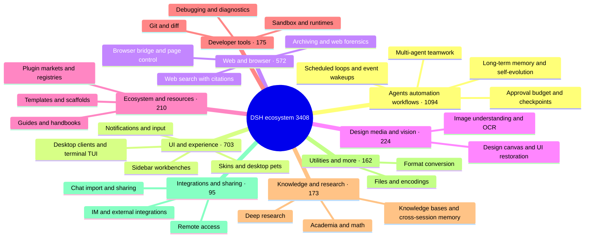

# 🐳 Awesome DSH Plugins

> Find the right DeepSeek Harness (DSH) plugin in 30 seconds.
> This is not another repository dump: every repo tagged `dsh-plugin` on GitHub is fetched automatically every day, then reviewed by humans — real plugins get listed, topic riders go to a public blacklist with reasons. And we tell you who each plugin is for and where to start.

[中文](./README.md) · [Full catalog](./CATALOG.md) · [Star Top 200](./TOP200.md) · [Author showcase](./SHOWCASE.md) · [Recommend a plugin](./CONTRIBUTING.md) · [Machine-readable data](./data/repositories.json)

**If this list helps you discover something useful, consider leaving a Star ⭐ so more DSH users can find the ecosystem.**

## 🧭 Quick index

| You want to… | Go to |
| --- | --- |
| Pick a plugin in 30 seconds | [Featured picks](#-featured-picks): great community plugins organized around "what do you want DSH to do" |
| Install your first plugins | [Starter kits](#-starter-kits): pick one combo closest to your current problem |
| Browse the full ranking by stars | [Community leaderboard](#-community-leaderboard) (home Top 20) · [TOP200.md](./TOP200.md) (full Top 200) |
| Browse everything by category | [CATALOG.md](./CATALOG.md) (full catalog) · [Ecosystem at a glance](#-ecosystem-at-a-glance) |
| See what authors are submitting themselves | [Author showcase](#-author-showcase) (10 most recent on the home page) · [SHOWCASE.md](./SHOWCASE.md) (all entries) |
| Consume plugin data programmatically | [data/market.json](./data/market.json) — the curated downstream-market file (≤500 KB, see the [interface spec](https://github.com/bruc3van/dsh-desktop-safe-market/blob/master/docs/market-json-spec.md)); [data/repositories.json](./data/repositories.json) — daily automated snapshot with stars, license, and activity metadata |
| List or recommend your own plugin | [Recommend or correct an entry](#-recommend-or-correct-an-entry) / [CONTRIBUTING](./CONTRIBUTING.md) |

## 🗺️ Ecosystem at a glance

As of 2026-08-16 the catalog lists **3,408** verified repositories. Here is the shape of it:

To browse every project in a category, see [CATALOG.md](./CATALOG.md).

## ⭐ Featured picks

**These are not ranked by stars.** We prioritize projects that solve a clear problem, document themselves well, are still maintained, and are representative — so you will find 1k-star projects next to a few-dozen-star one that has no substitute. Start from your problem, find the closest line, and the answer is one click away. Inclusion is not an endorsement of security or compatibility. For the full star-ranked board, see the [Community leaderboard](#-community-leaderboard).

### 🖥️ Desktop & terminal

- **Want a standalone desktop client** instead of a browser tab: [dsh-desktop](https://github.com/bruc3van/dsh-desktop) — Out-of-the-box: auto-reuse a running local instance or launch the bundled runtime with no Node.js/CLI install, plus remote connections, tray residency, and crash recovery.
- **Want a Claude Code-style terminal UI**: [dsh-TUI](https://github.com/ccch1mneyyy/dsh-TUI) · [dsh-tianshu-tui](https://github.com/huiliyi37/dsh-tianshu-tui) — Full-screen interactive terminals with a live status line, thought streaming, and context/TPS gauges; the tianshu build adds TDD and evidence-gate workflows.

### 🧰 Interface workbenches

- **Want one install that covers common UI needs**: [dsh-web-ui](https://github.com/zhu1090093659/dsh-web-ui) — Task board, Git graph, side panel, remote mobile UI, desktop pet, live token stats, and a skin center in one collection.
- **Want to see what is inside the context window**: [dsh-context](https://github.com/bowenliang123/dsh-context) — A Context tab in the Web UI showing what the model's context window is made of and how it evolves — helps time trimming and token control.
- **Want to turn the sidebar into a workbench**: [DSH-better-sidebar](https://github.com/omdsh-dev/DSH-better-sidebar) — File rendering/editing, terminal, Git, and subagents built in, with third-party tab extensions.
- **Want to inspect and operate the current web page from your dev conversation**: [dsh-browser](https://github.com/Lum1104/dsh-browser) — A Chrome side-panel extension that lets DSH operate your browser directly, with no vision capabilities required: grant the current tab and let DSH read and act on the page inside your existing conversation.

### 👀 Let the model see and search

- **Want to add visual understanding to DSH**: [modlens](https://github.com/liustack/modlens) · [dsh-vision-toolkit](https://github.com/Anionex/dsh-vision-toolkit) — modlens turns images into structured OCR/layout/semantics evidence; dsh-vision-toolkit covers image Q&A, long-screenshot OCR, UI restoration, and pixel diffs.
- **Want paste-and-go vision with no key and no Python**: [dsh-vision-router](https://github.com/ysr666/dsh-vision-router) — a built-in free vision chain (five-model anonymous fallback, no signup or key); image turns work like ordinary tool turns, with the model driving 10 `vision_*` pixel tools (ground, crop, describe, pixel diff, fix, palette, OCR, cutout, SVG trace, screenshot) in continuous multi-step sequences, plus structured evidence JSON; one-command install (Web profile), Node only.
- **Want the agent to search the web and X with citations**: [modsearch](https://github.com/liustack/modsearch) · [anysearch-dsh](https://github.com/anysearch-team/anysearch-dsh) — modsearch searches and fetches from the web/X inline, returning cited structured evidence; anysearch-dsh adds the AnySearch provider and advanced search tools as a complementary backend.

### 🧠 Memory & unattended runs

- **Want auditable cross-session memory**: [dsh-memory-evolve](https://github.com/csyangwen/dsh-memory-evolve) · [dsh-mneme](https://github.com/modusensus/dsh-mneme) — Five-track memory with skill self-evolution, or an SQLite + editable Markdown memory mirror you can audit.
- **Want to wake an agent on a schedule or event**: [dsh-loop](https://github.com/vlln/dsh-loop) · [dsh-sentinel](https://github.com/fuhefei/dsh-sentinel) — Scheduled runs plus file, command, HTTP, process, and webhook events.
- **Requests keep dying to network hiccups and timeouts**, and you do not want to say "continue" by hand every time: [dsh-auto-continue](https://github.com/HsiangNianian/dsh-auto-continue) — Auto-sends a queued "continue" after non-human failures: error classification resumes only transient faults, adaptive backoff avoids hammering a broken upstream, and templated continue text keeps you in the loop — all configurable from the plugin settings card.
- **Want to rewind conversation and workspace state**: [dsh-turn-rewind](https://github.com/Anionex/dsh-turn-rewind) — Rewind to any earlier turn via a persistent Change Ledger, restoring both conversation and workspace state.
- **Want a desktop notification when a turn finishes**: [dsh-notification](https://github.com/omdsh-dev/dsh-notification) — Per-outcome notifications with keyword include/exclude rules so long tasks need no babysitting.

### ✍️ Conversation details

- **Want to reference workspace files with @ mentions, like Codex**: [dsh-at-file](https://github.com/omdsh-dev/dsh-at-file) — @-search workspace files in the composer and attach their contents to the prompt, no copy-paste needed.
- **Want to navigate and annotate long conversations**: [dsh-navbar](https://github.com/vlln/dsh-navbar) · [dsh-annotation](https://github.com/omdsh-dev/dsh-annotation) — Jump between user-message nodes and attach Codex-style annotations.
- **Want to track background tasks**: [dsh-task-status](https://github.com/vlln/dsh-task-status) — Show task progress and a live output tail in the conversation view.
- **Want a live outline for long conversations**: [dsh-outline](https://github.com/urzeye/dsh-outline) — A tree of user questions and Markdown headings (H1-H6) that updates live while streaming, with click-to-jump highlight, expand-depth control, search, and per-session favorites.

### 🎨 Creation & fun

- **Want interactive UI rendered in chat**: [dsh-genui](https://github.com/omdsh-dev/dsh-genui) — Charts, forms, quizzes, Mermaid diagrams, and 3D scenes rendered inline.
- **Want agents to operate a real design canvas**: [dsh-openpencil](https://github.com/ZSeven-W/dsh-openpencil) — Create, edit, preview, and validate interactive multi-page OpenPencil designs.
- **Want a companion in the workspace**: [whale-girl](https://github.com/vlln/whale-girl) — A draggable, feedable, playable desktop companion with persistent progression.
- **Want to change the skin / set a custom wallpaper**: [dsh-skin](https://github.com/KinGao294/dsh-skin) · [dsh-deep-whale](https://github.com/Small-tailqwq/dsh-deep-whale) — dsh-skin switches --dsw-alias-* palettes and translucent wallpapers (Codex-style); dsh-deep-whale is the most popular whale-girl skin series (CC BY-NC-SA, non-commercial).

### 🛠️ Development & workflows

- **Want to turn existing application code into agent-callable capabilities**: [Code2Skill](https://github.com/leechen298/Code2Skill) — Generate Functions, MCP tools, workflow Skills, and offline tests from user-authorized frontend, backend, or full-stack source code, packaged as an installable DSH bundle.

### 🔀 Migration & integrations

- **Want to migrate chat histories from other tools into DSH**: [dsh-chat-import](https://github.com/Nwflower/dsh-chat-import) — Full-fidelity import from 13 sources (Claude Code/Codex/ChatGPT/Cursor/Gemini/Reasonix/opencode/ZCode/Grok Build/OpenClaw/Pi/Hermes/Kimi) into resumable DSH sessions, plus reverse export/sync back to Claude Code.

### 🔌 Remote & external collaboration

- **Want an external agent to drive Harness**: [dsh-harness-mcp-server](https://github.com/chushixixin/dsh-harness-mcp-server) — Runs an MCP server inside Harness so any MCP client (e.g. Hermes) can delegate coding tasks to Harness — a 'brain + arms' setup.
- **Want to access your local Harness securely from another device**: [dsh-remote](https://github.com/flymysql/dsh-remote) — Prints the exact commands for the live instance — SSH local forward, autossh keepalive, NAT-friendly reverse tunnel, and reverse-proxy access with --trusted-host — with one-click copy from the settings page. Respects the official safety design: no 0.0.0.0 hacks.

### 💰 Usage & billing

- **Want to track token usage and costs**: [dsh-usage-stats](https://github.com/Ychris12138/dsh-usage-stats) · [dsh-cost-meter](https://github.com/Han-1413141/dsh-cost-meter) — dsh-usage-stats adds a GitHub-style usage heatmap, per-model breakdowns, and DeepSeek account balance to the Web GUI; dsh-cost-meter tracks per-session and daily costs synced with official pricing.

### 🌱 Ecosystem entry points

- **Want to manage and discover plugins**: [plugin-registry](https://github.com/vlln/plugin-registry) · [dsh-market](https://github.com/dsh-market/dsh-market) — plugin-registry manages repository plugins in a browser console with development guidance; dsh-market brings a browse/search/one-click-install market into the DSH conversation UI.

### 🚀 Starter kits

You do not need to install everything. Start with the kit closest to the problem you have today:

| Kit | For | Combination |
| --- | --- | --- |
| Everyday experience | First plugin install: management, status, navigation | [plugin-registry](https://github.com/vlln/plugin-registry) · [dsh-task-status](https://github.com/vlln/dsh-task-status) · [dsh-navbar](https://github.com/vlln/dsh-navbar) |
| Automation | Scheduled loops + event-driven wakeups for unattended work | [dsh-loop](https://github.com/vlln/dsh-loop) · [dsh-sentinel](https://github.com/fuhefei/dsh-sentinel) |
| Vision & search | Let a text-only model see and search | [modlens](https://github.com/liustack/modlens) · [modsearch](https://github.com/liustack/modsearch) · [dsh-vision-toolkit](https://github.com/Anionex/dsh-vision-toolkit) |
| Creation & interfaces | Generative UI, real design canvas, visual understanding | [dsh-genui](https://github.com/omdsh-dev/dsh-genui) · [dsh-openpencil](https://github.com/ZSeven-W/dsh-openpencil) · [dsh-vision-toolkit](https://github.com/Anionex/dsh-vision-toolkit) |
| Memory & long-running | Cross-session memory + auto-resume for unattended projects | [dsh-memory-evolve](https://github.com/csyangwen/dsh-memory-evolve) · [dsh-mneme](https://github.com/modusensus/dsh-mneme) · [dsh-auto-continue](https://github.com/HsiangNianian/dsh-auto-continue) |

## 🏆 Community leaderboard

Community popularity by stars, from the 2026-08-16 snapshot. Repositories riding the `dsh-plugin` topic without being plugins, and editorially blacklisted repositories, are excluded — see [data/curated.json](./data/curated.json); new repositories first enter the [review queue](./data/review/pending.md) and rank only after the maintainer has verified them ([data/approved.json](./data/approved.json)). The home page shows the Top 20; the full Top 200 is in [TOP200.md](./TOP200.md). Ranking reflects popularity only — not quality, compatibility, or security.

| # | Project | ⭐ Stars | License |
| ---: | --- | ---: | --- |
| 1 | [zhu1090093659/dsh-web-ui](https://github.com/zhu1090093659/dsh-web-ui) | 2768 | Apache-2.0 |
| 2 | [liustack/modlens](https://github.com/liustack/modlens) | 1955 | MIT |
| 3 | [omdsh-dev/DSH-better-sidebar](https://github.com/omdsh-dev/DSH-better-sidebar) | 1302 | MIT |
| 4 | [ccch1mneyyy/dsh-TUI](https://github.com/ccch1mneyyy/dsh-TUI) | 1291 | MIT |
| 5 | [Small-tailqwq/dsh-deep-whale](https://github.com/Small-tailqwq/dsh-deep-whale) | 922 | — |
| 6 | [ccch1mneyyy/working-activity](https://github.com/ccch1mneyyy/working-activity) | 644 | MIT |
| 7 | [Anionex/dsh-vision-toolkit](https://github.com/Anionex/dsh-vision-toolkit) | 440 | MIT |
| 8 | [Nagi-ovo/dsh-ads](https://github.com/Nagi-ovo/dsh-ads) | 416 | BSD-3-Clause |
| 9 | [NanmiCoder/dsh-agent-teams](https://github.com/NanmiCoder/dsh-agent-teams) | 343 | MIT |
| 10 | [morluto/rea](https://github.com/morluto/rea) | 330 | MIT |
| 11 | [dsh-market/dsh-market](https://github.com/dsh-market/dsh-market) | 300 | MIT |
| 12 | [Electricitysheep/dsh-handbook](https://github.com/Electricitysheep/dsh-handbook) | 294 | — |
| 13 | [omdsh-dev/dsh-at-file](https://github.com/omdsh-dev/dsh-at-file) | 225 | MIT |
| 14 | [vibeinging/deepseek-harness-desktop-app](https://github.com/vibeinging/deepseek-harness-desktop-app) | 202 | MIT |
| 15 | [hust-open-atom-club/oh-dsh](https://github.com/hust-open-atom-club/oh-dsh) | 196 | MIT |
| 16 | [huiliyi37/dsh-tianshu-tui](https://github.com/huiliyi37/dsh-tianshu-tui) | 173 | Apache-2.0 |
| 17 | [vlln/whale-girl](https://github.com/vlln/whale-girl) | 173 | MIT |
| 18 | [Lum1104/dsh-browser](https://github.com/Lum1104/dsh-browser) | 167 | MIT |
| 19 | [ysr666/dsh-vision-router](https://github.com/ysr666/dsh-vision-router) | 155 | MIT |
| 20 | [bruc3van/awesome-dsh-plugin](https://github.com/bruc3van/awesome-dsh-plugin) | 152 | MIT |

[See the full Star Top 200 →](./TOP200.md)

## 🆕 Recently joined

Manually screened recent projects, updated from time to time:

| Project | Description | Created |
| --- | --- | --- |
| [mbj733/dsh-hermes-memory](https://github.com/mbj733/dsh-hermes-memory) | DSH (DeepSeek Harness) agent preset + plugin: Hermes-style cross-session memory & autonomous skill learning. | 2026-08-14 |
| [SnowAmberX/dsh-role-router](https://github.com/SnowAmberX/dsh-role-router) | Role-based model routing plugin for DeepSeek Harness: planner/subagent roles plus a settings card and composer summary | 2026-08-14 |
| [Yee-h/dsh-zen-proxy](https://github.com/Yee-h/dsh-zen-proxy) | dsh plugin: in-process proxy that injects official OpenCode Zen client headers, enabling Zen free models in dsh without the 429 FreeUsageLimitError | 2026-08-14 |
| [khiqwq/dsh-credentials-system](https://github.com/khiqwq/dsh-credentials-system) | System-bound encrypted credential provider for DeepSeek Harness | 2026-08-14 |
| [CodePrometheus/dsh-observability](https://github.com/CodePrometheus/dsh-observability) | Observability for DeepSeek Harness (dsh), use the OpenTelemetry Protocol | 2026-08-14 |
| [mixin-ai/dsh-file-changes](https://github.com/mixin-ai/dsh-file-changes) | DeepSeek Harness web plugin: per-turn file-change panel with diff viewing and filesystem reveal | 2026-08-14 |
| [pineapple880066/dsh-desktop-pets](https://github.com/pineapple880066/dsh-desktop-pets) | Codex-style desktop pets for DeepSeek Harness (dsh-plugin) | 2026-08-14 |
| [sherconan/dsh-web-recon](https://github.com/sherconan/dsh-web-recon) | Web-system reconnaissance · DeepSeek Harness plugin: learn how a web system works, once. Captures real endpoints and the accessibility tree into a reusable playbook. Zero deps, no Playwright. | 2026-08-14 |

## 📣 Author showcase

Self-submitted recommendations from plugin authors, following the [contributing rules](./CONTRIBUTING.md#作者自荐--self-promotion). **These entries are not editorially reviewed and carry no quality or security endorsement** — evaluate them yourself before installing (see Usage & safety below). At most 30 entries are kept — first in, first out; entries promoted to the [Featured picks](#-featured-picks) above are removed from this section without using a slot. The home page shows only the **10 most recent entries**; the complete list lives in [SHOWCASE.md](./SHOWCASE.md).

- **[dsh-tray](https://github.com/KAIbsb/dsh-tray)** ([@KAIbsb](https://github.com/KAIbsb) · 2026-08-15) — A Windows tray manager for DSH Web: one-click start/restart/stop, crash auto-restart, whale status icon, and autostart — pairs nicely with a browser app-mode window.
- **[dsh-plugin-guide](https://github.com/PerryLink/dsh-plugin-guide)** ([@PerryLink](https://github.com/PerryLink) · 2026-08-15) — The DSH plugin-development knowledge base as an on-demand agent skill: official constraints, task workflows, API references, and community pitfalls, installed as a bundle.
- **[dsh-auto-review](https://github.com/PerryLink/dsh-auto-review)** ([@PerryLink](https://github.com/PerryLink) · 2026-08-15) — Second-model AI auto-review on the approval answerer chain: a read-only reviewer subagent returns structured allow/deny verdicts with reasons and risk levels, fail-closed by default, with a full session-log audit trail; /auto-review command + Web review panel, npm-installable, pairs with dsh-permission-rules for a rules-first, AI-backstop loop.
- **[dsh-lsp-actions](https://github.com/PerryLink/dsh-lsp-actions)** ([@PerryLink](https://github.com/PerryLink) · 2026-08-15) — The LSP action surface for DeepSeek Harness: diagnostics, formatting, completion, code actions, symbols, signature help, inlay hints, and rename tools backed by real language servers; writes go through write-intent and the sandbox policy, everything else is read-only.
- **[dsh-doc-share](https://github.com/dawsondx/dsh-doc-share)** ([@dawsondx](https://github.com/dawsondx) · 2026-08-15) — Turns a DSH conversation into a formatted report with a cover, summary stats and per-turn chapters: turn-selector dialog (search / select-all / load older history), single-turn quick share, gen-UI rich components supported, and one-shot export to PNG / standalone HTML / PDF / Markdown.
- **[dsh-llm-ollama](https://github.com/NOirBRight/dsh-llm-ollama)** ([@NOirBRight](https://github.com/NOirBRight) · 2026-08-15) — Ollama Cloud native chat adapter: registers an `ollama-cloud` LLM route with native model discovery (context windows, vision, thinking, tools) and web search/fetch providers.
- **[dsh-abyss](https://github.com/Zongwei9888/dsh-abyss)** ([@Zongwei9888](https://github.com/Zongwei9888) · 2026-08-15) — Abyss turns one multi-agent run into an office you can watch: a card per agent (vendor, model, delegation depth, tokens, spend, context load), with assignments, messages and reports acted out verbatim from the session log; plus whole-tree cost and failure stats, attendance lanes, the delegation tree, and replay or one-click Markdown write-ups for any past case rebuilt from the durable logs. Zero runtime dependencies, no dsh code changed, data served on the product’s own origin under `/abyss`.
- **[dsh-mcp-lens](https://github.com/labmimors/dsh-mcp-lens)** ([@labmimors](https://github.com/labmimors) · 2026-08-15) — Keeps a large MCP catalog behind two model-visible interfaces, `mcp_search` and `mcp_call`, reveals a small set of exact schemas on demand, and applies the same `allowTools` / `denyTools` policy to search and calls; for DSH users connecting dozens to thousands of MCP tools, with a local schema-byte calculator and CI budget Action.
- **[dsh-movein](https://github.com/sjh9714/dsh-movein)** ([@sjh9714](https://github.com/sjh9714) · 2026-08-16) — Moves a whole Claude Code setup into DSH in one command: skills, MCP servers, hooks, subagents and permission rules (deny/ask bridge with a migration diff report), dry run by default; `--reverse` since v0.4 brings DSH-born skills back, dual boot instead of a one-way move.
- **[dsh-voice-input-plugin](https://github.com/Zhangbo-cn/dsh-voice-input-plugin)** ([@Zhangbo-cn](https://github.com/Zhangbo-cn) · 2026-08-16) — Composer mic for the Web UI: tap-to-monitor live transcription and hold-to-talk, with host Edge TTS reply reading that streams while the model generates, echo-pause during reading, and tap-to-stop.

[See all 30 showcase entries →](./SHOWCASE.md)

## 🔍 How this list is maintained

- **Built for users, not crawlers:** the front page is organized around "what I want to get done", not hundreds of repo names.
- **Layered: human picks + full index:** the front page carries only hand-screened featured picks and the showcase preview; [CATALOG.md](./CATALOG.md) lists every verified repository; new repositories first enter the [review queue](./data/review/pending.md) and appear after verification and merge (convention: [data/review/README.md](./data/review/README.md)).
- **Automated data, human pages:** the raw snapshot and the review queue refresh daily by script; the catalog and Top 200 leaderboard are regenerated only after a human review merge (generators: [scripts/merge.mjs](./scripts/merge.mjs), [scripts/top.mjs](./scripts/top.mjs), switchable back to Top 100); the home-page featured picks, showcase, and recently-joined sections are edited by hand, so polluted API data (star inflation, topic riders) never rewrites recommendations automatically.
- **Riders removed:** repositories carrying the `dsh-plugin` topic without being DSH plugins (the platform itself, other agent tools, competing catalogs) and editorially blacklisted repositories are excluded from the catalog and leaderboard, with per-repo reasons recorded in [data/curated.json](./data/curated.json) (the leaderboard additionally honors `leaderboard_exclusions` for repos that stay in the catalog but do not rank) — auditable and contestable at any time.
- **Downstream market file:** [data/market.json](./data/market.json) is the curated file downstream markets consume (e.g. the DSH desktop plugin market): the snapshot plus curation, filtered, cleaned, and dealt round-robin across categories (≤300 rows, ≤500 KB). It is rebuilt on every daily snapshot refresh and immediately after every curation merge; the field and generation rules live in the downstream [publishing spec](https://github.com/bruc3van/dsh-desktop-safe-market/blob/master/docs/market-json-spec.md). The same runs also publish [MARKET.md](./MARKET.md), a read-only star-ranked rendering of the file for previewing the market on GitHub without installing anything.
- **Chinese by default, bilingual:** native readability for the main audience, with a dedicated English entry point.

As of 2026-08-16, the catalog lists **3,408** repositories across **22** primary languages; **2,939** declare a license and **3,400** are neither archived nor disabled (the catalog updates after each human review merge — see [CATALOG.md](./CATALOG.md) for current numbers).

## ⚠️ Usage & safety

Third-party plugins can read conversations, files, network traffic, or system resources. Before installing, check the source, permissions, license, install method, and recent activity — and try new plugins in an isolated environment first. This list is for discovery and organization only; it is not affiliated with or endorsed by DSH, and inclusion is not a security or compatibility endorsement.

## 🤝 Recommend or correct an entry

Spot a miss, a wrong category, or stale wording? Open an Issue or Pull Request:

- **Get your plugin listed:** a public repo tagged `dsh-plugin` that is actually a DSH plugin enters the [review queue](./data/review/pending.md) on the next daily refresh and appears in the full catalog after we verify it — **no PR to this repo needed**. Topic riders are removed, with reasons recorded in [data/curated.json](./data/curated.json).
- **Self-promote as an author:** if you own the plugin, append one entry (Chinese and English) to [SHOWCASE.md](./SHOWCASE.md) following the [contributing rules](./CONTRIBUTING.md#作者自荐--self-promotion) and sync the home-page showcase preview to the 10 most recent entries — no editorial review needed.
- **Get on the front page:** the featured picks and recently-joined sections are hand-maintained — open an Issue telling us what problem it solves and for whom, or edit the corresponding Markdown directly with your reasoning. The leaderboard [TOP200.md](./TOP200.md) is generated by script; to keep a repository out of the board, register it under `leaderboard_exclusions` in [data/curated.json](./data/curated.json) with a reason.

See [CONTRIBUTING.md](./CONTRIBUTING.md) for details.

## 📈 Star History

## 🧭 Related projects

**Maintained by the author**

- **[dsh-desktop](https://github.com/bruc3van/dsh-desktop)** — a standalone DeepSeek Harness client that keeps an agent safely resident on your desktop: the official Web UI untouched, long-running tasks resident in the tray, curated plugins reviewed before they install. (Its bundled marketplace's catalog data comes from this repository's `market.json`.)
- **[dsh-desktop-safe-market](https://github.com/bruc3van/dsh-desktop-safe-market)** — the review-before-install DSH marketplace. (The downstream market consuming this repository's `market.json`; it powers the Plugins marketplace bundled with the DSH desktop client.)

**Official repositories**

- **[deepseek-harness](https://github.com/deepseek-ai/deepseek-harness)** — DeepSeek Harness: Everything is a Plugin. The upstream project behind the official `dsh` and Web UI — every plugin in this catalog exists for it.

## License

This list is published under the [MIT License](./LICENSE); each listed project remains under its own license.
