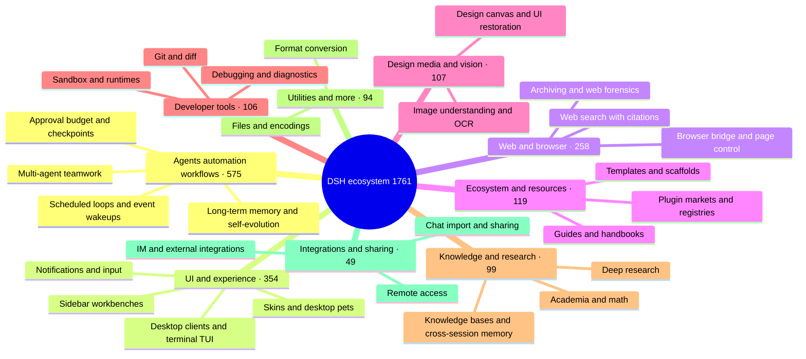

# 🐳 Awesome DSH Plugins

> Find the right DeepSeek Harness (DSH) plugin in 30 seconds.
> This is not another repository dump: out of 2,000+ repos tagged `dsh-plugin`, we surface the ones that solve a real problem, explain themselves clearly, and are still maintained — and tell you who each is for and where to start.

[中文](./README.md) · [Full catalog](./CATALOG.md) · [Star Top 100](./TOP100.md) · [Recommend a plugin](./CONTRIBUTING.md) · [Machine-readable data](./data/repositories.json)

**If this list helps you discover something useful, consider leaving a Star ⭐ so more DSH users can find the ecosystem.**

## How to use this list

This repository is split into three layers — pick the depth you need:

| You want to… | Go to |
| --- | --- |
| Pick a plugin in 30 seconds | Keep reading: [scenario picker](#-what-do-you-want-dsh-to-do) and [starter kits](#-new-to-dsh-plugins) |
| Browse everything by stars or category | [TOP100.md](./TOP100.md) (leaderboard) · [CATALOG.md](./CATALOG.md) (full catalog) |
| Consume plugin data programmatically | [data/repositories.json](./data/repositories.json) — daily automated snapshot with stars, license, and activity metadata |
| List your own plugin | No PR needed: tag your repo `dsh-plugin` and it enters the catalog automatically — see [Contributing](#-recommend-or-correct-an-entry) |
| You wrote a plugin and want front-page visibility | [Author showcase](#-author-showcase): submit one self-recommendation per the rules — no editorial review, first in first out |

## 🗺️ Ecosystem at a glance

As of 2026-08-14 the catalog lists **1,761** repositories. Here is the shape of it:

To browse every project in a category, see [CATALOG.md](./CATALOG.md).

## 🎯 What do you want DSH to do?

Start from your problem, not from a category. Find the closest row — the answer is one click away:

| I want to… | Start here | Why |
| --- | --- | --- |
| Run DSH as a standalone desktop app, not a browser tab | [dsh-desktop](https://github.com/bruc3van/dsh-desktop) · [deepseek-harness-desktop](https://github.com/anywhere-labs/deepseek-harness-desktop) | dsh-desktop is the out-of-the-box option: auto-reuse a running local instance or launch the bundled runtime with no Node.js/CLI install, plus remote connections, tray residency, and crash recovery; deepseek-harness-desktop is the ecosystem's most-starred desktop client (1.3k+ stars, macOS/Windows, service + window bundled). |
| Manage and discover plugins | [plugin-registry](https://github.com/vlln/plugin-registry) · [dsh-market](https://github.com/dsh-market/dsh-market) | plugin-registry manages repository plugins in a browser console with development guidance; dsh-market brings a browse/search/one-click-install market into the DSH conversation UI. |
| Turn existing application code into agent-callable capabilities | [Code2Skill](https://github.com/leechen298/Code2Skill) | Generate Functions, MCP tools, workflow Skills, and offline tests from user-authorized frontend, backend, or full-stack source code, packaged as an installable DSH bundle. |
| Track background tasks | [dsh-task-status](https://github.com/vlln/dsh-task-status) | Show task progress and a live output tail in the conversation view. |
| See what is inside the context window | [dsh-context](https://github.com/bowenliang123/dsh-context) | A Context tab in the Web UI showing what the model's context window is made of and how it evolves — helps time trimming and token control. |
| Wake an agent on a schedule or event | [dsh-loop](https://github.com/vlln/dsh-loop) · [dsh-sentinel](https://github.com/fuhefei/dsh-sentinel) | Cover scheduled runs plus file, command, HTTP, process, and webhook events. |
| Keep requests from dying to network hiccups and timeouts without manually saying "continue" every time | [dsh-auto-continue](https://github.com/HsiangNianian/dsh-auto-continue) | Auto-sends a queued "continue" after non-human failures: error classification resumes only transient faults, adaptive backoff avoids hammering a broken upstream, and templated continue text keeps you in the loop — all configurable from the plugin settings card. |
| Navigate and annotate long conversations | [dsh-navbar](https://github.com/vlln/dsh-navbar) · [dsh-annotation](https://github.com/omdsh-dev/dsh-annotation) | Jump between user-message nodes and attach Codex-style annotations. |
| Reference workspace files with @ mentions | [dsh-at-file](https://github.com/omdsh-dev/dsh-at-file) | @-search workspace files in the composer and attach their contents to the prompt, no copy-paste needed. |
| Render interactive UI in chat | [dsh-genui](https://github.com/omdsh-dev/dsh-genui) | Render charts, forms, quizzes, Mermaid diagrams, and 3D scenes inline. |
| Let agents operate a real design canvas | [dsh-openpencil](https://github.com/ZSeven-W/dsh-openpencil) | Create, edit, preview, and validate interactive multi-page OpenPencil designs. |
| Add visual understanding to DSH | [modlens](https://github.com/liustack/modlens) · [dsh-vision-toolkit](https://github.com/Anionex/dsh-vision-toolkit) · [dsh-luna-vision-bridge](https://github.com/ycp424c/dsh-luna-vision-bridge) | modlens turns images into structured OCR/layout/semantics evidence; dsh-vision-toolkit covers image Q&A, long-screenshot OCR, UI restoration, and pixel diffs — or bridge pure-text models to image input via a Luna transcription adapter. |
| Let the agent search the web and X with citations | [modsearch](https://github.com/liustack/modsearch) · [anysearch-dsh](https://github.com/anysearch-team/anysearch-dsh) | modsearch searches and fetches from the web/X inline, returning cited structured evidence; anysearch-dsh adds the AnySearch provider and advanced search tools as a complementary backend. |
| Inspect and operate the current web page from your dev conversation | [dsh-browser-bridge](https://github.com/ycp424c/dsh-browser-bridge) | Embeds the full DSH Web in a Chrome side panel; grant the current tab per prompt so DSH can read the DOM, styles, and console errors and interact with the page inside your existing conversation instead of a separate browser chat. |
| Turn the sidebar into a workbench | [DSH-better-sidebar](https://github.com/omdsh-dev/DSH-better-sidebar) | File rendering/editing, terminal, Git, and subagents built in, with third-party tab extensions. |
| Work from a Claude Code-style terminal UI | [dsh-TUI](https://github.com/ccch1mneyyy/dsh-TUI) · [dsh-tianshu-tui](https://github.com/huiliyi37/dsh-tianshu-tui) | Full-screen interactive terminals with a live status line, thought streaming, and context/TPS gauges; the tianshu build adds TDD and evidence-gate workflows. |
| Add auditable cross-session memory | [dsh-memory-evolve](https://github.com/csyangwen/dsh-memory-evolve) · [dsh-mneme](https://github.com/modusensus/dsh-mneme) | Five-track memory with skill self-evolution, or an SQLite + editable Markdown memory mirror you can audit. |
| Get notified when a turn finishes | [dsh-notification](https://github.com/omdsh-dev/dsh-notification) | Per-outcome notifications with keyword include/exclude rules so long tasks need no babysitting. |
| Rewind conversation and workspace state | [dsh-turn-rewind](https://github.com/Anionex/dsh-turn-rewind) | Rewind to any earlier turn via a persistent Change Ledger, restoring both conversation and workspace state. |
| Add a companion to the workspace | [whale-girl](https://github.com/vlln/whale-girl) | A draggable companion with feeding, play, and persistent progression. |
| Migrate chat histories from other tools into DSH | [dsh-chat-import](https://github.com/Nwflower/dsh-chat-import) | Full-fidelity import from 13 sources (Claude Code/Codex/ChatGPT/Cursor/Gemini/Reasonix/opencode/ZCode/Grok Build/OpenClaw/Pi/Hermes/Kimi) into resumable DSH sessions, plus reverse export/sync back to Claude Code. |
| Change the skin / set a custom wallpaper | [dsh-skin](https://github.com/KinGao294/dsh-skin) · [dsh-deep-whale](https://github.com/Small-tailqwq/dsh-deep-whale) | dsh-skin switches --dsw-alias-* palettes and translucent wallpapers (Codex-style); dsh-deep-whale is the most popular whale-girl skin series (CC BY-NC-SA, non-commercial). |
| Track token usage and costs | [dsh-web-billing](https://github.com/bpc-oss/dsh-web-billing) · [dsh-cost-meter](https://github.com/Han-1413141/dsh-cost-meter) | Auto-bill per message with official pricing (incl. peak/off-peak hours), keep a persistent cost ledger, show the account balance, and switch ¥/$ with the UI language. |
| Drive Harness from an external agent | [dsh-harness-mcp-server](https://github.com/chushixixin/dsh-harness-mcp-server) | Runs an MCP server inside Harness so any MCP client (e.g. Hermes) can delegate coding tasks to Harness — a 'brain + arms' setup. |
| Access your local Harness securely from another device | [dsh-remote](https://github.com/flymysql/dsh-remote) | Prints the exact commands for the live instance — SSH local forward, autossh keepalive, NAT-friendly reverse tunnel, and reverse-proxy access with --trusted-host — with one-click copy from the settings page. Respects the official safety design: no 0.0.0.0 hacks. |

## 🚀 New to DSH plugins?

You do not need to install everything. Start with the kit closest to the problem you have today:

| Kit | For | Combination |
| --- | --- | --- |
| Everyday experience | First plugin install: management, status, navigation | [plugin-registry](https://github.com/vlln/plugin-registry) · [dsh-task-status](https://github.com/vlln/dsh-task-status) · [dsh-navbar](https://github.com/vlln/dsh-navbar) |
| Automation | Scheduled loops + event-driven wakeups for unattended work | [dsh-loop](https://github.com/vlln/dsh-loop) · [dsh-sentinel](https://github.com/fuhefei/dsh-sentinel) |
| Vision & search | Let a text-only model see and search | [modlens](https://github.com/liustack/modlens) · [modsearch](https://github.com/liustack/modsearch) · [dsh-vision-toolkit](https://github.com/Anionex/dsh-vision-toolkit) |
| Creation & interfaces | Generative UI, real design canvas, visual understanding | [dsh-genui](https://github.com/omdsh-dev/dsh-genui) · [dsh-openpencil](https://github.com/ZSeven-W/dsh-openpencil) · [dsh-vision-toolkit](https://github.com/Anionex/dsh-vision-toolkit) |
| Memory & long-running | Cross-session memory + auto-resume for unattended projects | [dsh-memory-evolve](https://github.com/csyangwen/dsh-memory-evolve) · [dsh-mneme](https://github.com/modusensus/dsh-mneme) · [dsh-auto-continue](https://github.com/HsiangNianian/dsh-auto-continue) |

## ⭐ Editor's picks

**These are not ranked by stars.** We prioritize projects that solve a clear problem, document themselves well, are still maintained, and are representative — so you will find 1.2k-star projects next to a 4-star one that has no substitute. Inclusion is not an endorsement of security or compatibility.

### 🖥️ Desktop & terminal

- **[dsh-desktop](https://github.com/bruc3van/dsh-desktop)** (⭐ 20) — Community-maintained unofficial desktop client that loads the official Web UI directly: auto-reuse a running local instance or one-click launch the bundled dsh runtime with no extra Node.js/CLI install; smart connect, remote instances, tray residency, and crash recovery. `desktop` `out-of-the-box` `smart-connect`
- **[deepseek-harness-desktop](https://github.com/anywhere-labs/deepseek-harness-desktop)** (⭐ 1.3k) — The ecosystem's most-starred desktop client: service startup and window integration, ready to use on macOS/Windows. `desktop` `cross-platform`
- **[dsh-TUI](https://github.com/ccch1mneyyy/dsh-TUI)** (⭐ 835) — Claude Code-style full-screen interactive terminal: pixel-whale header, live status line, thought streaming, double-Esc rewind, context progress bar, and a TPS gauge; npm one-line install. `terminal-tui` `fullscreen` `cli-first`
- **[dsh-tianshu-tui](https://github.com/huiliyi37/dsh-tianshu-tui)** (⭐ 132) — Adds TDD and "evidence gate" workflows on top of a terminal UI, upgrading one-shot multi-agent runs into a governable engineering process. `terminal-tui` `tdd` `evidence-gate`

### 🧰 Interface workbenches

- **[DSH-better-sidebar](https://github.com/omdsh-dev/DSH-better-sidebar)** (⭐ 709) — The most popular sidebar enhancement: file rendering/editing, terminal, Git, and subagents built in, with third-party tab extensions that turn the sidebar into the main dev surface. `sidebar` `workbench` `extensible`
- **[dsh-web-ui](https://github.com/zhu1090093659/dsh-web-ui)** (⭐ 1.8k) — All-in-one collection: task board, Git graph, side panel, remote mobile UI, desktop pet, live token stats, and a skin center — one install covering many common interface needs. `collection` `skin-center` `mobile`

### 👀 Let the model see and search

- **[modlens](https://github.com/liustack/modlens)** (⭐ 1.2k) — The most-starred third-party plugin (MIT): paste an image and get structured JSON evidence with OCR, layout, and semantics, so text-only models can reliably see; ships with a Web UI. `vision` `ocr` `structured-evidence`
- **[modsearch](https://github.com/liustack/modsearch)** (⭐ 86) — Lets DSH search the web and X inline, returning cited structured JSON evidence (search/fetch/cite) so text-only models can answer from evidence; pairs with modlens as "see" + "search". `search` `citations` `evidence`
- **[dsh-vision-toolkit](https://github.com/Anionex/dsh-vision-toolkit)** (⭐ 308) — Image Q&A, long-screenshot OCR, UI restoration, visual grounding, pixel diffs, and Artifacts — suited to frontend and visual work. `vision` `ocr` `ui-restore`

### 🧠 Memory & unattended runs

- **[dsh-memory-evolve](https://github.com/csyangwen/dsh-memory-evolve)** (⭐ 50) — Five-track long-term memory as a pure plugin: git-branch awareness, in-turn self-review, skill self-evolution with a skill manager, four-track todos, and session search — zero core changes, zero runtime deps, clean uninstall. `memory` `self-evolution` `zero-deps`
- **[dsh-mneme](https://github.com/modusensus/dsh-mneme)** (⭐ 8) — SQLite plus a human-editable Markdown mirror, so memory is not a black box; autoDream dedupes/merges/adjudicates in the background and refines over time. Memory should not be the agent's decision alone. `memory-sovereignty` `cross-session` `autodream`
- **[dsh-auto-continue](https://github.com/HsiangNianian/dsh-auto-continue)** (⭐ 10) — After a turn fails from a network hiccup, timeout, or host crash, it auto-sends "continue": error classification (skips permanent auth/balance errors), adaptive backoff, templated continue text, and browser notifications — unattended runs pick themselves back up. `auto-resume` `unattended` `error-classification`
- **[dsh-sentinel](https://github.com/fuhefei/dsh-sentinel)** (⭐ 4) — Watches files, commands, HTTP, processes, or webhooks and wakes DSH when conditions are met — upgrading loops from scheduled to event-driven. `event-driven` `monitoring` `automation`

### ✍️ Conversation details

- **[dsh-at-file](https://github.com/omdsh-dev/dsh-at-file)** (⭐ 117) — @-search workspace files in the composer and attach contents to the prompt, no copy-paste; official bundle, zero core changes. `@file` `workspace` `input`
- **[dsh-annotation](https://github.com/omdsh-dev/dsh-annotation)** (⭐ 39) — Select text, attach annotations, and send them with the message; replies can address each annotation — suited to review, code review, and precise feedback. `annotation` `precise-feedback` `zero-core-changes`
- **[dsh-navbar](https://github.com/vlln/dsh-navbar)** (⭐ 15) — Jump to any user message node in long conversations. `long-conversations` `navigation`
- **[dsh-task-status](https://github.com/vlln/dsh-task-status)** (⭐ 7) — Puts background-task progress and a live output tail back into the conversation view — great for builds, downloads, and long test runs. `background-tasks` `live-output` `observability`
- **[dsh-notification](https://github.com/omdsh-dev/dsh-notification)** (⭐ 38) — Desktop notifications when a turn completes, per outcome (success/failure) with keyword include/exclude rules. `notifications` `unattended` `keyword-rules`
- **[dsh-outline](https://github.com/urzeye/dsh-outline)** (⭐ 3) — Real-time outline panel for the conversation page: a tree of user questions and Markdown headings (H1-H6) that updates live while streaming, with click-to-jump highlight, expand-depth control, search, and per-session favorites. `outline` `navigation` `web-ui`

### 🎨 Creation & fun

- **[dsh-genui](https://github.com/omdsh-dev/dsh-genui)** (⭐ 72) — Renders charts, forms, quizzes, Mermaid, and 3D scenes inline, and feeds user interactions back to the model. `generative-ui` `interactive` `visualization`
- **[DSH OpenPencil](https://github.com/ZSeven-W/dsh-openpencil)** (⭐ 65) — Connects DSH to OpenPencil so the agent understands canvas structure, nodes, and component relationships, then creates, edits, previews, and validates editable multi-page designs instead of returning a single image. `design-canvas` `multi-page` `editable`
- **[whale-girl](https://github.com/vlln/whale-girl)** (⭐ 121) — A draggable, feedable, playable desktop companion for the DSH Web GUI — a little company for long agent sessions. `desktop-pet` `companion` `web-ui`

### 🌱 Ecosystem entry points

- **[plugin-registry](https://github.com/vlln/plugin-registry)** (⭐ 34) — Visual plugin management for regular users plus make-dsh-plugin guidance for developers. The right first stop in the ecosystem. `beginner-friendly` `plugin-management` `dev-guidance`

## 🏆 Community leaderboard

Community popularity by stars, manually reviewed, from the 2026-08-14 snapshot (every project above pushed that day). Repositories riding the `dsh-plugin` topic without being plugins are excluded — see [data/curated.json](./data/curated.json). Full ranking in [TOP100.md](./TOP100.md). Ranking reflects popularity only — not quality, compatibility, or security.

| # | Project | ⭐ Stars | License |
| ---: | --- | ---: | --- |
| 1 | [zhu1090093659/dsh-web-ui](https://github.com/zhu1090093659/dsh-web-ui) | 1785 | Apache-2.0 |
| 2 | [anywhere-labs/deepseek-harness-desktop](https://github.com/anywhere-labs/deepseek-harness-desktop) | 1266 | MIT |
| 3 | [liustack/modlens](https://github.com/liustack/modlens) | 1208 | MIT |
| 4 | [ccch1mneyyy/dsh-TUI](https://github.com/ccch1mneyyy/dsh-TUI) | 835 | MIT |
| 5 | [omdsh-dev/DSH-better-sidebar](https://github.com/omdsh-dev/DSH-better-sidebar) | 709 | MIT |
| 6 | [Small-tailqwq/dsh-deep-whale](https://github.com/Small-tailqwq/dsh-deep-whale) | 538 | — |
| 7 | [Nagi-ovo/dsh-ads](https://github.com/Nagi-ovo/dsh-ads) | 321 | — |
| 8 | [Anionex/dsh-vision-toolkit](https://github.com/Anionex/dsh-vision-toolkit) | 308 | MIT |
| 9 | [morluto/rea](https://github.com/morluto/rea) | 308 | MIT |
| 10 | [NanmiCoder/dsh-agent-teams](https://github.com/NanmiCoder/dsh-agent-teams) | 231 | MIT |
| 11 | [Electricitysheep/dsh-handbook](https://github.com/Electricitysheep/dsh-handbook) | 181 | — |
| 12 | [hust-open-atom-club/oh-dsh](https://github.com/hust-open-atom-club/oh-dsh) | 163 | MIT |
| 13 | [huiliyi37/dsh-tianshu-tui](https://github.com/huiliyi37/dsh-tianshu-tui) | 132 | Apache-2.0 |

## 🆕 Recently joined

Manually screened recent projects, updated from time to time:

| Project | Description | Created |
| --- | --- | --- |
| [mbj733/dsh-hermes-memory](https://github.com/mbj733/dsh-hermes-memory) | DSH (DeepSeek Harness) agent preset + plugin: Hermes-style cross-session memory & autonomous skill learning. | 2026-08-14 |
| [SnowAmberX/dsh-role-router](https://github.com/SnowAmberX/dsh-role-router) | Role-based model routing plugin for DeepSeek Harness: planner/subagent roles plus a settings card and composer summary | 2026-08-14 |
| [Yee-h/dsh-zen-proxy](https://github.com/Yee-h/dsh-zen-proxy) | dsh plugin: in-process proxy that injects official OpenCode Zen client headers, enabling Zen free models in dsh without the 429 FreeUsageLimitError | 2026-08-14 |
| [khiqwq/dsh-credentials-system](https://github.com/khiqwq/dsh-credentials-system) | System-bound encrypted credential provider for DeepSeek Harness | 2026-08-14 |
| [CodePrometheus/dsh-observability](https://github.com/CodePrometheus/dsh-observability) | Observability for DeepSeek Harness (dsh), use the OpenTelemetry Protocol | 2026-08-14 |
| [mixin-ai/dsh-file-changes](https://github.com/mixin-ai/dsh-file-changes) | DeepSeek Harness web plugin: per-turn file-change panel with diff viewing and filesystem reveal | 2026-08-14 |
| [pineapple880066/dsh-desktop-pets](https://github.com/pineapple880066/dsh-desktop-pets) | Codex-style desktop pets for DeepSeek Harness (dsh-plugin) | 2026-08-14 |
| [sherconan/dsh-web-recon](https://github.com/sherconan/dsh-web-recon) | Web-system reconnaissance · DeepSeek Harness plugin: learn how a web system works, once. Captures real endpoints and the accessibility tree into a reusable playbook. Zero deps, no Playwright. | 2026-08-14 |

## 📣 Author showcase

Self-submitted recommendations from plugin authors, following the [contributing rules](./CONTRIBUTING.md#作者自荐--self-promotion). **These entries are not editorially reviewed and carry no quality or security endorsement** — evaluate them yourself before installing (see Usage & safety below). At most 30 entries are kept — first in, first out; entries promoted to Editor's picks are removed from this section.

- **[dsh-skin-amis](https://github.com/wanzhiwei5/dsh-skin-amis)** ([@wanzhiwei5](https://github.com/wanzhiwei5) · 2026-08-14) — A Wuthering Waves Amis-inspired pink-white skin: sakura gradients, a cyber-neon dark mode, a bundled character wallpaper and translucent glass panels, with one-click light/dark switching.
- **[dsh-plugin-hub](https://github.com/Noob-stupid/dsh-plugin-hub)** ([@Noob-stupid](https://github.com/Noob-stupid) · 2026-08-14) — Plugin manager panel: one-click enable/disable for installed plugins, plus a GitHub `dsh-plugin` marketplace with plugin details and one-click installs.
- **[dsh-github-login](https://github.com/Noob-stupid/dsh-github-login)** ([@Noob-stupid](https://github.com/Noob-stupid) · 2026-08-14) — Visual GitHub login with zero terminal: device-code flow, token persisted and synced into gh CLI config so the CLI works right after login.
- **[dsh-session-deeplink](https://github.com/R3alloc/dsh-session-deeplink)** ([@R3alloc](https://github.com/R3alloc) · 2026-08-14) — Gives every session a reusable `/?session=<id>` deep link: the address bar follows the active session, links can be bookmarked or shared and restore the session after a refresh; browser-only, no host service added.
- **[dsh-vision-proxy](https://github.com/Flyvhidbwo/dsh-vision-proxy)** ([@Flyvhidbwo](https://github.com/Flyvhidbwo) · 2026-08-14) — Keep DeepSeek as the brain and auto-describe attached images via any OpenAI-compatible VLM; auto-detects local Ollama when no key is set. Note: the default configuration sends images to a third-party VLM endpoint — switch to a local endpoint if that matters to you.
- **[dsh-memory-gate](https://github.com/GIT121995/dsh-memory-gate)** ([@GIT121995](https://github.com/GIT121995) · 2026-08-14) — Local long-term memory where retrieved ≠ injected: every memory must pass CBDC authority gating before entering context, with explainable use/verify/ignore decisions and a full audit trail; capped at 3 claims / 1,200 characters per turn, no extra model call.
- **[dsh-lark-meeting-notifier](https://github.com/yeruizhi/dsh-lark-meeting-notifier)** ([@yeruizhi](https://github.com/yeruizhi) · 2026-08-14) — A Feishu/Lark meeting-reminder panel: today's and tomorrow's meetings with flashing alarms, nudging you when it's time to "go meet carbon-based lifeforms".
- **[dsh-reverse-skill](https://github.com/dhicoc/dsh-reverse-skill)** ([@dhicoc](https://github.com/dhicoc) · 2026-08-14) — A pack of 85 SKILL.md files covering reverse engineering, authorized pentesting, and security research, routed on demand.
- **[dsh-vision-router](https://github.com/ysr666/dsh-vision-router)** ([@ysr666](https://github.com/ysr666) · 2026-08-14) — Eyes for text-only DSH agents: a built-in keyless vision chain plus pixel-level tools (Q&A, grounding, crop, pixel diff, colors, OCR, SVG trace, cutout, screenshots) — no Python, one-command install, and image turns behave like ordinary tool-calling turns. Note: the default anonymous endpoint sends images to a third party — configure your own endpoint if that matters to you.
- **[dsh-web-open](https://github.com/dawsondx/dsh-web-open)** ([@dawsondx](https://github.com/dawsondx) · 2026-08-14) — Zero manual steps during a cold `dsh web` boot (~25s measured on this machine): the moment the server is ready, the full URL is printed and the browser opens straight to the GUI — no watching the terminal, no copy-paste; cross-platform, zero runtime dependencies, fail-safe.
- **[dsh-rigorquant](https://github.com/linxichen/dsh-rigorquant)** ([@linxichen](https://github.com/linxichen) · 2026-08-14) — An unattended empirical/computational mathematics research framework: walled multi-agent exploration, dual-track ground-truth derivation, counterexample-only adversarial audit, a four-part pre-implementation check battery, fixed-seed LLN conventions, and a jacobian/Lean escalation lane for proof-critical claims.

## 🔍 How this list is maintained

- **Built for users, not crawlers:** the front page is organized around "what I want to get done", not hundreds of repo names.
- **Layered: human picks + full index:** the front page carries only hand-screened recommendations; [CATALOG.md](./CATALOG.md) keeps the complete topic snapshot so nothing is lost.
- **Automated data, human pages:** the catalog and raw snapshot refresh daily; front-page recommendations and the leaderboard are edited by hand against [data/repositories.json](./data/repositories.json), so polluted API data (star inflation, topic riders) never rewrites this page automatically.
- **Riders removed:** repositories carrying the `dsh-plugin` topic without being DSH plugins (the platform itself, other agent tools, competing catalogs) are excluded from the catalog and leaderboard, with per-repo reasons recorded in [data/curated.json](./data/curated.json) — auditable and contestable at any time.
- **Chinese by default, bilingual:** native readability for the main audience, with a dedicated English entry point.

As of 2026-08-14, the catalog lists **1,761** repositories across **17** primary languages; **1,486** declare a license and **1,758** are neither archived nor disabled (the catalog refreshes daily — see [CATALOG.md](./CATALOG.md) for current numbers).

## ⚠️ Usage & safety

Third-party plugins can read conversations, files, network traffic, or system resources. Before installing, check the source, permissions, license, install method, and recent activity — and try new plugins in an isolated environment first. This list is for discovery and organization only; it is not affiliated with or endorsed by DSH, and inclusion is not a security or compatibility endorsement.

## 🤝 Recommend or correct an entry

Spot a miss, a wrong category, or stale wording? Open an Issue or Pull Request:

- **Get your plugin listed:** a public repo tagged `dsh-plugin` that is actually a DSH plugin enters the full catalog automatically on the next daily refresh — **no PR to this repo needed**. Topic riders are removed, with reasons recorded in [data/curated.json](./data/curated.json).
- **Self-promote as an author:** if you own the plugin, add one entry to the [Author showcase](#-author-showcase) following the [contributing rules](./CONTRIBUTING.md#作者自荐--self-promotion) — no editorial review needed.
- **Get on the front page:** scenario picks, editor's picks, and the leaderboard are hand-maintained — open an Issue telling us what problem it solves and for whom, or edit the corresponding Markdown directly with your reasoning.

See [CONTRIBUTING.md](./CONTRIBUTING.md) for details.

## 📈 Star History

## License

This list is published under the [MIT License](./LICENSE); each listed project remains under its own license.
