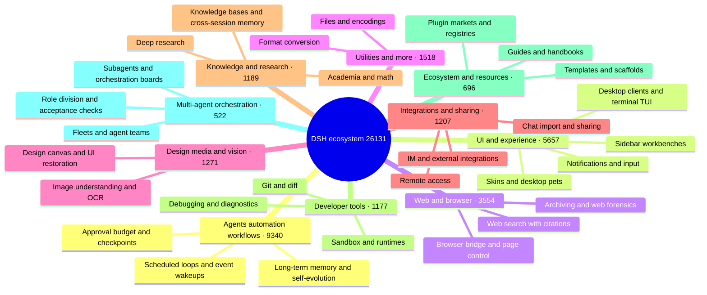

# 🐳 Awesome DSH Plugins

[中文](./README.md) · [Full catalog](./CATALOG.md) · [Star Top 200](./TOP200.md) · [Author showcase](./SHOWCASE.md) · [Recommend a plugin](./CONTRIBUTING.md) · [Machine-readable data](./data/repositories.json)

## Subscribe in DSH Discover

**Required version: DSH V0.2.1-rc.2 or later** (for third-party subscriptions in the official Discover tab; individual plugins still have their own host requirements).

**Subscription URL: [`https://bruc3van.com/dsh-plugins/index.json`](https://bruc3van.com/dsh-plugins/index.json)**

1. **Enable custom markets:** **Plugins** in the left sidebar → **More** beside **Experimental plugins** → switch on **Custom plugin markets**; the Plugins page then shows the **Installed / Discover** tabs.
2. **Add the subscription:** open **Discover**, click **Add index source** (or open the top-left market dropdown → **Manage index sources…**), paste the URL above, and click **Add**.
3. **Browse and install:** pick **Bruce's Plugin Picks** in the market dropdown; filter by category (including Editor's Picks), keyword, npm/Git, recency, or stars, and check each plugin's version requirements before installing. Use **Refresh** to reload data.

If the Discover tab is missing, check that DSH is ≥ V0.2.1-rc.2 and Custom plugin markets is enabled; the switch only unlocks the feature — the subscription URL still needs to be added manually. Subscribing in Discover **does not require `safer-dsh-market`** (that plugin is for a standalone interface, multiple-target installation, and post-install AI review), and the two switches are separate controls.

Inclusion criteria: only verified npm targets and Git bundles pinned to full commits are listed (unapproved, archived, disabled, blacklisted, and invalid-install-source repos are excluded), at most 1000 plugins ranked by stars. Inclusion is not a security audit or proof of runtime compatibility.

[DSH Plugin Directory and subscription guide](https://bruc3van.com/dsh-plugins/#subscribe) · [Index generation and exclusions report](https://bruc3van.com/markets/dsh/audit.json) · [Latest market plugin](https://www.npmjs.com/package/safer-dsh-market)

## 🗺️ Ecosystem at a glance

<!-- dsh:panorama:start -->
As of 2026-11-10 the catalog lists **26,131** verified repositories. Here is the shape of it:

```mermaid
mindmap
  root((DSH ecosystem 26131))
    Agents automation workflows · 9340
      Scheduled loops and event wakeups
      Long-term memory and self-evolution
      Approval budget and checkpoints
    UI and experience · 5657
      Desktop clients and terminal TUI
      Sidebar workbenches
      Skins and desktop pets
      Notifications and input
    Web and browser · 3554
      Browser bridge and page control
      Web search with citations
      Archiving and web forensics
    Utilities and more · 1518
      Files and encodings
      Format conversion
    Design media and vision · 1271
      Image understanding and OCR
      Design canvas and UI restoration
    Integrations and sharing · 1207
      Chat import and sharing
      Remote access
      IM and external integrations
    Knowledge and research · 1189
      Knowledge bases and cross-session memory
      Deep research
      Academia and math
    Developer tools · 1177
      Git and diff
      Sandbox and runtimes
      Debugging and diagnostics
    Ecosystem and resources · 696
      Plugin markets and registries
      Templates and scaffolds
      Guides and handbooks
    Multi-agent orchestration · 522
      Subagents and orchestration boards
      Fleets and agent teams
      Role division and acceptance checks
```
<!-- dsh:panorama:end -->

To browse every project in a category, see [CATALOG.md](./CATALOG.md) — the catalog is split into one volume per category, and the index lists them all.

## 🧭 Quick index

| You want to… | Go to |
| --- | --- |
| Pick a plugin in 30 seconds | [Featured picks](#-featured-picks): great community plugins organized around "what do you want DSH to do" |
| Install your first plugins | [Starter kits](#-starter-kits): pick one combo closest to your current problem |
| Browse the full ranking by stars | [Community leaderboard](#-community-leaderboard) (home Top 50) · [TOP200.md](./TOP200.md) (full Top 200) |
| Browse everything by category | [CATALOG.md](./CATALOG.md) (full catalog) · [Ecosystem at a glance](#-ecosystem-at-a-glance) |
| See what authors are submitting themselves | [Author showcase](#-author-showcase) (10 most recent on the home page) · [SHOWCASE.md](./SHOWCASE.md) (all entries) |
| Consume plugin data programmatically | [data/market-v2.json](./data/market-v2.json) — the curated downstream-market file (≤1000 rows, ≤1 MB, see the [interface spec]）(https://github.com/bruc3van/safer-dsh-market/blob/master/docs/market-json-spec.md)); [data/repositories.json](./data/repositories.json) — daily automated snapshot with stars, license, and activity metadata |
| List or recommend your own plugin | [Recommend or correct an entry](#-recommend-or-correct-an-entry) / [CONTRIBUTING](./CONTRIBUTING.md) |

## ⭐ Featured picks

**These are not ranked by stars, but we prioritize community-verified high-star projects** — most picks come from the Star Top 200: they solve a clear problem, document themselves well, stay maintained, and have been validated by many users. A few are dozens-of-stars picks with no substitute. Start from your problem, find the closest line, and the answer is one click away. Inclusion is not an endorsement of security or compatibility. For the full star-ranked board, see the [Community leaderboard](#-community-leaderboard). Screenshots under each category below are taken from the repositories' own READMEs — click any screenshot to jump straight to its repository home page.

### 🖥️ Desktop & terminal

- **Want a standalone desktop client** instead of a browser tab: prefer the [official client](https://www.deepseek.com/harness/). You can also consider [dsh-desktop](https://github.com/bruc3van/dsh-desktop), developed by this list's author — the authentic official Web UI, with little modification. It runs on macOS, Windows, and Linux alike, and Linux support is its differentiator beyond the official client. Closing the window doesn't stop your task: it stays resident in the tray until you open it again. The installer bundles the official runtime, so you just double-click to launch — no Node.js, no commands to type. Smart mode reuses the local instance you're already running, and fixed-address mode connects straight to a Web UI you maintain yourself. On security it's hardened layer by layer — window sandboxing, navigation locking, a hijack-proof update chain, and least privilege — and it ships a bundled security market of at most 1000 curated plugins, all reviewed before they install.
- **Want a Claude Code-style terminal UI**: [dsh-TUI](https://github.com/ccch1mneyyy/dsh-TUI) · [dsh-tianshu-tui](https://github.com/huiliyi37/dsh-tianshu-tui) — Full-screen interactive terminals with a live status line, thought streaming, and context/TPS gauges; the tianshu build adds TDD and evidence-gate workflows.
- **Want fewer terminal headaches on Windows**: [dsh-ops](https://github.com/T-Auto/dsh-ops) — A Windows productivity kit: an optional bundled Bash takes over the error-prone built-in terminal, with native Rust low-token readers for token efficiency.
- **Want to run DSH locally on an Android phone**: [dsh-mobile-apk](https://github.com/kelai141/dsh-mobile-apk) — An Android APK shell: WebView UI + embedded Termux runtime, SAF directory bridge, keep-alive service, and watchdog. To remote-control DSH already running on your computer, see [dsh-pocket](https://github.com/shaobeichen/dsh-pocket) below.

| | | |
| :---: | :---: | :---: |
|  [dsh-desktop](https://github.com/bruc3van/dsh-desktop) |  [dsh-desktop](https://github.com/bruc3van/dsh-desktop) |  [dsh-TUI](https://github.com/ccch1mneyyy/dsh-TUI) |
|  [dsh-tianshu-tui](https://github.com/huiliyi37/dsh-tianshu-tui) |  [dsh-ops](https://github.com/T-Auto/dsh-ops) | | |

### 🧰 Interface workbenches

- **Want one install that covers common UI needs**: [dsh-web](https://github.com/zhu1090093659/dsh-web) — Task board, Git graph, side panel, remote mobile UI, desktop pet, live token stats, and a skin center in one collection (renamed from `dsh-web-ui`).
- **Want to see what is inside the context window**: [dsh-context](https://github.com/bowenliang123/dsh-context) — A Context tab in the Web UI showing what the model's context window is made of and how it evolves — helps time trimming and token control.
- **Want to turn the sidebar into a workbench**: [DSH-better-sidebar](https://github.com/omdsh-dev/DSH-better-sidebar) — File rendering/editing, terminal, Git, and subagents built in, with third-party tab extensions.
- **Want all your agent projects in one management console**: [dsh-worktable](https://github.com/Aisland-SJL/dsh-worktable) — A sidebar app drawer, dockable split workspaces, and a live control room watching every project.
- **Want a real office environment inside DSH**: [dsh-univer-office](https://github.com/dream-num/dsh-univer-office) — From the makers of Univer: spreadsheets, docs, slides, canvases, and relational tables brought into the conversation, with connected data.
- **Want the working status line to come alive**: [working-activity](https://github.com/ccch1mneyyy/working-activity) — Real-time tool activity and progress, witty copy, model self-narration, and context warnings — no more boring waits.
- **Want the agent to operate a browser**: [dsh-browser](https://github.com/omdsh-dev/dsh-browser) · [BrowserSkill](https://github.com/Tencent/BrowserSkill) — dsh-browser is a Chrome side-panel extension that grants the current tab and acts on it inside your conversation; BrowserSkill is Tencent's bridge to a real, already-logged-in browser (a separate Agent Window, so your own browsing is not interrupted), with a first-class DSH plugin at `@wxg-prc-cpg/browser-skill-dsh-plugin`.

| | | |
| :---: | :---: | :---: |
|  [dsh-web](https://github.com/zhu1090093659/dsh-web) |  [dsh-context](https://github.com/bowenliang123/dsh-context) |  [BrowserSkill](https://github.com/Tencent/BrowserSkill) |
|  [dsh-worktable](https://github.com/Aisland-SJL/dsh-worktable) |  [dsh-univer-office](https://github.com/dream-num/dsh-univer-office) | |

### 👀 Let the model see and search

- **Want to add visual understanding to DSH**: [modlens](https://github.com/liustack/modlens) · [dsh-vision-toolkit](https://github.com/Anionex/dsh-vision-toolkit) — modlens turns images into structured OCR/layout/semantics evidence; dsh-vision-toolkit covers image Q&A, long-screenshot OCR, UI restoration, and pixel diffs.
- **Want paste-and-go vision with no key and no Python**: [dsh-vision-router](https://github.com/ysr666/dsh-vision-router) — a built-in free vision chain (five-model anonymous fallback, no signup or key); image turns work like ordinary tool turns, with the model driving 10 `vision_*` pixel tools (ground, crop, describe, pixel diff, fix, palette, OCR, cutout, SVG trace, screenshot) in continuous multi-step sequences, plus structured evidence JSON; one-command install (Web profile), Node only.
- **Want the agent to search the web and X with citations**: [modsearch](https://github.com/liustack/modsearch) · [anysearch-dsh](https://github.com/anysearch-team/anysearch-dsh) — modsearch searches and fetches from the web/X inline, returning cited structured evidence; anysearch-dsh adds the AnySearch provider and advanced search tools as a complementary backend.
- **Want to generate images in the conversation**: [dsh-image-gen](https://github.com/shanliuling/dsh-image-gen) — Calls `generate_image` in chat (Gemini / OpenAI / Seedream / DashScope), with a gallery, fullscreen preview, and one-click download.

| | | |
| :---: | :---: | :---: |
|  [modlens](https://github.com/liustack/modlens) |  [dsh-vision-toolkit](https://github.com/Anionex/dsh-vision-toolkit) |  [dsh-vision-router](https://github.com/ysr666/dsh-vision-router) |
|  [dsh-image-gen](https://github.com/shanliuling/dsh-image-gen) | | |

### 🧠 Memory & unattended runs

- **Want auditable cross-session memory**: [mem9](https://github.com/mem9-ai/mem9) · [dsh-mnemon](https://github.com/omdsh-dev/dsh-mnemon) — mem9 is cross-session / cross-machine / cross-agent persistent shared memory with hybrid recall and a visual dashboard, with a native DeepSeek Harness integration; Mnemon is a three-tier memory control plane: persistent runtime context, searchable project documents, pluggable long-term memory, and smart routing.
- **Want coding tasks to run on a schedule**: [dsh-automation](https://github.com/titanwings/dsh-automation) — Run tasks in fresh Agent sessions on a plan, with schedules created and managed from the DSH Web UI or by an agent.
- **Requests keep dying to network hiccups and timeouts**, and you do not want to say "continue" by hand every time: [dsh-auto-continue](https://github.com/HsiangNianian/dsh-auto-continue) — Auto-sends a queued "continue" after non-human failures: error classification resumes only transient faults, adaptive backoff avoids hammering a broken upstream, and templated continue text keeps you in the loop — all configurable from the plugin settings card.
- **Want to rewind conversation and workspace state**: [dsh-turn-rewind](https://github.com/Anionex/dsh-turn-rewind) — Rewind to any earlier turn via a persistent Change Ledger, restoring both conversation and workspace state.
- **Want a desktop notification when a turn finishes**: [dsh-notification](https://github.com/omdsh-dev/dsh-notification) — Per-outcome notifications with keyword include/exclude rules so long tasks need no babysitting.

| | | |
| :---: | :---: | :---: |
|  [dsh-mnemon](https://github.com/omdsh-dev/dsh-mnemon) |  [dsh-automation](https://github.com/titanwings/dsh-automation) | |
|  [dsh-auto-continue](https://github.com/HsiangNianian/dsh-auto-continue) |  [dsh-turn-rewind](https://github.com/Anionex/dsh-turn-rewind) | |

### ✍️ Conversation details

- **Want to tune reasoning effort**: [dsh-reasoning-effort](https://github.com/HanaAyane/dsh-reasoning-effort) — Codex-style model and reasoning-effort sliders, plus a big-fish running slider.
- **Want Codex-style text annotations**: [dsh-annotation](https://github.com/omdsh-dev/dsh-annotation) — Select assistant text, optionally add a note, and send it along with your message; the model replies to each annotation by number, with hoverable chips in the reply.
- **Want conversations laid out on a canvas, organized by branches**: [dsh-synapse](https://github.com/liangmianya/dsh-synapse) — A canvas-based session explorer and branching workspace for untangling long, non-linear conversations.

| | | |
| :---: | :---: | :---: |
|  [dsh-reasoning-effort](https://github.com/HanaAyane/dsh-reasoning-effort) |  [dsh-synapse](https://github.com/liangmianya/dsh-synapse) | | |

### 🎨 Creation & fun

- **Want to change the skin / set a custom wallpaper**: [dsh-deep-whale](https://github.com/Small-tailqwq/dsh-deep-whale) · [DSH-Transparent-UI-Plugin](https://github.com/WYH66666666/DSH-Transparent-UI-Plugin) — dsh-deep-whale is the most popular whale-girl skin series (CC BY-NC-SA, non-commercial); DSH-Transparent-UI-Plugin is a highly customizable frosted-glass theme — blur, frost, and background all adjustable, with a switch back to the stock UI anytime.
- **Want your local Wallpaper Engine wallpapers as the background**: [dsh-wallpaper-engine](https://github.com/elysia395/dsh-wallpaper-engine) — Turns local Wallpaper Engine wallpapers into the DSH web background: live video playback, a liquid-glass settings window, content ratings, and auto-rotate (⚠️ the repository does not ship a license yet).
- **Want interactive UI rendered in chat**: [dsh-genui](https://github.com/omdsh-dev/dsh-genui) · [dsh-visualize](https://github.com/Nagi-ovo/dsh-visualize) — Charts, forms, quizzes, Mermaid diagrams, and 3D scenes rendered inline, or model-generated interactive visualization cards.
- **Want agents to operate a real design canvas / make slides**: [dsh-openpencil](https://github.com/ZSeven-W/dsh-openpencil) · [deepseek-design](https://github.com/Devin-AXIS/deepseek-design) — OpenPencil creates, edits, previews, and validates interactive multi-page designs; deepseek-design is a native Design / PPT / Video studio (template catalogs, canvas refinement, selection-aware Ask AI).
- **Want influencer-grade design suites**: [baoyu-design](https://github.com/JimLiu/baoyu-design) · [dsh-guizang-design](https://github.com/op7418/dsh-guizang-design) — Baoyu (@dotey) brings the Claude design suite to DSH: editable slides, design canvases, and scene-by-scene animation, with comment annotations on designs handed back to the agent; Guizang's (@op7418) content-production suite shares one design system across web slides, image cards, and page layouts, with a tone profile that learns your writing style (no extra signup for either).
- **Want the agent to drive Blender directly**: [dsh-blender-plugin](https://github.com/sixtysevenlf/dsh-blender-plugin) — A real-time TCP link to Blender: viewport screenshots, click-picking, render profiling, and headless unload, letting the AI drive Blender directly.
- **Want to write novels or produce short dramas**: [oh-story-dsh](https://github.com/zenstory-ai/oh-story-dsh) — A plugin for novel writing and short-drama production, powered by Oh Story and Drama Skills.
- **Want SillyTavern-style text adventures and roleplay**: [dsh-tavern](https://github.com/flizzywine/dsh-tavern) — A text-game agent with candidate generation, conversational character-card editing, script mode, and asset extraction.
- **Want a companion in the workspace**: [whale-girl](https://github.com/vlln/whale-girl) · [dsh-pet](https://github.com/PC2005-cloud/dsh-pet) — A draggable, feedable, playable desktop companion with persistent progression; or one-line-install pets (28 transparent animations) with a DIY pipeline that crafts custom pets from AI video.
- **Want a voice-driven AI companion**: [dsh-voice-ai-girlfriend](https://github.com/beiyege-01/dsh-voice-ai-girlfriend) — Voice input, TTS replies, and a companion animation window, with two-way QQ chat; needs the repo's voice bridge plus NapCat (⚠️ the repository does not ship a license yet).
- **Want a bit of fun**: [dsh-ads](https://github.com/Nagi-ovo/dsh-ads) · [anime-find](https://github.com/cocofhu/anime-find) · [dsh-minigames](https://github.com/lhh010/dsh-minigames) — Turn DSH into a 2005 portal site; search anime across multiple sources with Bangumi ratings in-chat; or play 18 offline mini-games while waiting.
- **Want DSH to watch Bilibili for you**: [dsh-bili-scroll](https://github.com/c1overzz/dsh-bili-scroll) — Auto-scans videos every day, reads each subtitle track before judging, and writes the worthwhile ones into a Markdown report — especially good ones earn you a comment ping.
- **Want to read feeds and books in DSH**: [qiaomu-rss-dsh](https://github.com/joeseesun/qiaomu-rss-dsh) · [qiaomu-reader-dsh](https://github.com/joeseesun/qiaomu-reader-dsh) — Qiaomu's (@vista8) series: subscribe to overseas AI feeds with Chinese-summary rewriting; an EPUB/PDF/TXT/Markdown/HTML reader with highlights, notes, read-aloud, a vocabulary book, and native AI companion reading (some experimental features need an invite code and call the author's own service).

| | | |
| :---: | :---: | :---: |
|  [dsh-deep-whale](https://github.com/Small-tailqwq/dsh-deep-whale) |  [DSH-Transparent-UI-Plugin](https://github.com/WYH66666666/DSH-Transparent-UI-Plugin) |  [dsh-visualize](https://github.com/Nagi-ovo/dsh-visualize) |
|  [dsh-openpencil](https://github.com/ZSeven-W/dsh-openpencil) |  [dsh-pet](https://github.com/PC2005-cloud/dsh-pet) |  [dsh-ads](https://github.com/Nagi-ovo/dsh-ads) |
|  [anime-find](https://github.com/cocofhu/anime-find) |  [dsh-wallpaper-engine](https://github.com/elysia395/dsh-wallpaper-engine) |  [dsh-tavern](https://github.com/flizzywine/dsh-tavern) |
|  [baoyu-design](https://github.com/JimLiu/baoyu-design) |  [dsh-guizang-design](https://github.com/op7418/dsh-guizang-design) | |

### 🛠️ Development & workflows

- **Want to turn one session into a collaborating team**: [dsh-agent-teams](https://github.com/NanmiCoder/dsh-agent-teams) — The current session acts as the captain: create resumable subagents, split goals into tasks with dependencies, and coordinate members via direct messages, with a live Web UI activity panel.
- **Want to upgrade one-shot multi-agent runs into a workflow layer**: [dsh_workflow](https://github.com/omdsh-dev/dsh_workflow) — Brings Claude Code's UltraCode mode to DSH: workflows that can be generated, saved, governed, observed, and recovered.
- **Want a resident squad of bots**: [DS-Bot](https://github.com/Fei2411/DS-Bot) — A team of long-lived bots in one host: a primary bot, bot-to-bot messages, and group-chat collaboration, each bot with its own job.
- **Want a local task board for your agent team**: [DSH-taskboard](https://github.com/shengsheng90/DSH-taskboard) — A SQLite-backed native taskboard: projects, agent claim/review, and a native Web UI — no iframe, no second chat runtime.
- **Want the agent to drive an iOS Simulator or a real iPhone**: [dsh-ios](https://github.com/ZSeven-W/dsh-ios) — Run a live iOS Simulator (or a USB-connected iPhone) inside the conversation, with 22 tools that boot, build, and drive the UI by accessibility id.
- **Want agent workflows that compose and keep improving**: [dsh-evolve-modes](https://github.com/GraySilver/dsh-evolve-modes) — Composable task controls plus isolated, human-reviewed self-evolution, so the way it works keeps getting better.
- **Want DSH connected to your database for analysis**: [dsh-data-agent](https://github.com/omdsh-dev/dsh-data-agent) — Conversational data analysis and actionable business insights over your own database.

| | | |
| :---: | :---: | :---: |
|  [dsh-agent-teams](https://github.com/NanmiCoder/dsh-agent-teams) |  [DSH-taskboard](https://github.com/shengsheng90/DSH-taskboard) |  [dsh-ios](https://github.com/ZSeven-W/dsh-ios) |
|  [dsh-evolve-modes](https://github.com/GraySilver/dsh-evolve-modes) |  [dsh-data-agent](https://github.com/omdsh-dev/dsh-data-agent) |  [DS-Bot](https://github.com/Fei2411/DS-Bot) |

### 🔀 Migration & integrations

- **Want to migrate chat histories from other tools into DSH**: [dsh-chat-import](https://github.com/Nwflower/dsh-chat-import) — Imports sessions from 25+ AI coding agents into resumable DSH sessions, preserving tool calls, reasoning, and results, with reverse export/sync back to Claude Code.
- **Want to bring Pi-ecosystem extensions straight into DSH**: [pi2dsh](https://github.com/weijiafu14/pi2dsh) — One Pi Host ABI runs unmodified Pi extensions as native DSH plugins, bridging both ecosystems.
- **Want Claude Code / OpenCode / CodeBuddy and other ACP agents inside the DSH UI**: [dsh-ntr](https://github.com/GDWhisper/dsh-ntr) — Negotiated Target Routing: DSH provides the interface and your configured agent provides the capability — sessions, composer, and message rendering stay native while reasoning and tool execution run autonomously in the agent's own process.
- **Want to drive DSH from WeChat / Feishu / QQ and other chats**: [dsh-im](https://github.com/xmanrui/dsh-im) · [dsh-qqbot](https://github.com/tencent-connect/dsh-qqbot) — dsh-im connects Feishu, WeChat, DingTalk, WeCom, QQ, Slack, Telegram, Discord, and WhatsApp from one settings page; use dsh-qqbot when you only want Tencent's official QQ Bot.

| | | |
| :---: | :---: | :---: |
|  [dsh-im](https://github.com/xmanrui/dsh-im) |  [pi2dsh](https://github.com/weijiafu14/pi2dsh) |  [dsh-ntr](https://github.com/GDWhisper/dsh-ntr) |

### 🔌 Remote & external collaboration

- **Want to remote-control DSH already running on your computer from a phone**: [dsh-pocket](https://github.com/shaobeichen/dsh-pocket) — Run `dsh web` on the computer, scan a QR code on the phone, and get a live mirror (LAN + public tunnel, access password, mobile layout). Check progress, send tasks, and tap approvals while you are away.
- **Want the agent to operate remote hosts over SSH**: [dsh-remote](https://github.com/flymysql/dsh-remote) — Multi-machine SSH (password / private key / agent / OTP / jump host) plus remote workspace selection and 21 `rw_*` tools (list / read / edit / exec / search / port forward / two-way SFTP); ships a 🌐 remote-files sidebar, an audit log, and self-update. Does not bind 0.0.0.0.

| | | |
| :---: | :---: | :---: |
|  [dsh-pocket](https://github.com/shaobeichen/dsh-pocket) | | |

### 💰 Usage & billing

- **Want a corner widget for balance and per-turn spend**: [DeepSeek-Balance-Whale-Widget](https://github.com/MeteorNOX/DeepSeek-Balance-Whale-Widget) — A draggable whale in the lower-right corner: account balance, today's spend, and a per-turn cost bubble. Works out of the box (default bookkeeping from balance deltas, no platform token required).
- **Want a token-usage and cost panel**: [dsh-usage-stats](https://github.com/Ychris12138/dsh-usage-stats) · [dsh-cost-meter](https://github.com/Han-1413141/dsh-cost-meter) — dsh-usage-stats adds a GitHub-style usage heatmap, per-model breakdowns, and DeepSeek account balance to the Web GUI; dsh-cost-meter tracks per-session and daily costs synced with official pricing.

| | | |
| :---: | :---: | :---: |
|  [DeepSeek-Balance-Whale-Widget](https://github.com/MeteorNOX/DeepSeek-Balance-Whale-Widget) |  [dsh-usage-stats](https://github.com/Ychris12138/dsh-usage-stats) |  [dsh-cost-meter](https://github.com/Han-1413141/dsh-cost-meter) |

### 🔑 Models & subscriptions

- **Want to use an existing ChatGPT / Claude / Grok subscription as a model**, without another API key: [dsh-plugin-subscriptions](https://github.com/V1ki/dsh-plugin-subscriptions) — OAuth in Settings for ChatGPT (Codex), Claude, Grok (X Premium), and GitHub Copilot. Logged-in providers join the model picker, with usage windows plus image/video generation tools.
- **Want locally signed-in WorkBuddy models**: [dsh-connect-workbuddy](https://github.com/dingminhua/dsh-connect-workbuddy) — Connects domestic and international WorkBuddy models to DSH: per-model credit multipliers read from the upstream catalog on each refresh, per-model image-input toggles and default reasoning effort, multi-account switching with an auto-rotating account pool, plus daily check-in and capsule credit read-outs.
- **Want routing and costs tracked for you**: [dsh-model-router](https://github.com/Alice-Marx/dsh-model-router) — A cost-aware model-routing workbench for the desktop client: local planning, comparison against configured routes, and execution-permission checks, running dependency work packages via the model API or the official CLI.

| | | |
| :---: | :---: | :---: |
|  [dsh-plugin-subscriptions](https://github.com/V1ki/dsh-plugin-subscriptions) | | |

### 🛡️ Security & audit

- **Want to check whether your API relay has been tampered with**: [api-relay-audit](https://github.com/toby-bridges/api-relay-audit) — a local audit for AI API relays & LLM proxies: detects prompt injection, model substitution, tool-call rewriting, SSE anomalies, error leakage, and Web3 wallet risks. A single-file Python tool that produces redacted reports on the spot (AGPL-3.0).
- **Want a safety net that can undo a broken DSH setup**: [dsh-undo-savepoint](https://github.com/lire1131/dsh-undo-savepoint) — undo changes to config and plugin code, secret-safe snapshots, one-click SAFE MODE; and when DSH won't even boot, an offline CLI/GUI rolls you back.
- **Want an authorized red-team workbench**: [dsh-redteam-model](https://github.com/SeaOf0/dsh-redteam-model) — A multi-mode red-team workbench over the DSH Web UI covering penetration testing, red-team assessment, and code auditing, with presets and runtime plugins managed from one settings page (authorized security research only).

| | | |
| :---: | :---: | :---: |
|  [api-relay-audit](https://github.com/toby-bridges/api-relay-audit) |  [dsh-undo-savepoint](https://github.com/lire1131/dsh-undo-savepoint) |  [dsh-undo-savepoint](https://github.com/lire1131/dsh-undo-savepoint) |
|  [dsh-undo-savepoint](https://github.com/lire1131/dsh-undo-savepoint) | | |

### 🌱 Ecosystem entry points

- **Want to review before you install (security first)**: [safer-dsh-market](https://github.com/bruc3van/safer-dsh-market) — a review-before-install DSH marketplace: the feed comes from this list's daily snapshot plus human curation, and "Safe install" executes nothing — it hands a security-review prompt to the agent, which actually reads the plugin's code, and only after it comes back clean do you decide whether to run the official install command. Off by default — it goes online only once you enable it, and the plugin itself has no interface that can run an install.
- **Want a plugin market right inside the DSH UI**: the official DSH client (0.2.1+) ships a built-in **Plugin market** tab whose catalog is this list's daily snapshot; third-party options are [dsh-market](https://github.com/dsh-market/dsh-market) · [dsh-plugin-gating-hub](https://github.com/Noob-stupid/dsh-plugin-gating-hub) — dsh-market adds browse, search, and workshop-style distribution; dsh-plugin-gating-hub focuses on framework-upgrade safety and plugin gating — contract pre-checks, rollback points, auto-rollback on failure, evidence-gated auto-disable — plus a multi-source plugin market.

| | | |
| :---: | :---: | :---: |
|  [safer-dsh-market](https://github.com/bruc3van/safer-dsh-market) |  [dsh-market](https://github.com/dsh-market/dsh-market) |  [dsh-plugin-gating-hub](https://github.com/Noob-stupid/dsh-plugin-gating-hub) |

### 🚀 Starter kits

You do not need to install everything. Start with the kit closest to the problem you have today:

| Kit | For | Combination |
| --- | --- | --- |
| Everyday experience | First install: start with the desktop client, then turn the sidebar into a workbench | [dsh-desktop](https://github.com/bruc3van/dsh-desktop) · [DSH-better-sidebar](https://github.com/omdsh-dev/DSH-better-sidebar) |
| Review-before-install market | Review first, then install. Bundled in the desktop client; on plain Web, search-install `bruc3van/safer-dsh-market` | [safer-dsh-market](https://github.com/bruc3van/safer-dsh-market) |
| Terminal lover | Command-line fans who want a full-screen terminal (pick one) | [dsh-TUI](https://github.com/ccch1mneyyy/dsh-TUI) · [dsh-tianshu-tui](https://github.com/huiliyi37/dsh-tianshu-tui) |
| Search & image gen | Search the web in-chat and generate images (official models already see images; no vision plugin required) | [modsearch](https://github.com/liustack/modsearch) · [dsh-image-gen](https://github.com/shanliuling/dsh-image-gen) |
| Look & feel | Skins, frosted glass, and desktop pets | [dsh-deep-whale](https://github.com/Small-tailqwq/dsh-deep-whale) · [DSH-Transparent-UI-Plugin](https://github.com/WYH66666666/DSH-Transparent-UI-Plugin) · [whale-girl](https://github.com/vlln/whale-girl) |
| Multi-agent teams | Hand complex tasks to a team of agents | [dsh-agent-teams](https://github.com/NanmiCoder/dsh-agent-teams) · [dsh_workflow](https://github.com/omdsh-dev/dsh_workflow) |
| Memory & long-running | Cross-session memory (pick one) + auto-resume for unattended projects | [mem9](https://github.com/mem9-ai/mem9) or [dsh-mnemon](https://github.com/omdsh-dev/dsh-mnemon) · [dsh-auto-continue](https://github.com/HsiangNianian/dsh-auto-continue) |
| Phone remote | Use the DSH on your computer while you are away | [dsh-pocket](https://github.com/shaobeichen/dsh-pocket) |
| Subscription models | Use existing ChatGPT / Claude / Grok subscriptions, no API key | [dsh-plugin-subscriptions](https://github.com/V1ki/dsh-plugin-subscriptions) |

**Read first:** [dsh-handbook](https://github.com/Electricitysheep/dsh-handbook) — a deep 0-to-1 handbook for DSH: install, plugin development, performance tuning, and real-world case studies (Chinese + English PDF). Want to write your own plugins? Start with [hello-dsh](https://github.com/pingfanfan/hello-dsh) — a zero-to-plugin tutorial with 22 Chinese skill examples.

## 🏆 Community leaderboard

Community popularity by stars, from the 2026-11-10 snapshot. Repositories riding the `dsh-plugin` topic without being plugins, and editorially blacklisted repositories, are excluded — see [data/curated.json](./data/curated.json); new repositories first enter the [review queue](./data/review/pending.md) and rank only after the maintainer has verified them ([data/approved.json](./data/approved.json)). The home page shows the Top 50; the full Top 200 is in [TOP200.md](./TOP200.md). Ranking reflects popularity only — not quality, compatibility, or security.

<!-- dsh:leaderboard:start -->
| # | Project | Description | ⭐ Stars | License |
| ---: | --- | --- | ---: | --- |
| 1 | [ccch1mneyyy/dsh-TUI](https://github.com/ccch1mneyyy/dsh-TUI) | Claude Code-style full-screen terminal TUI: whale top bar, live status,… | 7423 | MIT |
| 2 | [Fei2411/DS-Bot](https://github.com/Fei2411/DS-Bot) | A team of long-lived bots for DeepSeek Harness: main bots, bot-to-bot m… | 6832 | Apache-2.0 |
| 3 | [elysia395/dsh-wallpaper-engine](https://github.com/elysia395/dsh-wallpaper-engine) | Turn local Wallpaper Engine wallpapers into the DSH web background: dyn… | 6364 | MIT |
| 4 | [PC2005-cloud/dsh-pet](https://github.com/PC2005-cloud/dsh-pet) | DSH desktop pet: a transparent animated companion installed in one comm… | 6052 | MIT |
| 5 | [T-Auto/dsh-ops](https://github.com/T-Auto/dsh-ops) | Windows token-efficiency toolkit: bundled bash 5.3 and PowerShell 7 tak… | 5669 | MIT |
| 6 | [omdsh-dev/DSH-better-sidebar](https://github.com/omdsh-dev/DSH-better-sidebar) | Open sidebar foundation that lets third parties register new tabs; bund… | 5057 | MIT |
| 7 | [liustack/modlens](https://github.com/liustack/modlens) | External vision for text-only models: paste an image and get structured… | 4894 | MIT |
| 8 | [bowenliang123/dsh-context](https://github.com/bowenliang123/dsh-context) | One-stop context visualizer for DSH: a Context panel and commands for c… | 4890 | Apache-2.0 |
| 9 | [xmanrui/dsh-im](https://github.com/xmanrui/dsh-im) | Wire IM bots into DSH via QR code or credentials: Feishu, WeChat, DingT… | 3459 | MIT |
| 10 | [Small-tailqwq/dsh-deep-whale](https://github.com/Small-tailqwq/dsh-deep-whale) | Whale-girl skin series for DeepSeek Harness. | 3086 | NOASSERTION |
| 11 | [shaobeichen/dsh-pocket](https://github.com/shaobeichen/dsh-pocket) | Put DSH in your pocket: run dsh web on the computer, scan a QR code fro… | 2891 | GPL-2.0 |
| 12 | [NanmiCoder/dsh-agent-teams](https://github.com/NanmiCoder/dsh-agent-teams) | AgentTeams multi-agent collaboration plugin for DeepSeek Harness. | 2842 | MIT |
| 13 | [sixtysevenlf/dsh-blender-plugin](https://github.com/sixtysevenlf/dsh-blender-plugin) | Direct real-time Blender bridge for DSH over TCP: 16 tools across 186 o… | 1968 | BSD-3-Clause |
| 14 | [Devin-AXIS/deepseek-design](https://github.com/Devin-AXIS/deepseek-design) | Editable design system for DSH: AI generation, visual editing, a templa… | 1803 | NOASSERTION |
| 15 | [flizzywine/dsh-tavern](https://github.com/flizzywine/dsh-tavern) | SillyTavern-style text-game agent on DSH: candidate-turn generation, co… | 1558 | AGPL-3.0 |
| 16 | [Miaotofu01/Study-Mate](https://github.com/Miaotofu01/Study-Mate) | AI study partner that plans, explains, and builds projects with you — l… | 1417 | MIT |
| 17 | [dingminhua/dsh-connect-workbuddy](https://github.com/dingminhua/dsh-connect-workbuddy) | Connect locally signed-in WorkBuddy models to DeepSeek Harness with a r… | 1414 | MIT |
| 18 | [c1overzz/dsh-bili-scroll](https://github.com/c1overzz/dsh-bili-scroll) | A DSH plugin that scrolls Bilibili for you daily: searches videos, read… | 1364 | MIT |
| 19 | [shanliuling/dsh-image-gen](https://github.com/shanliuling/dsh-image-gen) | Lightweight plugin that generates images right inside the DSH conversat… | 1260 | Apache-2.0 |
| 20 | [ysr666/dsh-vision-router](https://github.com/ysr666/dsh-vision-router) | Eyes for text-only DSH agents: a free vision chain (no key) plus pixel-… | 1256 | MIT |
| 21 | [mem9-ai/mem9](https://github.com/mem9-ai/mem9) | Unlimited memory for OpenClaw. | 1236 | Apache-2.0 |
| 22 | [ADWMC/helm-d](https://github.com/ADWMC/helm-d) | All-in-one DSH security-analysis suite aggregating Android, Web, native… | 1186 | AGPL-3.0 |
| 23 | [DDDMUC/dsh-free-search](https://github.com/DDDMUC/dsh-free-search) | Free web-search provider: DuckDuckGo backend, no API key. | 1045 | MIT |
| 24 | [omdsh-dev/dsh-browser](https://github.com/omdsh-dev/dsh-browser) | Let DSH drive the browser you are already using: pages become structure… | 1039 | MIT |
| 25 | [beiyege-01/dsh-voice-ai-girlfriend](https://github.com/beiyege-01/dsh-voice-ai-girlfriend) | Voice AI companion plugin for DSH: Whisper voice input, Qwen3-TTS voice… | 1030 | NOASSERTION |
| 26 | [liustack/modsearch](https://github.com/liustack/modsearch) | Free web search for DSH: no signup, no API key — brings structured JSON… | 969 | MIT |
| 27 | [omdsh-dev/dsh-genui](https://github.com/omdsh-dev/dsh-genui) | Inline interactive UI inside assistant replies via dsh-ui fences: layou… | 965 | MIT |
| 28 | [Alice-Marx/dsh-model-router](https://github.com/Alice-Marx/dsh-model-router) | A cost-aware model-routing workbench for DSH Desktop: plan locally, com… | 959 | MIT |
| 29 | [omdsh-dev/dsh-mnemon](https://github.com/omdsh-dev/dsh-mnemon) | Composable three-layer memory control plane for DSH: persistent runtime… | 959 | MIT |
| 30 | [Anionex/dsh-vision-toolkit](https://github.com/Anionex/dsh-vision-toolkit) | A stronger vision toolkit for text-only models: one-line install, paste… | 937 | MIT |
| 31 | [toby-bridges/api-relay-audit](https://github.com/toby-bridges/api-relay-audit) | Local security audit for AI API relays and LLM proxies: prompt injectio… | 910 | AGPL-3.0 |
| 32 | [SeaOf0/dsh-redteam-model](https://github.com/SeaOf0/dsh-redteam-model) | Multi-mode red-team workbench on dsh web: authorized security research… | 857 | MIT |
| 33 | [Aisland-SJL/dsh-worktable](https://github.com/Aisland-SJL/dsh-worktable) | Agent project management console for DSH: sidebar app drawer, dockable… | 856 | MIT |
| 34 | [6shenhonghong9/dsh-startup-screen](https://github.com/6shenhonghong9/dsh-startup-screen) | Startup animation plugin: studio logo, whiteout, warm technical-file ba… | 819 | MIT |
| 35 | [saya-ch/dsh-mobile](https://github.com/saya-ch/dsh-mobile) | Android client and secure remote access for DSH: LAN/remote connections… | 812 | Apache-2.0 |
| 36 | [csyangwen/dsh-memory-evolve](https://github.com/csyangwen/dsh-memory-evolve) | Cross-session long-term memory + background self-evolution: five-track… | 766 | MIT |
| 37 | [op7418/dsh-guizang-design](https://github.com/op7418/dsh-guizang-design) | Guizang design suite: four skills — web slides, image-text cards, web t… | 763 | AGPL-3.0 |
| 38 | [zenstory-ai/oh-story-dsh](https://github.com/zenstory-ai/oh-story-dsh) | Novel-writing and short-drama production plugin powered by Oh Story and… | 725 | MIT |
| 39 | [Nagi-ovo/dsh-ads](https://github.com/Nagi-ovo/dsh-ads) | Turn DSH into a 2005 web portal: parody ads, fake games, and pop-ups. | 716 | BSD-3-Clause |
| 40 | [dream-num/dsh-univer-office](https://github.com/dream-num/dsh-univer-office) | Real Office for DSH: the Univer runtime brings spreadsheets, docs, slid… | 706 | Apache-2.0 |
| 41 | [liangmianya/dsh-synapse](https://github.com/liangmianya/dsh-synapse) | Visual non-linear conversation workspace: canvas-style session explorat… | 698 | MIT |
| 42 | [anysearch-team/anysearch-dsh](https://github.com/anysearch-team/anysearch-dsh) | AnySearch web-search provider and advanced search tools for DeepSeek Ha… | 690 | MIT |
| 43 | [Han-1413141/dsh-cost-meter](https://github.com/Han-1413141/dsh-cost-meter) | Session cost meter: per-session and daily costs, budgets, provider bala… | 669 | MIT |
| 44 | [ccch1mneyyy/working-activity](https://github.com/ccch1mneyyy/working-activity) | Lively working-line status strip for pi CLI and DSH. | 668 | MIT |
| 45 | [FuRongJun-1999/dsh-memory](https://github.com/FuRongJun-1999/dsh-memory) | White-box AGI architecture exploration: metacognition loop, knowledge f… | 649 | MIT |
| 46 | [Yu-tao-Li/dsh-computer-use-win](https://github.com/Yu-tao-Li/dsh-computer-use-win) | Windows computer-use plugin: lets the agent see and drive real Windows… | 642 | MIT |
| 47 | [howmp/dsh-pentest](https://github.com/howmp/dsh-pentest) | Penetration-testing mode for DeepSeek Harness (@CloverSecLabs). | 620 | — |
| 48 | [V1ki/dsh-plugin-subscriptions](https://github.com/V1ki/dsh-plugin-subscriptions) | Use ChatGPT (Codex), Claude, or Grok subscriptions as DSH model provide… | 584 | MIT |
| 49 | [tencent-connect/dsh-qqbot](https://github.com/tencent-connect/dsh-qqbot) | Official plugin that wires a Tencent QQ Bot into DeepSeek Harness (DSH)… | 570 | MIT |
| 50 | [FSMargoo/dsh-at-file](https://github.com/FSMargoo/dsh-at-file) | Codex-style @file references for DSH: search workspace files from the i… | 568 | MIT |
<!-- dsh:leaderboard:end -->

[See the full Star Top 200 →](./TOP200.md)

## 🆕 Recently joined

Manually screened recent projects, updated from time to time:

| Project | Description | Created |
| --- | --- | --- |
| [Cyberbolt/dsh-snapcompact](https://github.com/Cyberbolt/dsh-snapcompact) | Context snap-compact: renders discarded chat history into bitmap frames a vision model reads directly — local, deterministic, no summarizer call — while keeping exact head/tail text and a searchable archive. | 2026-11-06 |
| [GenePad/dsh-zot-library](https://github.com/GenePad/dsh-zot-library) | Zotero-compatible literature library: edits a real zotero.sqlite in place, with PDF import and metadata lookup, annotations, WebDAV sync, an agent chat dock and a full Word citation plugin. | 2026-11-09 |
| [zhaizhoux/dsh-cad-freecad](https://github.com/zhaizhoux/dsh-cad-freecad) | Turns a local FreeCAD install into a declarative CAD modeling backend: parametric solids, exact geometry reports, STEP/IGES/STL/SVG/DXF export, plus a standalone CLI and a local browser UI. | 2026-11-10 |
| [fuqiang-lab/dsh-wps-office](https://github.com/fuqiang-lab/dsh-wps-office) | WPS Office bundle: five compact facade tools over the 250-tool WPS MCP server, plus four embedded WPS skills — documents and sheets one click away. | 2026-11-10 |
| [dengluliang/dsh-meetclip](https://github.com/dengluliang/dsh-meetclip) | MeetClip: live-stream / video / meeting capture, cloud transcription and AI minutes as a DeepSeek Harness plugin. | 2026-11-10 |
| [Silasvanceneo/dsh-dynamic-multiagent](https://github.com/Silasvanceneo/dsh-dynamic-multiagent) | Dynamic multi-agent orchestration: task graphs of child agents with per-node role, model, reasoning effort and tools, plus a settings UI and per-conversation switch. | 2026-11-10 |
| [1997liuyh-boop/dsh-studio-library](https://github.com/1997liuyh-boop/dsh-studio-library) | Studio suite console: manages the project lists, service connections and sessions of the ten-studio family (film, design, fitness, travel and more) on one shared runtime. | 2026-11-10 |
| [liangdabiao/dsh-resume-matcher](https://github.com/liangdabiao/dsh-resume-matcher) | Resume clinic: an HR-view Chinese resume workbench — the five-step audit produces a full report, and the optimized resume jumps into a visual editor for layout tweaks and PDF export. | 2026-11-10 |

## 📣 Author showcase

Self-submitted recommendations from plugin authors, following the [contributing rules](./CONTRIBUTING.md#作者自荐--self-promotion). **These entries are not editorially reviewed and carry no quality or security endorsement** — evaluate them yourself before installing (see Usage & safety below). At most 30 entries are kept — first in, first out; entries promoted to the [Featured picks](#-featured-picks) above are removed from this section without using a slot. The home page shows only the **10 most recent entries**; the complete list lives in [SHOWCASE.md](./SHOWCASE.md).

<!-- dsh:showcase:start -->
- **[dsh-mcp-manage](https://github.com/null119/dsh-mcp-manage)** ([@null119](https://github.com/null119) · 2026-09-04) — An MCP-server management page for the DSH Web GUI: lists every installed MCP tool grouped by server (expandable), with add/edit/delete and enable/disable for stdio and Streamable HTTP servers — effective at runtime, no host restart. Composition-provided rows (cordis.yml / patches) are equally editable at runtime — disable, remove with restore, and edits that survive toggles and host restarts while the source composition files stay untouched. MIT, 14 unit tests.
- **[BOWLUNA/dsh-custom-mode](https://github.com/BOWLUNA/dsh-custom-mode)** ([@BOWLUNA](https://github.com/BOWLUNA) · 2026-09-19) — Manage dsh agent modes from the settings page: choose a base composition, toggle plugin rows, edit the system prompt (takes effect on the next model step); several assistants can coexist.
- **[dsh-config-manager](https://github.com/xiajiajun516/dsh-config-manager)** ([@xiajiajun516](https://github.com/xiajiajun516) · 2026-09-27) — Backup, restore, export, import, migrate and sync a DeepSeek Harness (DSH) configuration: settings, providers, plugins, MCP servers, skills, agent presets and workspaces. Everything is previewed before it is written, conflicts are decided per item, a failed import rolls back, dead absolute paths are remapped across machines, and "export secrets" carries credentials inside an encrypted snapshot (scrypt + AES-256-GCM). A built-in configuration marketplace installs community configs in one click.
- **[dsh-backup](https://github.com/xiaoyuyu6420/dsh-backup)** ([@xiaoyuyu6420](https://github.com/xiaoyuyu6420) · 2026-09-30) — One command to back up and restore all of `~/.dsh` (sessions, settings, skills, MCP configs, credentials): restart-surviving scheduled backups with tiered retention, automatic pre-upgrade snapshots, a session-log doctor with targeted repair and migration precheck, and an out-of-process rescue console for when the host will not boot; credentials are redacted by default with plaintext confined to a local vault, and private-repo GitHub sync covers machine migration. For DSH users who do not want an upgrade or a new laptop to cost them their data; published on npm as `@xiaoyuyu6420/dsh-backup`.
- **[dsh-cost-meter](https://github.com/Han-1413141/dsh-cost-meter)** ([@Han-1413141](https://github.com/Han-1413141) · 2026-10-02) — Track session and model costs, token usage, budgets, provider balances and coding-plan quotas in a bilingual DSH interface.
- **[dsh-piggy](https://github.com/CLICGGER-TYPES/dsh-piggy)** ([@CLICGGER-TYPES](https://github.com/CLICGGER-TYPES) · 2026-10-03) — A pet pig for DSH Web that grows as you work, with care, study, jobs, fishing, a collection book, and skins. It registers no model tools and injects no pet state into conversations. npm package: `dsh-piggy`; standalone desktop builds are also available.
- **[dsh-sieve](https://github.com/Sev7eEn7/dsh-sieve)** ([@Sev7eEn7](https://github.com/Sev7eEn7) · 2026-10-10) — Filters tool outputs, prunes stale context and discloses skills on demand for DSH 0.2.1-alpha.1.
- **[dsh-oh-my-claude](https://github.com/lcestou/dsh-oh-my-claude)** ([@lcestou](https://github.com/lcestou) · 2026-10-13) — Claude Code as a model provider in DSH: log in once with the `claude` CLI, pick a Claude model in the session picker, and the CLI's own permission modes, images, resume and compaction work from the DSH chat. DSH's subagents, background jobs and skills reach Claude as MCP tools. A workspace can run Claude on another machine over SSH.
- **[dsh-zhihu-search](https://github.com/dsh-plugin-lab/dsh-zhihu-search)** ([@zlZayn](https://github.com/zlZayn) · 2026-10-27) — Zhihu search for DSH: in-site search, global web search and Zhida answers as three tools, over the official Zhihu Open Platform API rather than scraping, with a citable source link on every result (in-site results also carry vote counts) — for Chinese-language research and fact-checking.
- **[AgentCompare](https://github.com/lijiaqi-AI-Product-Manager/dsh-agent-compare)** ([@lijiaqi-AI-Product-Manager](https://github.com/lijiaqi-AI-Product-Manager) · 2026-11-04) — Compare two running Vite builds inside DSH conversations, run shared checks, choose blind, and review adoption against current project edits. For developers comparing front-end implementations; model, duration and example settings reuse the existing DSH configuration through the interface.
<!-- dsh:showcase:end -->

[See all 30 showcase entries →](./SHOWCASE.md)

## 🔍 How this list is maintained

- **Built for users, not crawlers:** the front page is organized around "what I want to get done", not hundreds of repo names.
- **Layered: human picks + full index:** the front page carries only hand-screened featured picks and the showcase preview; [CATALOG.md](./CATALOG.md) and its per-category volumes list every verified repository; new repositories first enter the [review queue](./data/review/pending.md) and appear after verification and merge (convention: [data/review/README.md](./data/review/README.md)).
- **Automated data, human pages:** the raw snapshot and the review queue refresh daily by script; the catalog and Top 200 leaderboard are regenerated only after a human review merge (generators: [scripts/merge.mjs](./scripts/merge.mjs), [scripts/top.mjs](./scripts/top.mjs), switchable back to Top 100); the home-page featured picks, showcase, and recently-joined sections are edited by hand, so polluted API data (star inflation, topic riders) never rewrites recommendations automatically.
- **Riders removed:** repositories carrying the `dsh-plugin` topic without being DSH plugins (the platform itself, other agent tools, competing catalogs) and editorially blacklisted repositories are excluded from the catalog and leaderboard, with per-repo reasons recorded in [data/curated.json](./data/curated.json) (the leaderboard additionally honors `leaderboard_exclusions` for repos that stay in the catalog but do not rank) — auditable and contestable at any time.
- **Auditable review trail:** every inclusion decision can be checked — approval dates live in [data/approved.json](./data/approved.json), and each removal or leaderboard exclusion carries its reason in [data/curated.json](./data/curated.json); bulk reviews additionally keep a narrative record (e.g. the [2026-11-11 review log](./data/review/2026-11-11.md)), and the whole workflow is documented in [data/review/README.md](./data/review/README.md).
- **Downstream market file:** [data/market-v2.json](./data/market-v2.json) is the curated file downstream markets consume (e.g. the DSH desktop plugin market): the snapshot plus curation, filtered, cleaned, and dealt round-robin across categories (≤1000 rows, ≤1 MB). It is rebuilt on every daily snapshot refresh and immediately after every curation merge; the field and generation rules live in the downstream [publishing spec](https://github.com/bruc3van/safer-dsh-market/blob/master/docs/market-json-spec.md). The same runs also publish [MARKET.md](./MARKET.md), a read-only star-ranked rendering of the file for previewing the market on GitHub without installing anything.
- **Chinese by default, bilingual:** native readability for the main audience, with a dedicated English entry point.

As of 2026-11-10, the catalog lists **26,131** repositories across **40** primary languages; **23,990** declare a license and **25,835** are neither archived nor disabled (the catalog updates after each human review merge — see [CATALOG.md](./CATALOG.md) for current numbers).

## ⚠️ Usage & safety

Third-party plugins can read conversations, files, network traffic, or system resources. Before installing, check the source, permissions, license, install method, and recent activity — and try new plugins in an isolated environment first. This list is for discovery and organization only; it is not affiliated with or endorsed by DSH, and inclusion is not a security or compatibility endorsement.

## 🤝 Recommend or correct an entry

Spot a miss, a wrong category, or stale wording? Open an Issue or Pull Request:

- **Get your plugin listed:** a public repo tagged `dsh-plugin` that is actually a DSH plugin enters the [review queue](./data/review/pending.md) on the next daily refresh and appears in the full catalog after we verify it — **no PR to this repo needed**. Topic riders are removed, with reasons recorded in [data/curated.json](./data/curated.json).
- **Self-promote as an author:** if you own the plugin, append one entry (Chinese and English) to [SHOWCASE.md](./SHOWCASE.md) following the [contributing rules](./CONTRIBUTING.md#作者自荐--self-promotion) — no editorial review needed. Once merged, the home-page showcase preview is refreshed automatically by a workflow; do not hand-edit it.
- **Get on the front page:** the featured picks and recently-joined sections are hand-maintained — open an Issue telling us what problem it solves and for whom, or edit the corresponding Markdown directly with your reasoning. The leaderboard [TOP200.md](./TOP200.md) is generated by script; to keep a repository out of the board, register it under `leaderboard_exclusions` in [data/curated.json](./data/curated.json) with a reason.

See [CONTRIBUTING.md](./CONTRIBUTING.md) for details.

## 📈 Star History

## 🔗 Related projects

**Maintained by the author**

- **[dsh-desktop](https://github.com/bruc3van/dsh-desktop)** — a standalone DeepSeek Harness client that keeps an agent safely resident on your desktop. The window loads the authentic official Web UI, with little modification; closing the window doesn't stop your task — it stays resident in the tray until you open it again; the installer bundles the official runtime, so you just double-click to launch. Smart mode reuses an existing local instance and fixed-address mode connects straight to a Web UI you maintain yourself; security is hardened layer by layer, and it ships a bundled security market of at most 1000 curated plugins, all reviewed before they install. (Its bundled marketplace's catalog data comes from this repository's [`market-v2.json`](./data/market-v2.json).)
- **[safer-dsh-market](https://github.com/bruc3van/safer-dsh-market)** — the review-before-install DSH marketplace. (The downstream market consuming this repository's [`market-v2.json`](./data/market-v2.json); it powers the Plugins marketplace bundled with the DSH desktop client.)
- **[bruce-md2word](https://github.com/bruc3van/bruce-md2word)** — a Markdown-to-Word tool built for AI agents: Chinese typography, Mermaid diagrams rendered to images and editable math formulas, shipped in three forms — a Skill, a standalone CLI and a DSH plugin. (Also listed in the [agents-workflows volume](./catalog/agents-workflows.md) of this catalog.)

**Official repositories**

- **[deepseek-harness](https://github.com/deepseek-ai/deepseek-harness)** — DeepSeek Harness: Everything is a Plugin. The upstream project behind the official `dsh` and Web UI — every plugin in this catalog exists for it.

## License

This list is published under the [MIT License](./LICENSE); each listed project remains under its own license.

## Community index for DSH Discover

This repository also owns a format-1 index and its generation and exclusions report, served through a fixed HTTPS route on bruc3van.com. See [generation and delivery details](scripts/host-market/README.md). Existing market-v2 and npm feed publication remain independent.
